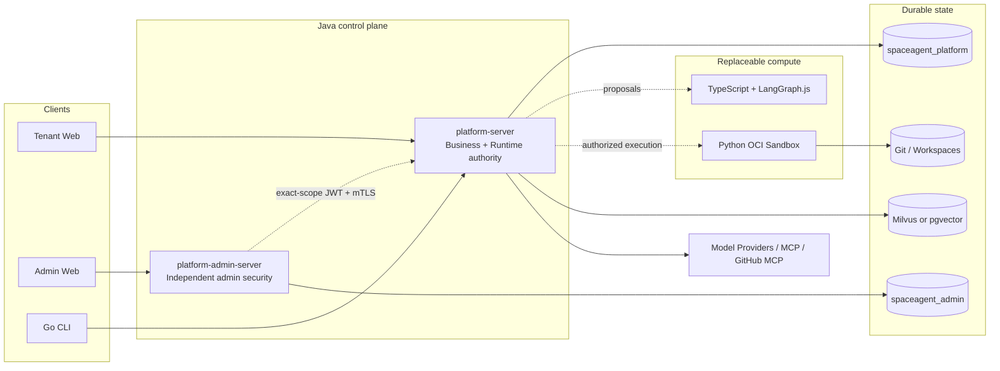

<p align="center">
  
</p>

<h1 align="center">SpaceAgent</h1>

<p align="center">
  面向团队的自托管 AI Agent 平台：把 Chat、Project、Coding、Memory、RAG、MCP、自动化与可恢复 Runtime 放在同一个可信控制面中。
</p>

<p align="center">
  <a href="README.md">中文</a> ·
  <a href="README_EN.md">English</a> ·
  <a href="README_JA.md">日本語</a>
</p>

<p align="center">
  <a href="https://github.com/lzswdg1/SpaceAgent/actions/workflows/ci.yml"></a>
  <a href="LICENSE"></a>
  
</p>

> [!IMPORTANT]
> SpaceAgent 当前是 **Developer Beta**，适合可信、自托管的开发与评估环境。它不宣称已经完成生产级渗透测试、高可用认证、公网不可信代码沙箱认证或所有 Provider/MCP 的真实环境验收。部署前请阅读 [安全策略](SECURITY.md) 与 [生产运行手册](docs/operations/PRODUCTION-RUNBOOK.md)。

## SpaceAgent 是什么

SpaceAgent 不是一个只负责拼 Prompt 的聊天外壳。它把 AI Agent 的配置、模型路由、工具权限、任务计划、执行、审批、恢复和审计组织成可追踪的系统：

- Java 与 PostgreSQL 持有业务状态、权限、Runtime、Ledger 和恢复权威；
- TypeScript/LangGraph.js 只负责可替换的 Multi-Agent 推理与提案；
- Python Sandbox Worker 只负责受控 Docker/OCI 计算；
- React 客户端与 Go CLI 只消费公开契约，不持有业务真相；
- 模型、MCP、Git 与 Tool 副作用都经过授权、幂等与 `UNKNOWN` 对账边界。

## 主要能力

- **组织与身份**：Organization、成员角色、邀请、Session、密码与租户隔离。
- **Agent**：单一当前配置、模型/ModelPool、Tool、Skill、MCP、Memory/RAG 绑定与不可变 Run 快照。
- **Chat Runtime**：SSE 流式响应、Tool 审批、断线恢复、计划提案和可靠继续执行。
- **Project / Coding**：ProjectDirectory、Task、TaskPlan DAG、隔离 Workspace、代码执行、测试、评审、Handoff 与本地 SourceMerge 证据。
- **模型与用量**：OpenAI-compatible Provider、模型发现、路由、预算、价格、调用 Ledger 与首个有效流式 Chunk 证据。
- **MCP Marketplace**：版本化 Server、Installation、Connection、OAuth + PKCE、能力快照、健康状态和 GitHub MCP。
- **Knowledge / RAG**：文本与文档处理、URL 刷新、Embedding、Milvus/pgvector 二选一检索、可选重排与引用。
- **Memory 与自动化**：User/Project/Task Memory、候选审核、Schedule、事件触发和可恢复执行。
- **管理控制面**：独立 Admin 服务与数据库、管理员 Session、命令日志、审计和脱敏全局视图。
- **可观测性**：Prometheus、Grafana、Loki、Tempo、Alertmanager 与脱敏 OpenTelemetry。

## 架构



| 目录 | 职责 |
| --- | --- |
| `apps/platform-server` | Java 21 业务、公开 API、Runtime 与副作用权威 |
| `apps/platform-admin-server` | 独立管理员身份、安全与控制面 |
| `apps/web` | Tenant React/TypeScript 客户端 |
| `apps/admin-web` | 私有 Admin React/TypeScript 客户端 |
| `cli` | Go 命令行客户端 |
| `services/multi-agent-orchestrator` | TypeScript + LangGraph.js 计算边界 |
| `workers/sandbox-worker` | Python Docker/OCI 执行控制面 |
| `contracts` | 跨语言 JSON/Protobuf 契约与 Fixture |

更完整的所有权和运行链路见 [最终架构](docs/architecture/FINAL-ARCHITECTURE.md) 与 [V2 架构](docs/architecture/V2-ARCHITECTURE.md)。

## 安全边界

- Provider/MCP/OAuth Secret 只在 Java/PostgreSQL 受控边界中保存和解密，不进入浏览器存储、Multi-Agent、Sandbox 子容器、Telemetry 或 Git 证据。
- 所有业务资源都以 tenant/user/role 校验；Admin 服务没有业务数据库凭据，也不能冒充普通用户。
- Tool、Provider、MCP、Git 和对象存储的不确定结果保持 `UNKNOWN`，不会盲目重试。
- Sandbox 子容器默认无网络、只读根文件系统、非 root、移除全部 capability，只挂载精确 Workspace。
- **Sandbox Worker 控制进程持有可写 Docker Socket；一旦被攻破，影响接近宿主机 root。** Sandbox profile 默认关闭，仅支持可信代码与受控环境。推荐独立执行节点、rootless Docker 或受限 Socket Proxy。
- Alloy 的 `:ro` Socket 挂载并不等于 Docker API 只读。Observability profile 必须保持私有。
- `/actuator/prometheus` 仅用于回环或私有网络抓取；扩大监听范围前必须加独立保护。

## 快速开始

### 环境要求

- Java 21
- Node.js 22+
- Go 1.23+
- Python 3.11+
- Docker Engine 26+ 与 Docker Compose

### 启动核心后端

```bash
git clone https://github.com/lzswdg1/SpaceAgent.git
cd SpaceAgent
cp .env.example .env
# 编辑 .env，替换所有 Secret 占位符
docker compose up -d postgres database-init platform-server
```

默认后端地址：`http://127.0.0.1:9000`

```bash
curl -fsS http://127.0.0.1:9000/actuator/health/readiness
```

### 启动 Web

```bash
docker compose --profile web up -d web
```

默认 Web 地址：`http://127.0.0.1:8080`

### 可选 Profile

```bash
# 独立管理员控制面；必须先配置 ADMIN_* Secret
docker compose --profile admin up -d platform-admin-server admin-web

# 私有 Observability
docker compose --profile observability up -d prometheus alertmanager grafana loki tempo alloy

# 可信代码 OCI Sandbox；默认关闭，不发布端口
SANDBOX_MODE=http docker compose --profile sandbox up -d sandbox-worker platform-server
```

Milvus、pgvector、Tika 与独立 Knowledge Worker 的组合方式见 [Knowledge RAG 运行手册](docs/operations/KNOWLEDGE-RAG-RUNBOOK.md)。

## 本地开发与验证

```bash
# Java
./mvnw verify
scripts/check-architecture.sh

# Tenant / Admin Web
npm ci
npm test
npm run build
npm run test:admin
npm run build:admin

# Go CLI
cd cli && go test ./... && go vet ./...

# Multi-Agent Orchestrator
cd services/multi-agent-orchestrator
npm ci && npm test && npm run build

# Sandbox Worker
cd workers/sandbox-worker
python3 -m venv .venv
.venv/bin/pip install .
.venv/bin/python -m unittest discover -s tests -t . -v
```

完整 CI 还会执行 Gitleaks、Exporter、Compose、五个 Dockerfile、GoReleaser、npm audit 以及源码/依赖/镜像 SBOM 门禁。

## 文档入口

- [开发指南](docs/DEVELOPMENT.md)
- [生产运行手册](docs/operations/PRODUCTION-RUNBOOK.md)
- [Release Checklist](docs/operations/RELEASE-CHECKLIST.md)
- [安全策略](SECURITY.md)
- [贡献指南](CONTRIBUTING.md)
- [第三方声明](THIRD_PARTY_NOTICES.md)
- [资产来源](ASSET-PROVENANCE.md)
- [公开源码清单](PUBLIC-SOURCE-MANIFEST.txt)

## 贡献与安全报告

提交代码前请阅读 [CONTRIBUTING.md](CONTRIBUTING.md)，并使用 DCO `Signed-off-by`。安全漏洞不要提交公开 Issue，请按照 [SECURITY.md](SECURITY.md) 使用 GitHub Private Vulnerability Reporting。

## License

SpaceAgent 自有源码与项目所有者制作的 Logo/Prototype 以 [MIT License](LICENSE) 分发。第三方依赖、容器镜像和 Contributor Covenant 保留各自许可证，详见 [THIRD_PARTY_NOTICES.md](THIRD_PARTY_NOTICES.md)。本仓库不宣称已经完成法律审查。
