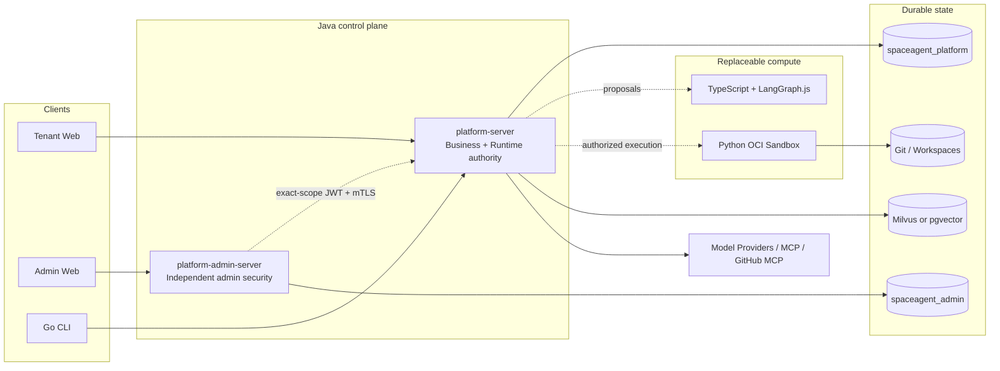

<p align="center">
  
</p>

<h1 align="center">SpaceAgent</h1>

<p align="center">
  A self-hosted AI Agent platform for teams, unifying Chat, Project, Coding, Memory, RAG, MCP, automation, and a recoverable Runtime under one trusted control plane.
</p>

<p align="center">
  <a href="README.md">中文</a> ·
  <a href="README_EN.md">English</a> ·
  <a href="README_JA.md">日本語</a>
</p>

<p align="center">
  <a href="https://github.com/lzswdg1/SpaceAgent/actions/workflows/ci.yml"></a>
  <a href="LICENSE"></a>
  
</p>

> [!IMPORTANT]
> SpaceAgent is currently a **Developer Beta** for trusted, self-hosted development and evaluation. It does not claim production penetration testing, high-availability certification, public-untrusted sandbox certification, or live acceptance against every Provider and MCP server. Read the [Security Policy](SECURITY.md) and [Production Runbook](docs/operations/PRODUCTION-RUNBOOK.md) before exposing it to the internet.

## What is SpaceAgent?

SpaceAgent is more than a chat UI around prompts. It organizes Agent configuration, model routing, tool permissions, task planning, execution, approval, recovery, and audit into a traceable system:

- Java and PostgreSQL own business state, authorization, Runtime state, ledgers, and recovery truth.
- TypeScript/LangGraph.js provides replaceable Multi-Agent reasoning and proposals only.
- The Python Sandbox Worker provides controlled Docker/OCI compute only.
- React clients and the Go CLI consume contracts without owning durable business truth.
- Model, MCP, Git, and Tool effects cross authorization, idempotency, and `UNKNOWN` reconciliation boundaries.

## Capabilities

- **Identity and organizations**: Organizations, membership roles, invitations, sessions, passwords, and tenant isolation.
- **Agents**: one current configuration, Model/ModelPool, Tool, Skill, MCP, Memory/RAG bindings, and immutable per-Run snapshots.
- **Chat Runtime**: SSE streaming, Tool approval, reconnect/recovery, plan proposals, and reliable continuation.
- **Project and Coding**: ProjectDirectory, Task, TaskPlan DAG, isolated Workspaces, code execution, tests, review, Handoff, and local SourceMerge evidence.
- **Models and usage**: OpenAI-compatible Providers, model discovery, routing, budgets, pricing, call ledgers, and trustworthy first-chunk evidence.
- **MCP Marketplace**: versioned Servers, Installations, Connections, OAuth + PKCE, capability snapshots, health evidence, and GitHub MCP.
- **Knowledge and RAG**: text/document parsing, URL refresh, Embeddings, deployment-selected Milvus or pgvector retrieval, optional reranking, and citations.
- **Memory and automation**: User/Project/Task Memory, candidate review, schedules, event triggers, and recoverable execution.
- **Administration**: an independent Admin service/database, administrator sessions, command journal, audit, and redacted global views.
- **Observability**: Prometheus, Grafana, Loki, Tempo, Alertmanager, and redacted OpenTelemetry.

## Architecture



| Path | Responsibility |
| --- | --- |
| `apps/platform-server` | Java 21 business APIs, Runtime, and effect authority |
| `apps/platform-admin-server` | Independent administrator identity, security, and control plane |
| `apps/web` | Tenant React/TypeScript client |
| `apps/admin-web` | Private Admin React/TypeScript client |
| `cli` | Go command-line client |
| `services/multi-agent-orchestrator` | TypeScript + LangGraph.js compute boundary |
| `workers/sandbox-worker` | Python Docker/OCI execution control plane |
| `contracts` | Cross-language JSON/Protobuf contracts and fixtures |

See [Final Architecture](docs/architecture/FINAL-ARCHITECTURE.md) and [V2 Architecture](docs/architecture/V2-ARCHITECTURE.md) for detailed ownership and runtime flows.

## Security boundaries

- Provider, MCP, and OAuth secrets stay inside controlled Java/PostgreSQL boundaries. They do not enter browser storage, Multi-Agent compute, Sandbox children, telemetry, or Git evidence.
- Every business resource is tenant/user/role authorized. The Admin service has no business-database credential and cannot impersonate tenant users.
- Uncertain Tool, Provider, MCP, Git, and object-storage effects remain `UNKNOWN` and are never blindly retried.
- Sandbox children are network-disabled, read-only-rootfs, non-root, capability-free, and mount only the exact Workspace.
- **The Sandbox Worker controller owns a writable Docker Socket. If compromised, its impact approaches host root.** The profile is disabled by default and supports trusted code in controlled environments only. Prefer a dedicated execution node, rootless Docker, or a restricted Socket proxy.
- Alloy's `:ro` Socket mount does not make the Docker API read-only. Keep the observability profile private.
- `/actuator/prometheus` is intended for loopback/private scraping and needs a separate protection boundary before wider exposure.

## Quick start

### Requirements

- Java 21
- Node.js 22+
- Go 1.23+
- Python 3.11+
- Docker Engine 26+ and Docker Compose

### Start the core backend

```bash
git clone https://github.com/lzswdg1/SpaceAgent.git
cd SpaceAgent
cp .env.example .env
# Replace every secret placeholder in .env
docker compose up -d postgres database-init platform-server
```

The backend listens on `http://127.0.0.1:9000` by default.

```bash
curl -fsS http://127.0.0.1:9000/actuator/health/readiness
```

### Start the Web client

```bash
docker compose --profile web up -d web
```

The Web client listens on `http://127.0.0.1:8080` by default.

### Optional profiles

```bash
# Independent administration plane; configure ADMIN_* secrets first
docker compose --profile admin up -d platform-admin-server admin-web

# Private observability stack
docker compose --profile observability up -d prometheus alertmanager grafana loki tempo alloy

# Trusted-code OCI Sandbox; disabled by default and exposes no host port
SANDBOX_MODE=http docker compose --profile sandbox up -d sandbox-worker platform-server
```

For Milvus, pgvector, Tika, and the independent Knowledge Worker, see the [Knowledge RAG Runbook](docs/operations/KNOWLEDGE-RAG-RUNBOOK.md).

## Development and verification

```bash
# Java
./mvnw verify
scripts/check-architecture.sh

# Tenant/Admin Web
npm ci
npm test
npm run build
npm run test:admin
npm run build:admin

# Go CLI
cd cli && go test ./... && go vet ./...

# Multi-Agent Orchestrator
cd services/multi-agent-orchestrator
npm ci && npm test && npm run build

# Sandbox Worker
cd workers/sandbox-worker
python3 -m venv .venv
.venv/bin/pip install .
.venv/bin/python -m unittest discover -s tests -t . -v
```

The full CI gate also runs Gitleaks, public-source export tests, Compose validation, five Dockerfile checks, GoReleaser, npm production audits, and source/dependency/image SBOM generation.

## Documentation

- [Development Guide](docs/DEVELOPMENT.md)
- [Production Runbook](docs/operations/PRODUCTION-RUNBOOK.md)
- [Release Checklist](docs/operations/RELEASE-CHECKLIST.md)
- [Security Policy](SECURITY.md)
- [Contributing](CONTRIBUTING.md)
- [Third-Party Notices](THIRD_PARTY_NOTICES.md)
- [Asset Provenance](ASSET-PROVENANCE.md)
- [Public Source Manifest](PUBLIC-SOURCE-MANIFEST.txt)

## Contributing and security reports

Read [CONTRIBUTING.md](CONTRIBUTING.md) and use a DCO `Signed-off-by` line for contributions. Do not open a public issue for a vulnerability; follow [SECURITY.md](SECURITY.md) and use GitHub Private Vulnerability Reporting.

## License

SpaceAgent-owned source and the project-owner-created logo/prototypes are distributed under the [MIT License](LICENSE). Dependencies, container images, and Contributor Covenant material retain their own licenses; see [THIRD_PARTY_NOTICES.md](THIRD_PARTY_NOTICES.md). No legal review is claimed.
