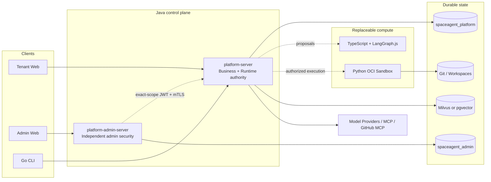

<p align="center">
  
</p>

<h1 align="center">SpaceAgent</h1>

<p align="center">
  Chat、Project、Coding、Memory、RAG、MCP、自動化、復旧可能な Runtime を一つの信頼されたコントロールプレーンに統合する、チーム向けセルフホスト型 AI Agent プラットフォーム。
</p>

<p align="center">
  <a href="README.md">中文</a> ·
  <a href="README_EN.md">English</a> ·
  <a href="README_JA.md">日本語</a>
</p>

<p align="center">
  <a href="https://github.com/lzswdg1/SpaceAgent/actions/workflows/ci.yml"></a>
  <a href="LICENSE"></a>
  
</p>

> [!IMPORTANT]
> SpaceAgent は現在、信頼されたセルフホスト環境での開発・評価を対象とする **Developer Beta** です。本番向けペネトレーションテスト、高可用性認証、公開環境での信頼できないコードに対する Sandbox 認証、または全 Provider/MCP の実環境検証を完了したものではありません。インターネットへ公開する前に、[セキュリティポリシー](SECURITY.md)と[本番運用 Runbook](docs/operations/PRODUCTION-RUNBOOK.md)を確認してください。

## SpaceAgent とは

SpaceAgent は、Prompt を包むだけの Chat UI ではありません。Agent 設定、モデルルーティング、Tool 権限、タスク計画、実行、承認、復旧、監査を追跡可能なシステムとして構成します。

- Java と PostgreSQL が、ビジネス状態、認可、Runtime、Ledger、復旧に関する正本を保持します。
- TypeScript/LangGraph.js は、交換可能な Multi-Agent 推論と提案のみを担当します。
- Python Sandbox Worker は、制御された Docker/OCI コンピュートのみを担当します。
- React クライアントと Go CLI は公開契約を利用し、永続的なビジネス上の正本を保持しません。
- Model、MCP、Git、Tool の副作用は、認可、冪等性、`UNKNOWN` 照合の境界を通過します。

## 主な機能

- **ID と Organization**：Organization、メンバーロール、招待、Session、パスワード、テナント分離。
- **Agent**：単一の現在設定、Model/ModelPool、Tool、Skill、MCP、Memory/RAG の関連付け、Run ごとの不変スナップショット。
- **Chat Runtime**：SSE ストリーミング、Tool 承認、再接続・復旧、計画提案、信頼できる継続実行。
- **Project / Coding**：ProjectDirectory、Task、TaskPlan DAG、分離 Workspace、コード実行、テスト、レビュー、Handoff、ローカル SourceMerge 証跡。
- **Model と使用量**：OpenAI-compatible Provider、モデル検出、ルーティング、予算、価格、呼び出し Ledger、最初の有効なストリーム Chunk の証跡。
- **MCP Marketplace**：バージョン管理された Server、Installation、Connection、OAuth + PKCE、Capability Snapshot、Health 証跡、GitHub MCP。
- **Knowledge / RAG**：テキスト・文書解析、URL 更新、Embedding、Milvus または pgvector による検索、任意の Reranking、引用。
- **Memory と自動化**：User/Project/Task Memory、候補レビュー、Schedule、イベントトリガー、復旧可能な実行。
- **管理コントロールプレーン**：独立した Admin サービスとデータベース、管理者 Session、Command Journal、監査、秘匿化された全体ビュー。
- **可観測性**：Prometheus、Grafana、Loki、Tempo、Alertmanager、秘匿化された OpenTelemetry。

## アーキテクチャ



| パス | 責務 |
| --- | --- |
| `apps/platform-server` | Java 21 のビジネス API、Runtime、副作用の正本 |
| `apps/platform-admin-server` | 独立した管理者 ID、セキュリティ、コントロールプレーン |
| `apps/web` | Tenant 向け React/TypeScript クライアント |
| `apps/admin-web` | 非公開 Admin 向け React/TypeScript クライアント |
| `cli` | Go コマンドラインクライアント |
| `services/multi-agent-orchestrator` | TypeScript + LangGraph.js のコンピュート境界 |
| `workers/sandbox-worker` | Python Docker/OCI 実行コントロールプレーン |
| `contracts` | 言語間 JSON/Protobuf 契約と Fixture |

詳細な所有権と Runtime フローについては、[最終アーキテクチャ](docs/architecture/FINAL-ARCHITECTURE.md)と[V2 アーキテクチャ](docs/architecture/V2-ARCHITECTURE.md)を参照してください。

## セキュリティ境界

- Provider、MCP、OAuth の Secret は、制御された Java/PostgreSQL 境界内に保持されます。ブラウザストレージ、Multi-Agent コンピュート、Sandbox 子コンテナ、Telemetry、Git 証跡には渡しません。
- すべてのビジネスリソースに tenant/user/role 認可を適用します。Admin サービスはビジネスデータベースの認証情報を持たず、Tenant ユーザーになりすますこともできません。
- Tool、Provider、MCP、Git、オブジェクトストレージの結果が不確定な場合は `UNKNOWN` のまま保持し、無条件に再試行しません。
- Sandbox 子コンテナは、ネットワーク無効、読み取り専用 rootfs、非 root、全 Capability 削除を既定とし、対象 Workspace のみをマウントします。
- **Sandbox Worker のコントローラーは書き込み可能な Docker Socket を保持します。侵害された場合の影響は、ホストの root 権限に近いものです。** この Profile は既定で無効であり、管理された環境で信頼できるコードを実行する用途のみを想定しています。専用実行ノード、rootless Docker、または制限付き Socket Proxy を推奨します。
- Alloy の `:ro` Socket マウントは、Docker API 自体を読み取り専用にはしません。Observability Profile は非公開ネットワーク内に置いてください。
- `/actuator/prometheus` は Loopback または非公開ネットワークからの Scrape を想定しています。公開範囲を広げる場合は、別の保護境界が必要です。

## クイックスタート

### 必要環境

- Java 21
- Node.js 22+
- Go 1.23+
- Python 3.11+
- Docker Engine 26+ と Docker Compose

### コア Backend の起動

```bash
git clone https://github.com/lzswdg1/SpaceAgent.git
cd SpaceAgent
cp .env.example .env
# .env 内のすべての Secret プレースホルダーを置き換えてください
docker compose up -d postgres database-init platform-server
```

Backend は既定で `http://127.0.0.1:9000` を Listen します。

```bash
curl -fsS http://127.0.0.1:9000/actuator/health/readiness
```

### Web クライアントの起動

```bash
docker compose --profile web up -d web
```

Web クライアントは既定で `http://127.0.0.1:8080` を Listen します。

### オプション Profile

```bash
# 独立した管理コントロールプレーン。先に ADMIN_* Secret を設定してください
docker compose --profile admin up -d platform-admin-server admin-web

# 非公開の可観測性スタック
docker compose --profile observability up -d prometheus alertmanager grafana loki tempo alloy

# 信頼できるコード向け OCI Sandbox。既定では無効で、ホストポートを公開しません
SANDBOX_MODE=http docker compose --profile sandbox up -d sandbox-worker platform-server
```

Milvus、pgvector、Tika、独立した Knowledge Worker については、[Knowledge RAG Runbook](docs/operations/KNOWLEDGE-RAG-RUNBOOK.md)を参照してください。

## 開発と検証

```bash
# Java
./mvnw verify
scripts/check-architecture.sh

# Tenant / Admin Web
npm ci
npm test
npm run build
npm run test:admin
npm run build:admin

# Go CLI
cd cli && go test ./... && go vet ./...

# Multi-Agent Orchestrator
cd services/multi-agent-orchestrator
npm ci && npm test && npm run build

# Sandbox Worker
cd workers/sandbox-worker
python3 -m venv .venv
.venv/bin/pip install .
.venv/bin/python -m unittest discover -s tests -t . -v
```

完全な CI Gate では、Gitleaks、公開ソース Export テスト、Compose 検証、5 個の Dockerfile チェック、GoReleaser、npm 本番依存関係 Audit、ソース・依存関係・コンテナイメージの SBOM 生成も実行します。

## ドキュメント

- [開発ガイド](docs/DEVELOPMENT.md)
- [本番運用 Runbook](docs/operations/PRODUCTION-RUNBOOK.md)
- [Release Checklist](docs/operations/RELEASE-CHECKLIST.md)
- [セキュリティポリシー](SECURITY.md)
- [コントリビューションガイド](CONTRIBUTING.md)
- [サードパーティ通知](THIRD_PARTY_NOTICES.md)
- [アセットの出所](ASSET-PROVENANCE.md)
- [公開ソース Manifest](PUBLIC-SOURCE-MANIFEST.txt)

## オープンソースとしての状態

このリポジトリは、非公開 Git 履歴を含まないソーススナップショットを最初の公開 Commit として開始します。`copy/browser`、実環境ファイル、認証情報、データベース、Backup、生成済み Build Output は含まれていません。公開前に、GitHub の Private Vulnerability Reporting、Branch Protection、Required Checks、CODEOWNERS、DCO、署名・Attestation 権限を有効にしてください。

## コントリビューションと脆弱性報告

コードを送る前に [CONTRIBUTING.md](CONTRIBUTING.md) を読み、DCO の `Signed-off-by` 行を付けてください。脆弱性を公開 Issue として報告しないでください。[SECURITY.md](SECURITY.md) に従い、GitHub Private Vulnerability Reporting を利用してください。

## ライセンス

SpaceAgent が所有するソースコード、およびプロジェクト所有者が制作した Logo/Prototype は [MIT License](LICENSE) で配布されます。依存関係、コンテナイメージ、Contributor Covenant の素材には、それぞれのライセンスが適用されます。詳細は [THIRD_PARTY_NOTICES.md](THIRD_PARTY_NOTICES.md) を参照してください。本リポジトリは法務レビューの完了を表明するものではありません。
