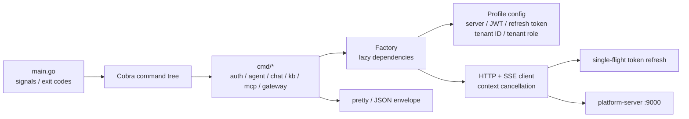

# SpaceAgent CLI

SpaceAgent CLI is the Go 1.23 command-line client for the SpaceAgent
platform. It talks only to `apps/platform-server`; model keys and
database credentials never enter the CLI.

## Architecture



The layout follows the same practical ideas used by the official
Lark/Feishu CLI: a command tree, a replaceable Factory, named profiles,
agent-friendly structured output, explicit confirmation for risky actions,
and cross-platform releases.

## Build

```bash
go build -o spaceagent .
go test ./...
go vet ./...
```

## Profiles

The default profile remains backward-compatible with
`~/.spaceagent/config.json`. Named profiles are stored under
`~/.spaceagent/profiles/`.

```bash
spaceagent config profile add local --server http://127.0.0.1:9000 --use
spaceagent config profile add staging --server https://staging.example.com
spaceagent config profile list
spaceagent --profile staging auth login
spaceagent config profile use local
```

Resolution order:

1. `--profile`
2. `SPACEAGENT_PROFILE`
3. `~/.spaceagent/active-profile`
4. `default`

Set `SPACEAGENT_CONFIG_DIR` to isolate all CLI state in CI or automation.

## Output Contract

Human-readable output remains the default:

```bash
spaceagent health
```

For shell scripts and AI Agents, use `--format json` or `--json`:

```bash
spaceagent --format json health
```

Success is written to stdout:

```json
{
  "ok": true,
  "data": {"output": "✓ 服务器运行正常"},
  "meta": {"command": "spaceagent health", "profile": "default"}
}
```

Errors are written to stderr and use stable categories:

```json
{
  "ok": false,
  "error": {
    "type": "authentication",
    "subtype": "token_missing",
    "message": "未登录",
    "hint": "run `spaceagent auth login`"
  }
}
```

Exit codes are category-based: validation `2`, auth/config `3`, network `4`,
internal `5`, policy `6`, and confirmation required `10`.

## Authentication

Login stores the access and rotating refresh token in the selected profile
with file mode `0600`. If a normal HTTP, upload, or SSE request returns `401`,
the client serializes refresh-token rotation, persists the new token pair, and
retries the original request once. Concurrent requests reuse the first
successful refresh.

## SaaS Workspaces

The active workspace is encoded in the JWT and persisted in the selected CLI
profile. Switching workspaces rotates both access and refresh tokens.

```bash
spaceagent tenant list
spaceagent tenant create --name "Agent Team" --slug agent-team
spaceagent tenant switch agent-team
spaceagent tenant members
spaceagent tenant update --name "Runtime Team" --slug runtime-team
spaceagent tenant invite alice --role MEMBER
spaceagent tenant incoming
spaceagent tenant accept <token>
spaceagent tenant invitations
spaceagent tenant set-role <user-id> --role VIEWER
spaceagent tenant remove-member <user-id> --yes
spaceagent tenant transfer-owner <user-id> --yes
spaceagent tenant audit --limit 50
spaceagent tenant leave --tenant runtime-team --yes
spaceagent tenant archive --tenant runtime-team --yes
```

The CLI never sends a caller-controlled tenant header; `platform-server`
derives trusted tenant context from the signed token.

## Release

Tags matching `cli-v*.*.*` run tests and GoReleaser. Release archives target
Linux, macOS, and Windows on amd64/arm64 where supported. Homebrew publishing
is intentionally disabled until a real tap repository is configured.
