# SpaceAgent 架构图与核心业务链路

更新时间：2026-08-20

> **历史架构：** 本文记录 M8 cutover 前、现已从活动树移除的五服务实现。
> 旧源码仅存在于未随本公开快照分发的私有归档中，不再支持 runtime rollback。
> Active Java runtime 是 `apps/platform-server`。

本文档用于保留五服务版本的技术架构、服务边界、认证授权、聊天编排、RAG、MCP、CLI 和迁移证据。

历史五服务版本曾完成本地 jar 回归验证：

- `gateway-service`
- `identity-service`
- `agent-service`
- `chat-service`
- `knowledge-service`

旧 backend 与以下五服务源码均已从活动树移除，私有归档不随本公开快照分发。

## 1. 总体技术架构图

```mermaid
flowchart TB
    subgraph Clients["客户端与外部入口"]
        Web["React Web 前端<br/>TypeScript / Vite"]
        CLI["Go CLI<br/>Cobra / SSE Client / named profiles"]
        External["外部渠道或第三方调用方<br/>Agent API Key / Gateway Ingress"]
        Swagger["Swagger / API 调试"]
    end

    subgraph Gateway["gateway-service<br/>Spring Boot 3.5.13 / Java 21"]
        GatewayAuth["JWT 本地验签 / Redis 撤销检查<br/>Agent API Key 校验"]
        GatewayRate["Redis 分布式固定窗口限流<br/>RequestId"]
        GatewayProxy["统一路由与 SSE 流式转发"]
        GatewayBinding["外部用户绑定与渠道投递<br/>去重 / 定向回复 / 持久化重试"]
    end

    subgraph Identity["identity-service"]
        Auth["注册 / 登录 / 密码校验"]
        Jwt["JWT 签发"]
        TenantGovernance["租户生命周期 / 邀请 / RBAC<br/>结构化审计 / Transactional Outbox"]
        UserInfo["用户信息内部查询"]
        IdentityDB[("spaceagent_identity<br/>users / tenants / memberships<br/>invitations / audit / outbox")]
    end

    subgraph Agent["agent-service"]
        AgentCrud["Agent CRUD"]
        AgentKeys["Agent API Key<br/>hash 存储 / 创建时返回一次"]
        RuntimeConfig["AgentRuntimeConfig<br/>模型 / 知识库 / 工具 / Skill"]
        AgentDB[("spaceagent_agent<br/>agent_configs / agent_api_keys / agent_knowledge_bases")]
    end

    subgraph Chat["chat-service"]
        Conversation["会话与消息"]
        Context["上下文治理<br/>maxTurns / token budget<br/>history / summary / RAG / memory"]
        ToolSkill["统一 Tool Loop<br/>@Tool time / memory / profile<br/>MCP dynamic tools"]
        McpBridge["MCP stdio / Streamable HTTP<br/>AES-GCM secret storage<br/>tools/list / tools/call"]
        ModelCall["OpenAI-Compatible / LangChain4j 模型调用"]
        Stream["SSE / reasoning / cancellation<br/>usage / terminal state"]
        ChatDB[("spaceagent_chat<br/>conversations / chat_messages<br/>chat_turns / context summaries<br/>usage / memory / encrypted MCP configs")]
    end

    subgraph Knowledge["knowledge-service"]
        Upload["文件上传"]
        Parse["Apache Tika 文本解析"]
        Chunk["DocumentChunker 切分"]
        Embed["Embedding API"]
        Retrieve["pgvector TopK 检索"]
        KnowledgeDB[("spaceagent_knowledge<br/>knowledge_documents / knowledge_chunks / vector")]
    end

    subgraph Infra["基础设施与外部服务"]
        Postgres[("PostgreSQL 17 + pgvector<br/>端口 5436")]
        Redis[("Redis 7<br/>端口 6377")]
        FileStore[("DocumentStorage<br/>Local disk / S3 / MinIO")]
        Providers["DashScope / Qwen<br/>DeepSeek<br/>其他 OpenAI-Compatible Provider"]
        McpServers["External MCP Servers<br/>stdio process<br/>JSON-RPC tools"]
        Resilience["Resilience4j<br/>Circuit Breaker / Bulkhead<br/>Idempotent Retry"]
        Observability["Java 21 Virtual Threads + G1 + JFR<br/>Micrometer / Prometheus / Grafana / Loki / Tempo / Alloy<br/>W3C traceparent / OTLP / Trace-to-Logs"]
    end

    Web --> GatewayAuth
    CLI --> GatewayAuth
    External --> GatewayAuth
    Swagger --> GatewayAuth
    GatewayAuth --> GatewayRate
    GatewayRate --> GatewayProxy
    GatewayProxy --> GatewayBinding

    GatewayProxy --> Identity
    GatewayProxy --> Agent
    GatewayProxy --> Chat
    GatewayProxy --> Knowledge

    Chat --> RuntimeConfig
    Chat --> Retrieve
    Chat --> UserInfo
    Chat --> Providers
    ToolSkill --> McpBridge
    McpBridge --> McpServers
    Knowledge --> Providers

    Identity --> IdentityDB
    Agent --> AgentDB
    Chat --> ChatDB
    Knowledge --> KnowledgeDB
    GatewayBinding --> Postgres
    IdentityDB --> Postgres
    AgentDB --> Postgres
    ChatDB --> Postgres
    KnowledgeDB --> Postgres
    GatewayRate --> Redis
    Identity --> Redis
    Chat --> Redis
    Upload --> FileStore
    GatewayProxy --> Resilience
    Chat --> Resilience
    Knowledge --> Resilience
    Resilience --> Providers
    Resilience --> McpServers
    Gateway --> Observability
    Identity --> Observability
    Agent --> Observability
    Knowledge --> Observability
    Chat --> Observability
```

## 2. 五服务职责边界图

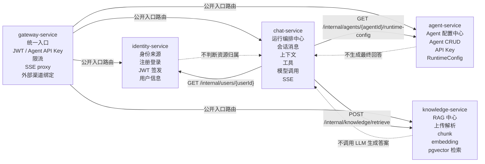

一句话边界：

| 服务 | 核心定位 | 主要技术与数据 |
| --- | --- | --- |
| `gateway-service` | 统一入口、入口鉴权、租户上下文、限流、路由、SSE 透传 | Spring Security、RestClient、Redis rate limit / token 与成员撤权、`session_bindings` |
| `identity-service` | 身份来源、租户治理、邀请、审计、JWT 签发 | BCrypt、tenant-scoped JWT/Refresh Token、Transactional Outbox、Flyway、PostgreSQL |
| `agent-service` | Agent 配置与运行配置中心 | Agent CRUD、Agent API Key hash、`AgentRuntimeConfig`、PostgreSQL |
| `chat-service` | Agent 运行编排与模型调用 | Conversation、Message、Memory、Tool、MCP stdio / Streamable HTTP、SSE、OpenAI-Compatible、LangChain4j |
| `knowledge-service` | RAG 文档处理与向量检索 | Tika、chunk、Local/S3 对象存储、Embedding API、PostgreSQL pgvector |

## 3. 认证与授权逻辑图

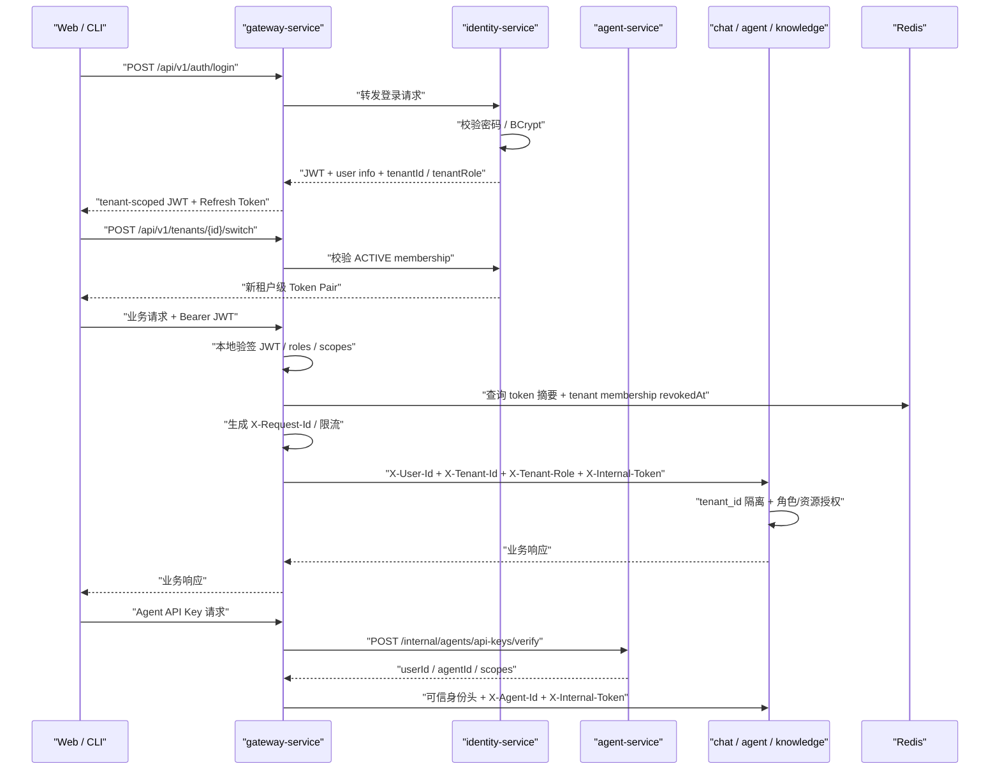

核心原则：

- `identity-service` 负责身份来源、租户成员关系和租户级 Token Pair 签发。
- `gateway-service` 负责入口认证、成员即时撤权检查、限流和可信身份透传。
- 业务服务按 `tenant_id` 做第一层隔离，再按角色与资源归属授权；会话和记忆在租户内继续按用户私有。
- 下游服务只信任带 `X-Internal-Token` 的内部请求，不裸信前端传来的身份或租户 Header。
- 完整多租户数据模型和 RBAC 见 [multi-tenant-saas.md](multi-tenant-saas.md)。

### 3.1 租户治理与可靠撤权链路

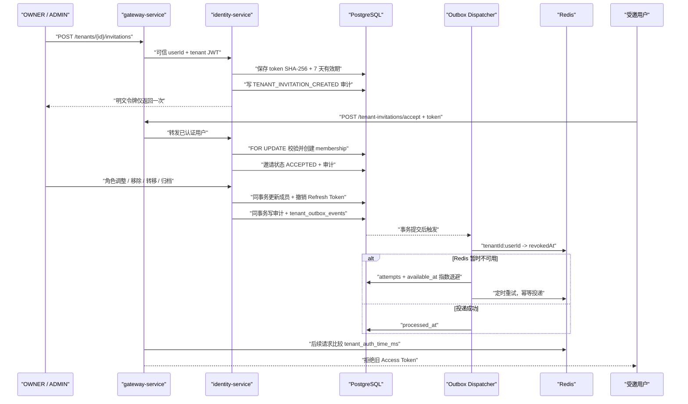

邀请令牌只存 SHA-256，唯一 OWNER 由部分唯一索引和服务层规则共同保护；组织删除采用 `ARCHIVED` 软归档，保留治理证据。

## 4. 聊天与 Agent 运行逻辑图

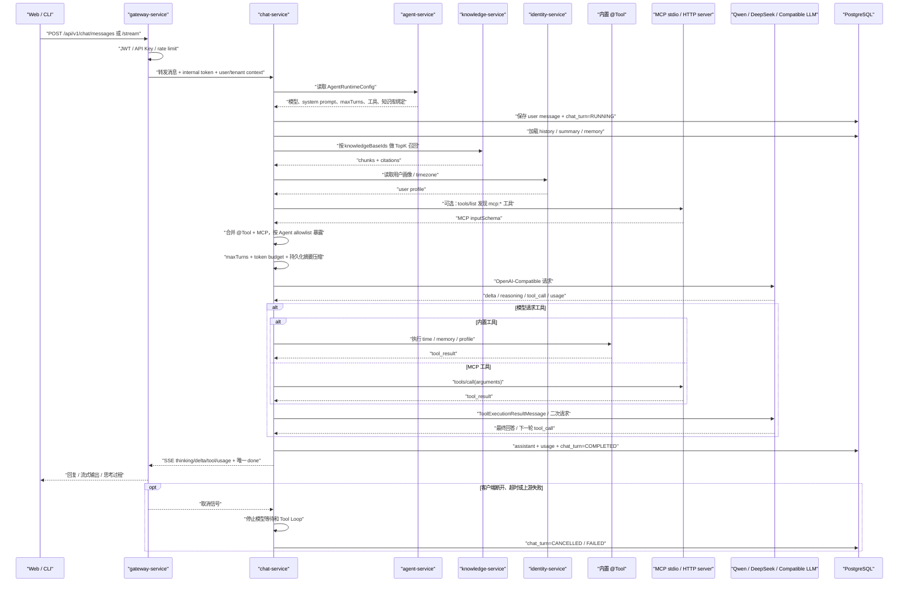

运行链路要点：

- 前端和 CLI 不直接请求大模型 API，全部通过后端转发。
- Agent 配置由 `agent-service` 提供，聊天运行由 `chat-service` 编排。
- RAG 召回由 `knowledge-service` 负责，最终答案由 `chat-service` 调模型生成。
- MCP 接入由 `chat-service` 保存用户级 stdio / Streamable HTTP server config，工具以 `mcp:{serverId}:{toolName}` 进入统一工具目录。
- `time`、`memory`、`profile` 是真实 LangChain4j `@Tool`；内置 Tool 和 MCP Tool 共用 `AgentToolRegistry` 与多轮执行循环。
- `ContextWindowManager` 组合 `maxTurns`、token 预算、最近连续历史、RAG、Memory 和持久化摘要，旧历史摘要写入 `conversation_context_summaries`。
- `chat-service` 使用 LangChain4j 原生流式回调直接发送模型增量，不再对完整回答做服务端切片。
- SSE 事件包括 `thinking`、`delta`、`tool_call`、`tool_result`、`tool_error`、`usage`、`done/error`；取消信号贯穿 Tool Loop、模型等待、JDK HTTP future 和 provider SSE 输入流，且一个流最多发一个终止事件。
- `chat_turns` 记录 `RUNNING / COMPLETED / FAILED / CANCELLED`，`chat_turn_usages` 保存 provider token 用量。

## 4.1 MCP 工具接入链路

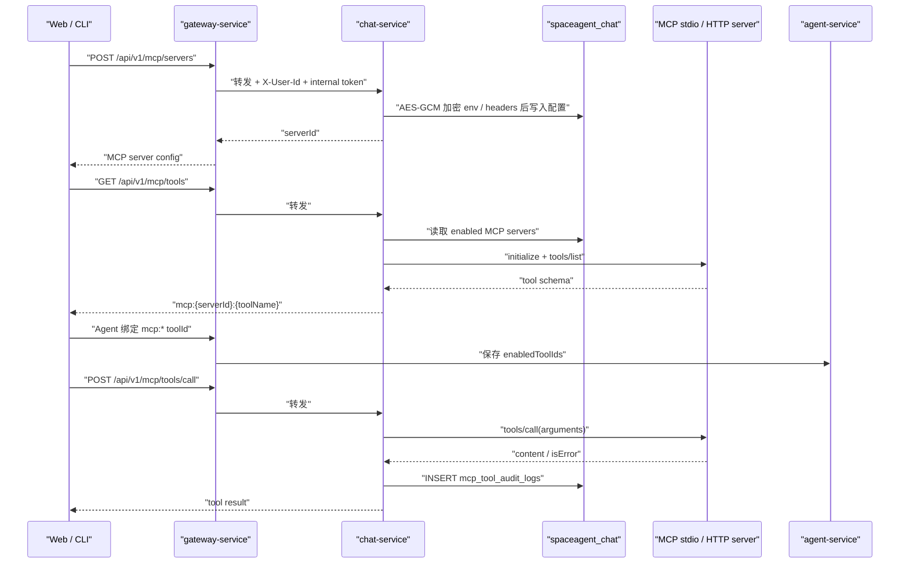

当前实现重点：

| 能力 | 当前状态 |
| --- | --- |
| server config | 用户级配置，存储在 `mcp_server_configs` |
| 密钥存储 | `env` 和 HTTP `headers` 使用随机 nonce 的 AES-GCM 加密；启动时自动迁移旧明文列并清空明文 |
| transport | 支持 `stdio` 与 MCP Streamable HTTP；HTTP 链路处理 initialize、session ID、JSON/SSE 响应和会话关闭 |
| 进程安全 | 可执行文件按精确 allowlist 校验；解释器只允许执行配置根目录内的真实脚本；拒绝 `-c/-m/--eval`、package runner 和危险环境变量 |
| 远程安全 | URL host allowlist + DNS 解析阻止 SSRF；默认仅允许本机 HTTP，公网要求 HTTPS；鉴权头返回前统一脱敏 |
| 工具权限 | 每个 server 配置独立 `allowedTools`，支持精确名称、前缀通配符和 `*`；发现与执行均强制校验 |
| 调用审计 | `mcp_tool_audit_logs` 持久化成功、失败、拒绝、耗时和错误摘要；Web/CLI 可查询最近记录 |
| tools/list | 已支持，从启用的 MCP server 实时发现工具 |
| tools/call | 已支持，通过 `/api/v1/mcp/tools/call` 执行 |
| Agent 绑定 | MCP 工具进入 `/api/v1/tools/catalog`，可作为 `enabledToolIds` 绑定 |
| 自动 tool-call 编排 | 默认使用 OpenAI-Compatible 原生 Tool Calling 和 MCP JSON Schema，后端校验 Agent 工具白名单、参数大小和轮数后执行并回填标准 tool result；旧 `mcp_tool_call` JSON 可关闭原生模式后兼容使用 |

## 4.2 外部渠道回调链路

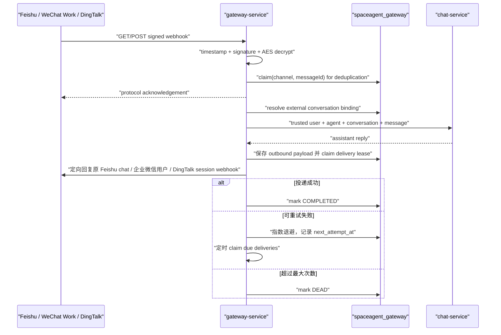

三类回调都在入口完成验签、时间窗校验和协议解密。耗时的聊天链路进入有界线程池，平台收到快速确认；`channel_webhook_events` 同时保存去重状态、回复载荷、投递次数和租约，避免重复模型调用并支持故障恢复；`channel_conversation_bindings` 保持外部会话到内部会话的一致映射。

## 5. RAG 导入与召回逻辑图

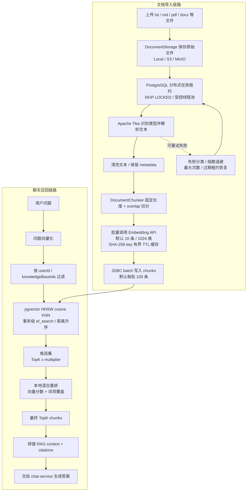

RAG 当前设计：

| 环节 | 当前方案 |
| --- | --- |
| 文档解析 | Apache Tika |
| 原始文件 | `DocumentStorage` 端口；默认本地磁盘，可切换 S3/MinIO-compatible 对象存储；文档 ID 同时作为对象 key，PostgreSQL 保存文档元数据与处理状态 |
| 摄取调度 | 上传先返回 `PROCESSING`；数据库原子 claim + lease owner/expiry + `FOR UPDATE SKIP LOCKED` 支持多实例竞争，受控线程池执行并恢复过期租约 |
| 失败恢复 | 区分永久失败与瞬时失败；持久化 attempts / next attempt / last attempt，指数退避并限制最大重试次数 |
| 切分策略 | `DocumentChunker`，默认 max chunk size 512，overlap 50 |
| 向量模型 | OpenAI-Compatible embedding，`.env` 配置 `AI_EMBEDDING_*` |
| 默认维度 | 1024，适配 DashScope `text-embedding-v3` / `text-embedding-v4` |
| Embedding 性能 | 默认每请求 10 条；相同文本在批次内去重，并使用 SHA-256 key 的有界 TTL Caffeine 缓存 |
| 向量库 | PostgreSQL 17 + pgvector |
| 向量写入 | `JdbcTemplate.batchUpdate`，默认每批 100 条，文档状态与 chunks 在同一短事务提交 |
| 候选召回 | owner/document 过滤 + pgvector HNSW cosine KNN；索引参数 `m=16`、`ef_construction=64`，事务级 `ef_search=100` 且不低于候选数，候选集外层再做 threshold |
| 重排 | 默认启用本地混合重排，向量分数 0.85 + 中英文词项覆盖 0.15；可关闭降级为纯向量排序 |
| 返回 | 最终 chunks、向量/词项/综合分数和结构化 citations，由 `chat-service` 拼入上下文并通过 JSON/SSE 返回 |

## 6. CLI 调用逻辑图

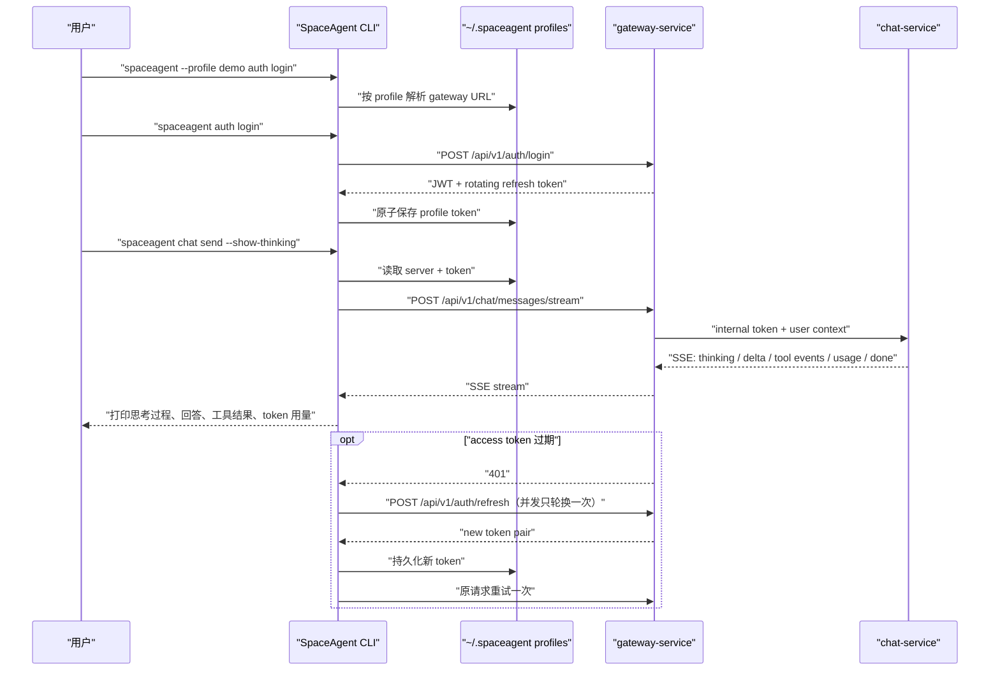

CLI 重点能力：

- 使用命名 Profile 隔离服务地址、JWT 和 Refresh Token，支持 flag /
  environment / active profile 优先级。
- 支持 `pretty` 与稳定 JSON envelope，错误类别映射到固定退出码，便于
  shell 与 AI Agent 调用。
- 普通 HTTP、multipart 上传和 SSE 均支持并发安全的 Token 自动刷新。
- 支持登录、注册、聊天、Agent CRUD 与 API Key 管理。
- 支持 Provider/模型生命周期、Tool Catalog、MCP stdio 管理和外部渠道用户绑定。
- 支持知识库上传、摄取诊断、文档 chunk 诊断和真实 pgvector RAG 检索。
- 支持渠道投递状态查询、死信 `--dry-run` 预览和显式确认重放。
- `--show-thinking` 可控制是否显示模型返回的 reasoning / thinking 字段。

## 7. 部署与运行拓扑图

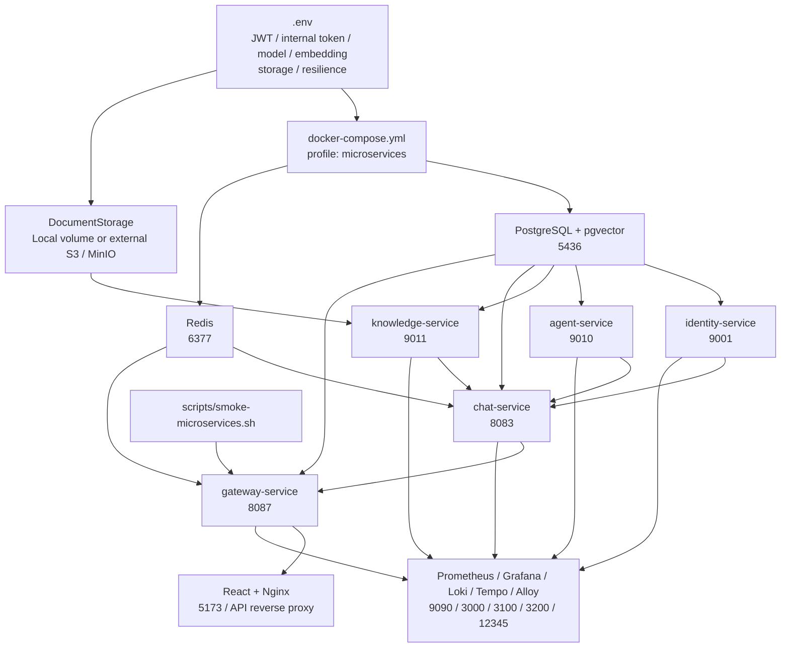

业务服务中只有 `gateway-service:8087` 对宿主机发布入口；`9001`、`9010`、
`9011`、`8083` 仅在 Compose 内部网络可达。前端 Nginx 发布 `5173` 并将
`/api` 反向代理到 gateway。PostgreSQL 和 Redis 的开发映射绑定到
`127.0.0.1`。容器化微服务启动时必须显式配置 JWT、内部调用 Token、
模型 Provider 密钥和 MCP 配置加密 Key。五个服务均输出 Micrometer
Prometheus 指标，并通过 W3C `traceparent` 串联 Gateway、内部 HTTP、异步
执行器、模型与 MCP 调用；`observability` profile 使用 Tempo 接收 OTLP Trace，
Alloy 采集 Docker 日志写入 Loki，并由 Grafana Trace-to-Logs 按 `traceId` 关联。
五个 Java 21 服务使用虚拟线程承接阻塞型 MVC 请求，Hikari、Resilience4j
bulkhead 和有界业务线程池继续提供资源边界；JFR 性能门槛检查 carrier pinning。
核心调用额外生成 `rag.retrieve`、`embedding.generate`、`model.chat`、
`tool.execute`、`mcp.call` 业务 Span。模型、Embedding、MCP、Gateway 转发和
服务间 HTTP 共享 Resilience4j 保护层；聊天生成、写请求和 Tool 调用不自动
重试，只有幂等查询与 Embedding 对瞬时故障做有限重试。

本地 jar 回归验证结果：

| 检查项 | 结果 |
| --- | --- |
| 五服务 jar 启动 | 通过 |
| 五个 `/actuator/health` | 全部 `UP` |
| 微服务 smoke | `PASS: microservices smoke completed` |
| 五服务后端单元测试 | `./mvnw verify`，280 个执行、275 通过、5 个容器用例在 Docker 未启动时跳过；所有服务通过 JaCoCo 门禁 |
| PostgreSQL / Redis 集成测试 | Testcontainers 使用 `pgvector/pgvector:pg16` 与 `redis:7.4-alpine`，覆盖 HNSW 顺序、摄取租约、Lua 限流和撤销 token；Docker-capable CI 自动执行 |
| 兼容单体单元测试 | `./mvnw -f backend/pom.xml verify`，754 个执行、753 通过、1 跳过，并满足 JaCoCo 门禁 |
| CLI 测试 | `go test ./...`、`go vet ./...` 通过；CI 与 CLI Release 均执行 |
| CLI 真实 RAG + SSE E2E | `scripts/regression-cli-local.sh` 通过；覆盖 Provider 生命周期、Tool Catalog、Gateway binding、诊断、Qwen + DashScope embedding + pgvector |
| 原生 MCP Tool Calling E2E | `scripts/regression-mcp-native-local.sh` 通过；模型自主调用 stdio echo 并二次回答 |
| Streamable HTTP MCP E2E | `scripts/regression-mcp-http-local.sh` 通过；覆盖 CLI 配置、鉴权 Header、SSE tools/list、tools/call、权限拒绝和审计查询 |
| 固定模型浏览器 E2E | `scripts/regression-e2e-local.sh` 通过；覆盖五服务 smoke、注册、Agent 创建和 SSE 对话 |
| 外部渠道本地契约 | `scripts/regression-channel-contracts-local.sh`，飞书/企微/钉钉 11/11 通过；真实账号另行验收 |
| Flyway | chat V8、gateway V3、knowledge V2；MCP 密文列、分页复合索引、渠道投递重试状态和知识摄取租约均已落库 |

本地 jar 验收脚本：

```bash
scripts/start-microservices-local.sh
scripts/check-microservices-health.sh
scripts/smoke-microservices.sh
scripts/regression-cli-local.sh
scripts/regression-mcp-native-local.sh
scripts/regression-mcp-http-local.sh
scripts/stop-microservices-local.sh
```

一键回归：

```bash
scripts/regression-microservices-local.sh
```

## 8. 面试讲解主线

可以这样讲：

> 我把 Agent 平台按职责拆成 gateway、identity、agent、chat、knowledge 五个服务。gateway 负责统一入口和入口安全；identity 是身份来源；agent 管 Agent 配置和运行配置；knowledge 负责 RAG 文档处理和向量检索；chat 负责最终运行编排，包括上下文、记忆、工具、模型调用、SSE 和 usage。认证在 gateway，授权在业务服务，内部调用用 internal token 防止绕过入口。

最重要的三条链路：

1. **登录鉴权链路**：客户端登录 gateway，gateway 转 identity，identity 签 JWT，gateway 后续本地验签并透传可信用户上下文。
2. **Agent 聊天链路**：gateway 转 chat，chat 拉 agent runtime config，查 knowledge TopK，拼上下文，调用模型，SSE 返回。
3. **RAG 链路**：knowledge 解析文档、切分、embedding 入 pgvector；聊天时按 Agent 绑定知识库召回 chunks 和 citations。

## 9. Mermaid 显示说明

本文档图使用 Markdown Mermaid 语法，代码块必须是：

````text
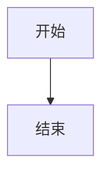
````

如果预览器只显示代码块，不显示图，不是文档语法问题，通常是当前 Markdown 预览器没有启用 Mermaid。GitHub、VS Code Mermaid Preview、部分 JetBrains Markdown 插件可以渲染。
