# SpaceAgent V2 已实现功能架构与业务全链路

> 文档日期：2026-08-26
> 旧运行时归档不包含在公开源码快照中，也不是受支持的回滚路径。
> 里程碑状态：V2 M0-M9 COMPLETE；M11-M55-PR2 COMPLETE；M30 TRUSTED_BETA RC；M31 official GitHub MCP host COMPLETE；M33 Runtime Tool Suite COMPLETE；M34 OCI Sandbox COMPLETE；M36 P1 + M37 P2 HARDENING COMPLETE；M50 MCP MARKETPLACE + M55 SKILL REGISTRY/RUNTIME IMPLEMENTED
> 当前整体代码审计状态：TRUSTED_BETA_RC / FINAL TARGET ENHANCEMENTS PARTIAL
> 当前活动业务后端：`apps/platform-server`；独立管理后端/前端：`apps/platform-admin-server` / `apps/admin-web`
> 权威业务数据库：PostgreSQL `spaceagent_platform`；独立管理员安全库：`spaceagent_admin`
> 最终产品蓝图：Java 权威业务/Runtime + TypeScript/LangGraph.js Multi-Agent

> **M74 权威修正（2026-09-11）**：Agent 只有一个可变且保存即生效的 CurrentConfiguration；Runtime
> 为每个 Run 保存不可变配置快照。本文后续旧里程碑中关于 AgentVersion、审核、发布、回滚或激活调度
> 的描述仅是历史记录，已被 ADR-079 与 V1081 取代，禁止据此恢复旧实现。

## 1. 文档目标与边界

本文描述 SpaceAgent V2 **当前已经实现并通过验证的功能架构、业务流程和端到端链路**，不把规划中的能力描述为现有能力。M0-M9 COMPLETE 仅表示既定 V2 重构里程碑已经完成，不表示整个平台的企业级目标能力已经完整交付；当前整体代码审计结论为 `PARTIAL`。

本文覆盖：

- 当前物理部署拓扑；
- `platform-server` 模块职责和依赖方向；
- Identity、Agent、Provider、Knowledge、Conversation、Chat、Memory、Tool、Recovery 业务流程；
- REST、SSE、模型 Provider、TypeScript Multi-Agent、Sandbox Worker 的调用边界；
- PostgreSQL 表和状态归属；
- 安全、租户隔离、幂等、恢复和错误契约；
- 已知限制、可选能力和 legacy Git 归档边界。

本文不把以下内容列为活动产品能力：

- 已从活动树删除旧 Java runtime，相关私有归档不随本公开快照分发；
- Project/Task/SourceRepository/Workspace/ProjectBlueprint 已持久化；
- Automation periodic/one-time/manual trigger 已作为活动产品能力，并且只声明 PostgreSQL-clock、Governance、Continuation 与 prepared Chat 已验证边界；Webhook/Repository Event/自动重试仍未实现；
- 未配置时的 TypeScript Multi-Agent orchestration 和外部 OCI sandbox-worker；
- M40-PR3 已在 M40-PR2 独立身份安全基础上实现 V1036 User 状态/登录/活动投影、owner-module
  全局只读 APIs、专用 mTLS/短期 exact-scope service JWT、Dashboard、User/Organization 分页、
  Provider/Agent-key/MCP 脱敏清单和敏感读取审计；M40-PR4 进一步实现 V1037 一次性激活创建、
  停用/恢复、会话撤销、跨 owner 删除预检、双命令账本和 UNKNOWN 对账；M40-PR5 新增 V1038
  UserCleanupJob/Step、15 步 owner purge、Organization cleanup handoff 和最小 DELETED Tombstone；
- M42-PR1 已实现 Identity-owned Organization 新建、名称/Slug 修改和 ADR-025 持久化退役，
  以及按 User 分页查询脱敏 Provider 与 Agent 身份/状态/当前版本/API Key 计数；Admin 服务仍无
  `spaceagent_platform` 凭据或 Provider/MCP 解密能力，Admin Web 未在本里程碑修改；
- M43-PR1 已实现 Admin Web 硬刷新恢复：HttpOnly Refresh Cookie、可读 SameSite=Strict CSRF
  Cookie、请求 Header 和 Admin Session Hash 必须一致；每次刷新双轮换，登出双清理，Access 与
  Refresh Token 继续不进入 Web Storage；
- M44-PR1 已实现 Admin 组织成员分页/过滤、添加或重新激活、非 OWNER 角色修改、移除和显式
  OWNER 转移；Identity 原子更新旧/新 OWNER 与 creator，唯一 ACTIVE OWNER 约束保持有效；
- M45-PR1 已实现 User/Organization Cleanup 全局分页、状态/阻断聚合、Step 明细，以及 Admin
  Command 状态/操作/目标分页与 UNKNOWN 调和入口；Cleanup 不提供通用重试；
- M46-PR1 已实现 12 类 owner-module User 资源/风险效果下钻与 Admin Web 分页；只返回归属、
  状态、时间、计数和安全错误码，排除 Prompt、消息、文档/Memory/Automation 内容、路径、Tool
  payload、Provider 响应和全部凭据；
- M47-PR1 已实现 Admin V3 Principal/RecoveryCode、管理员创建/暂停/恢复、强制改密、TOTP 与
  恢复码登录、凭据恢复和 Session 撤销；一次性交付材料不进入命令或审计持久化；
- M48-PR1 已按最终需求把 Admin 后端收敛为唯一、非租户的 SystemAdministrator：Admin V4
  唯一约束阻止第二个 Principal，在线多管理员生命周期失败关闭；本人可在近期 MFA 与当前密码
  校验后轮换恢复码，离线 Break-glass 以确认词、唯一 Request ID 和重放栅栏重置全部因子并撤销
  全部 Session。M47 的多 Principal 成功路径已被取代；本里程碑未修改 Admin Web；
- M50-PR1 已实现 Tooling-owned Publisher/ServerVersion/Remote Transport 与 Trust/Lifecycle/
  来源证据；V1039 将现有 GitHub/Custom Entry 和已有 Installation 无损回填，每个 Installation
  固定同一 Entry 的 APPROVED Version，旧 Catalog 字段仅作为 current projection 保持兼容；
- M50-PR2A 已实现 Connection `PENDING_VALIDATION`、真实 MCP initialize/有界 Tool 发现、
  revision-fenced immutable CapabilitySnapshot 与安全 Health Observation；新配置仅在原子
  成功后进入 `ACTIVE`，初次失败为 `ERROR`，已激活重验失败为 `DEGRADED`；
- M50-PR2B 已实现预注册通用 MCP OAuth：Protected Resource/Authorization Server/OIDC
  metadata、PKCE S256、resource indicator、一次性 revision-bound state、加密 Token 与 CAS
  Refresh；回调只进入 `PENDING_VALIDATION`，且消费后的 PKCE transaction 会被清除；
- M24-PR1/PR2 曾验证历史 Web 的 Monitoring 与 Organization Governance surface；M32-PR2A 按用户明确授权将复制来的历史 UI 从活动树移除。当前 `apps/web` 只声明全新中日英公共入口、认证展示和动态调用链视觉基础，不声明任何已删除后台页面的 parity。

特别是，M22 已实现确定性 TypeScript Supervisor 路由与 Java 权威的
Delegation/Workspace/child Run/Handoff/Review 闭环，M28-PR1 又加入一次性
`MODEL_REQUESTED` -> Java 账本化推理 -> TypeScript 严格决策的 Provider-backed 边界。
M29-PR1 已提供 reviewed manual-first 本地 Source Ref 集成，但这仍不代表远程自动合并或
默认生产切换已经实现。M23 已实现 Java Runtime
Continuation/RunEvent 层面的可靠多副本协调；Provider/Tool 副作用仍遵守各自 Ledger 的
UNKNOWN 语义，不被描述为 exactly-once。

M30-PR1 已把当前后端固化为 API-first Trusted Beta RC；M50-PR2B 把当前 release schema 推进到 V1041：严格发布 Compose/Secret、V1041
readiness、非 root 持久 Workspace、graceful shutdown、preflight、备份/显式恢复/隔离恢复验证、
运维手册和重启黄金链路均有可执行证据。公网不可信代码执行被启动校验明确禁止。

M38-PR2 已退役 Python AI Orchestrator。Multi-Agent 唯一外部目标与当前实现均为
TypeScript `services/multi-agent-orchestrator` + LangGraph.js；Python 仅保留 OCI Sandbox
Worker，不参与 Agent 编排。

## 2. 一句话架构结论

SpaceAgent V2 是一个以 **Java Runtime 为唯一业务编排核心**、以 **PostgreSQL 为唯一耐久业务状态源**、以 **模块化单体**组织 Identity/Agent/Conversation/Memory/Knowledge/Inference/Tooling 能力，并把 TypeScript/Python 分别限定为 Multi-Agent 推理与 OCI Sandbox 计算边界的 Agent 平台。

核心原则：

```text
Client
  -> Integration HTTP/SSE
  -> Java Runtime
  -> ContextCompiler
  -> Inference
  -> optional Tooling
  -> Checkpoint / Persistence
  -> Continue / Complete
```

## 3. 当前物理部署拓扑

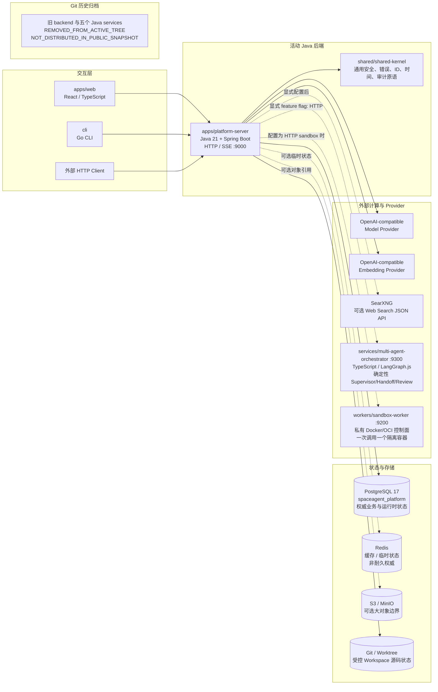

### 3.1 默认 Compose 运行单元

默认部署只需要：

1. `postgres`；
2. `database-init`；
3. `platform-server`。

TypeScript 编排服务和 OCI Sandbox Worker 不是默认依赖：

- `platform.sandbox.mode=in-process` 时工具使用 Java 内置安全子集；
- M18 Java adapter 仅在 `platform.multi-agent-orchestrator.mode=http` 时调用 TypeScript
  服务；M22 的 LangGraph state 仍只存在于单次 invocation，Delegation/Review/Handoff
  和 Workspace/Run 状态全部由 Java/PostgreSQL 持久化；默认仍为 `none`。

### 3.2 多副本与 Active-Active 边界

`platform-server` 可以以多个副本安全处理同一 Runtime 工作队列：

- PostgreSQL clock 决定 Worker Lease 过期，重新领取会增加 fencing token；
- 所有 AgentRun mutation 使用 expected-revision CAS，Continuation-driven resume 还校验
  当前 lease token/fence；
- `FOR UPDATE SKIP LOCKED` 保证一个 Continuation 同时只由一个副本领取；过期 claim 可被
  另一副本接管，旧 completion 会被拒绝；
- RunEvent append 在 Run row lock 内分配单调 sequence；JSON/SSE 以 exclusive sequence
  cursor 回放，SSE 使用 sequence 作为 event ID 并支持 `Last-Event-ID`；
- Redis、Trace 和进程锁均不是恢复状态源。

该 Active-Active 结论限定于 Java Runtime claim/mutation/Continuation/RunEvent 协调。外部
Provider/Tool side effect 不能与 PostgreSQL 原子提交，仍以各自 Ledger 的 Replay/UNKNOWN/
Reconciliation 规则为准。

## 4. Platform Server 功能模块图

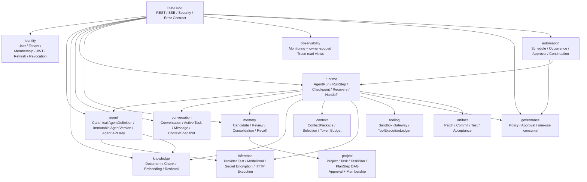

### 4.1 模块实现状态

| 模块 | 当前状态 | 已实现职责 | 不属于该模块的职责 |
| --- | --- | --- | --- |
| `integration` | 已实现 | HTTP/SSE、JWT 入口、授权过滤、兼容路径、稳定错误契约 | 不访问 Repository/Mapper，不编排模型/工具细节 |
| `identity` | 已实现 | 注册、登录、Organization/Tenant、唯一 OWNER、成员/邀请、所有权转移、退出、DELETING、CleanupJob/Step、Retention/Lease/Fencing/Retry、Owner 清理编排后的 DELETED Tombstone、Profile、密码 Hash、JWT/Refresh | 不拥有 Agent/Project/Conversation；邀请投递和客户端 Local Bridge 文件删除不属于服务端 |
| `agent` | 已实现 | Agent CRUD、不可变 AgentVersion、Draft/Review/Publish/Deprecate/Rollback、兼容自动发布、ModelPool 或 Provider/Model 互斥绑定、Knowledge Binding、Agent API Key | 不执行模型，不拥有 Run/Task；定时激活与独立 Reviewer 角色尚未实现 |
| `inference` | 已实现 | Provider/Model CRUD、加密 Secret、定时健康探测、Priority/Weighted/Cost/Latency 快照、已知安全逐尝试 Fallback、不可变价格、Organization 配额预算预留/结算与可信成本 | 不依赖其他业务模块；UNKNOWN 不自动 Fallback，缺失成本证据不估算 |
| `knowledge` | 已实现 | Document/Chunk、处理状态、HTTP Embedding、向量元数据、Retrieval/RAG | 不依赖 Agent/Conversation/Runtime |
| `conversation` | 已实现 | Conversation、PROJECT/CHAT scoped active Task bind/switch/clear、Message、消息序号、ContextSnapshot | 不充当 Agent orchestrator，不执行 TaskPlan |
| `context` | 已实现 | 贡献选择、去重、优先级、相关度、Token Budget、ContextPackage | ContextPackage 不作为独立耐久实体 |
| `memory` | 已实现 | Candidate、Review、Consolidation、USER/PROJECT/TASK scope、Recall | 普通聊天不自动写长期 Memory |
| `runtime` | 已实现 | tenant-aware AgentRun、Task/TaskPlan/PlanStep UUID binding、revision CAS、Worker Lease/Fencing、durable Continuation、RunEvent/SSE cursor、RunStep、Checkpoint、Recovery、Handoff、Chat 编排、pinned AgentVersion Tool/SkillVersion context dispatch、M53 Chat 审批/UNKNOWN 等待与同 Run 恢复、M54-PR3A Planner/review wait、M54-PR3B lease-fenced Chat PlanStep execution、M55-PR2 hash-only Skill use evidence、Workspace postcondition reconciliation coordinator | 不拥有 Project/AgentDefinition/Tool state；Provider/Tool side effect 不承诺 exactly-once |
| `tooling` | 已实现 Runtime Tool、Skill Registry/Runtime resolution、OCI Sandbox 与 GitHub MCP 后端闭环 | 16 项 JSON-Schema Tool Registry、Organization-scoped immutable SkillVersion draft/publish/deprecate、exact historical pin resolution、required Tool subset validation、bounded SearXNG/HTTP、版本化 MCP Publisher/ServerVersion/Transport/Installation、动态 advertised Tool、官方 GitHub Remote MCP Metadata/OAuth2+PKCE、加密 AuthRef/Refresh CAS、official SDK、repository search/discovery、Invocation/Tool Ledger、UNKNOWN fenced reconciliation、加密短期 checkout grant、Docker SDK disposable Sandbox | Skill 不授予权限或执行代码；MCP/command 无通用 UNKNOWN verifier；不承诺任意外部副作用 exactly-once |
| `project` | 已实现源码、Workspace、scoped Task/Plan 与本地 reviewed integration | PROJECT/CHAT Task 和 TaskPlan/PlanStep、Project Membership、SourceRepository、GitHub/Local Bridge、isolated Workspace、scoped File/List/Git/Document、ProjectBlueprint、mid-term Memory、SourceMergeJob、Git Base-SHA CAS/rollback | 不拥有 AgentRun/RunEvent/Artifact；CHAT Task 无 Project/Workspace；不更新远程分支 |
| `artifact` | Coding 基础已实现 | PATCH、COMMIT_PROPOSAL、TEST_REPORT、ACCEPTANCE_EVIDENCE metadata/hash/ref | 不拥有 Workspace/Runtime；大型对象仍需外部存储 |
| `observability` | 已实现 | tenant-scoped Overview/Usage/Realtime/Session、owner-scoped Trace list/detail/stats、可信已结算 Model 成本与脱敏关联、Runtime-backed stop；Micrometer/Prometheus、可选 OpenTelemetry OTLP、低基数 Agent SLO 指标、Grafana/Alertmanager | SQL views 和外部 telemetry 都是 disposable projection；未定价/未完整结算时 cost=null；Trace/metrics 不是 recovery truth |
| `governance` | 已实现 Coding/Network/SourceMerge/Chat 审批基础 | Organization Policy、ApprovalRequest/Decision、TTL、职责分离、精确 actor/action/resource/hash 绑定、一次性消费、Runtime network/document、Coding file/command、通用 Chat same-Run resume 与 reviewed local merge gate | 不拥有 Runtime/Tool/Project state；Inference quota/budget 由 Inference 拥有；MCP/command UNKNOWN 调和与 retention 尚未实现 |
| `automation` | 已实现 Schedule/Execution 基础 | periodic/one-time/manual、Spring Cron/IANA timezone、PostgreSQL clock/SKIP LOCKED、unique fire key、Governance wait、pinned AgentVersion、Conversation/AgentRun、Continuation/fenced prepared Chat、at-most-once/UNKNOWN、执行历史 UI | 无 Redis/Bull truth；Webhook/Repository Event/Task trigger 与 effect-aware 自动重试尚未实现 |

### 4.2 模块内部四层结构

每个业务模块遵循：

```text
<module>/
├── api/             对其他模块公开的 Command、View、Application API、Ownership Port
├── application/     用例、业务协调、事务编排
├── domain/          Framework-independent Entity、Value Object、Domain Port
└── infrastructure/  PostgreSQL、HTTP Client、Spring Configuration、外部 Adapter
```

跨模块调用必须经过 `api`，禁止：

- Controller 直接访问 Repository/Mapper；
- 一个模块导入另一个模块的 persistence implementation；
- Domain 依赖 Spring、MyBatis、LangChain4j、Provider SDK；
- Conversation 或 AgentDefinition 持有 Runtime/Project/Task 状态。

## 5. 当前 HTTP 功能入口

| 业务域 | 主要入口 | 能力 |
| --- | --- | --- |
| Identity | `/auth/register`、`/auth/login`、`/auth/refresh`、`/auth/logout`、`/users/me` | 身份、会话、Profile、Token Lifecycle |
| Organization | `/api/v1/organizations`、`/{id}/switch`、`/{id}/members`、`/{id}/invitations`、`/organization-invitations/accept`、`/public/organization-invitations/preview`、`/transfer-owner`、`/leave` | 创建/列表/Active Context、现有用户绑定、哈希令牌邀请、角色、唯一 OWNER、退出和 DELETING |
| Agent | `/api/v1/agents`、`/{agentId}/versions/**` | Agent CRUD、ModelPool/直连模型配置、不可变 Draft、Review、Publish、Deprecate、Rollback、Knowledge Binding |
| Agent API Key | `/agents/{id}/keys`、`/internal/agents/api-keys/verify` | 一次性 raw key、Hash 持久化、验证、撤销 |
| Provider/Model | `/api/v1/model-providers`、`/{providerId}/models`、`/{providerId}/test` | Provider、Model、加密 Secret、默认模型、连接测试与耐久健康状态 |
| ModelPool | `/api/v1/model-pools`、`/{poolId}/members`、`/activate`、`/disable`、`/resolution` | PRIVATE/ORGANIZATION 可见性、Owner 写权限、Priority/Fallback 成员解析 |
| Knowledge | `/api/v1/knowledge/documents`、`/process`、`/retrieve` | 文档、Chunk、Embedding、RAG、删除 |
| Conversation | `/api/v1/chat/conversations`、`/{id}/active-task`、`/{id}/tasks` | 会话 CRUD、PROJECT/CHAT active Task focus、消息与 Chat Root Task 历史 |
| Chat TaskPlan | `/api/v1/chat/conversations/{conversationId}/tasks/{rootTaskId}/plans`、`/approve`、`/activate`、`/cancel` | Java 持久化 LangGraph proposal、生成 Child Task/PlanStep DAG、owner review 与单 ACTIVE plan |
| Chat | `/api/v1/chat/messages`、`/runs/{runId}/resume-plan`、`/resume-approval`、`/tools/{toolCallId}/reconcile` | 同步 Runtime Chat、reviewed plan DAG execution、Tool wait/reconcile continuation |
| Chat SSE | `/api/v1/chat/messages/stream` | Runtime Event、Delta、Done Contract |
| Runtime Event | `/api/v1/runtime/runs/{runId}/events`、`/events/stream` | exclusive sequence replay、SSE event ID、`Last-Event-ID` 跨副本恢复 |
| Recovery | `/api/v1/chat/runs/{runId}/recover` | 从持久化 Checkpoint 重建并创建 fenced `RESUME_RUN` Continuation |
| Runtime Worker | `/api/v1/internal/runtime/leases/**`、`/continuations/**` | internal-token Worker Lease、Heartbeat、Claim、Complete/Fail |
| Monitoring | `/api/v1/monitoring/overview`、`/usage`、`/realtime`、`/sessions` | Active Organization OWNER/ADMIN operations、usage/read views、Runtime-backed stop |
| Memory | `/api/v1/memory`、`/candidates`、`/review`、`/consolidate` | Scope 授权、Candidate、Recall、Consolidation |
| Project | `/api/v1/projects`、`/{id}`、`/{id}/members` | Tenant-scoped CRUD、逻辑归档、OWNER/ADMIN/MEMBER/VIEWER Membership |
| Task | `/api/v1/projects/{projectId}/tasks`、`/{taskId}`、状态动作路径 | durable intent、parent ancestry、PENDING/READY/IN_PROGRESS/BLOCKED/终态 lifecycle |
| TaskPlan | `/api/v1/projects/{projectId}/tasks/{rootTaskId}/plans`、`/propose`、`/approve`、`/activate`、`/complete`、`/cancel` | immutable plan versions、direct-child PlanSteps、normalized DAG、approval、single ACTIVE plan |

## 6. Identity 与认证业务流程

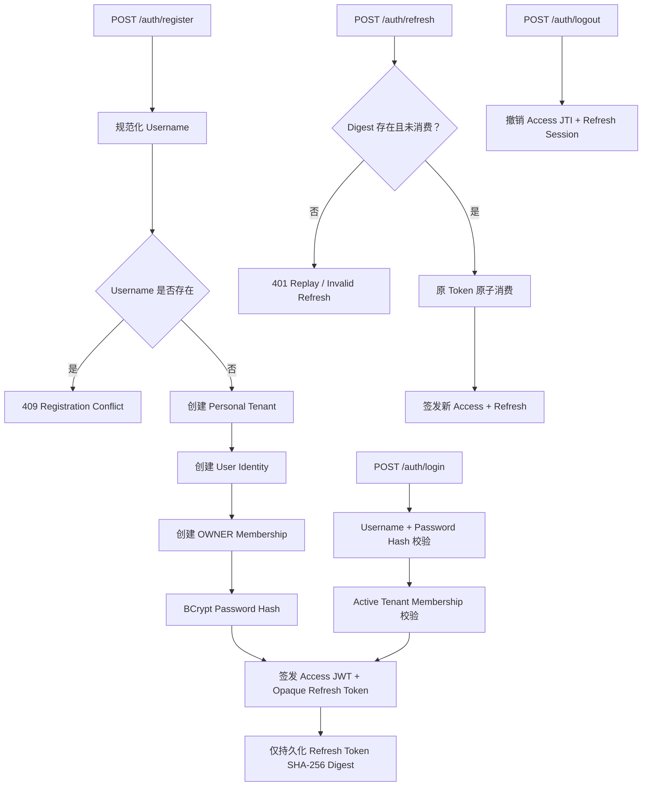

### 6.1 每次受保护请求的安全链

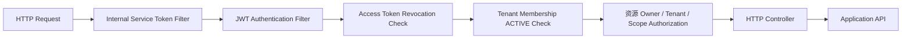

### 6.2 Organization 生命周期

```text
Register
  -> Personal Organization（物理复用 platform_tenants）
  -> User
  -> creatorUserId + 唯一 ACTIVE OWNER Membership
  -> Organization-scoped Access/Refresh Session

Create Organization
  -> 当前用户成为 OWNER
  -> 绑定已注册用户为 ADMIN/MEMBER/VIEWER
  -> Switch 重新签发 organization_id == tenant_id 的 Token
  -> Role 变化后旧角色 Token 立即因数据库 Role 不一致而拒绝
  -> OWNER 转移后才能离开非空 Organization
  -> 最后一名成员离开 -> DELETING + 立即拒绝访问
```

用户可以属于多个 Organization。`platform_users.tenant_id` 继续保留最初注册组织作为兼容
Primary Reference；如果 Primary 已进入 DELETING，后续登录会选择用户最早加入的其他 ACTIVE
Organization。M25-PR1 已实现 Organization 邀请的哈希令牌、有效期、撤销、掩码公开预览、
登录身份邮箱绑定、原子接受与防重放；令牌投递/UI 尚未实现。M25-PR2C 已实现 DELETING
资源物理清理 Worker、模块参与者、Git 清理、租约排空和最终 Tombstone。

## 7. Agent、Provider 与 Knowledge 配置流程

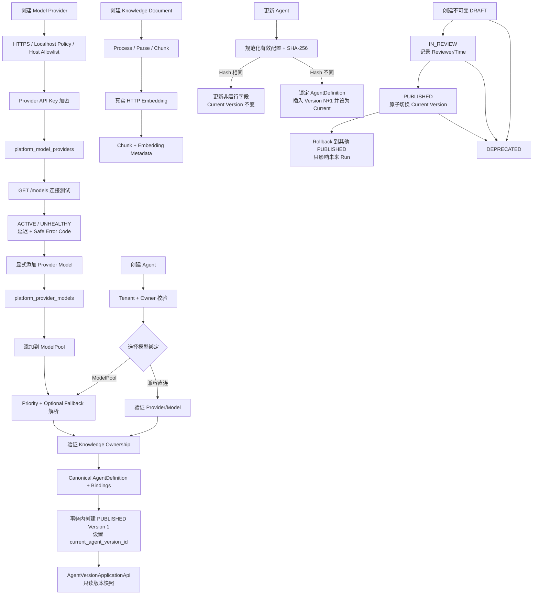

关键安全点：

- Provider Secret 只在 inference infrastructure 中解密；
- Provider GET/List 只返回 `configured` 状态，不返回原始 Secret；
- Provider 连接测试响应与持久化只保留发现的模型 ID、延迟和固定错误码，不暴露响应体、异常消息或 Secret；
- 只有已启用、连接状态为 ACTIVE 且已显式配置的 Provider Model 才能加入 ModelPool；
- ModelPool 变更仅允许 Owner，PRIVATE 仅 Owner 可见，ORGANIZATION 对当前组织成员可见；
- AgentVersion 的 `modelPoolId` 与直连 Provider/Model 互斥；历史直连版本及其 Config Hash 保持兼容；
- Agent API Key 只在创建时返回一次 raw key，数据库只保存 Hash；
- AgentDefinition 不保存 Provider/Model、Prompt 或运行策略；这些只存在于 AgentVersion；
- Agent 只保存 Knowledge 绑定引用，不读取 Knowledge persistence implementation；
- 产品 API 原 `platform_agent_configurations.id` 已原位提升为唯一 canonical `agentId`，
  Conversation、API Key、Version 和 Run 均保留该 ID；
- AgentVersion 不保存 Provider Secret，Repository 不提供快照更新或删除方法。

AgentVersion 配置快照始终不可变，显式生命周期为
`DRAFT -> IN_REVIEW -> PUBLISHED -> DEPRECATED`。Publish 必须经过 Review；Rollback
只能选择其他 PUBLISHED 版本并只影响未来 Run。现有 Agent create/update 自动发布继续作为
兼容路径；定时激活和独立 Reviewer/Approver 角色尚未实现。

## 8. Chat 核心业务全链路

```mermaid
flowchart TD
    CHAT["POST /chat/messages<br/>或 /messages/stream"] --> AUTH["JWT + Tenant + Resource Authorization"]
    AUTH --> AGENTVERSION["解析 Current AgentVersion<br/>加载不可变 Runtime Snapshot"]
    AGENTVERSION --> MODELSELECT["ModelPool 解析主候选<br/>或兼容直连 Provider/Model"]
    MODELSELECT --> CONV["创建或校验 Conversation"]
    CONV --> RUN["Runtime.startRun<br/>持久化 agent_id + agent_version_id"]
    RUN --> RUNNING["AgentRun -> IN_PROGRESS"]
    RUNNING --> STEP["创建 chat-runtime RunStep"]
    STEP --> CP1["Checkpoint: request-received<br/>Pool/Provider/Model Selection Evidence"]
    CP1 --> USERMSG["持久化 USER Message"]
    USERMSG --> CP2["Checkpoint: message-persisted"]

    CP2 --> MEMRECALL["Recall USER Memory"]
    CP2 --> RAG["Knowledge Retrieval"]
    MEMRECALL --> CONTEXT["ContextCompiler"]
    RAG --> CONTEXT
    CONTEXT --> CP3["Checkpoint: context-compiled"]
    CP3 --> INFERENCE["InferenceExecutionApi<br/>稳定 logicalCallId + requestHash"]
    INFERENCE --> MODELCLAIM["ModelCallLedger 原子 Claim"]
    MODELCLAIM -->|CLAIMED| PROVIDER["事务外 OpenAI-compatible HTTP Provider"]
    MODELCLAIM -->|REPLAY| RESPONSE
    MODELCLAIM -->|BUSY / UNKNOWN / CONFLICT| STOP["不调用 Provider"]
    PROVIDER --> RESPONSE["Content + Usage + optional Tool Calls"]
    RESPONSE --> MODELCOMPLETE["Fenced Completion<br/>token + revision + active lease"]
    MODELCOMPLETE --> CP4["Checkpoint: inference-completed"]
    CP4 --> TOOLQ{"存在 Tool Calls？"}

    TOOLQ -->|否| SKIPTOOL["Checkpoint: tooling-skipped"]
    TOOLQ -->|是| TOOLFLOW["Runtime Tool Dispatcher<br/>Schema + Scope + Governance + Ledger"]
    TOOLFLOW -->|Approval Required| WAITAPPROVAL["chat-approval/v1 Checkpoint<br/>Run WAITING_FOR_USER"]
    WAITAPPROVAL --> RESUME["Exact Approval ID + Worker Lease<br/>same Run / same ToolCall"]
    RESUME --> TOOLFLOW
    SKIPTOOL --> ASSEMBLE["组装 Assistant Message"]
    TOOLFLOW --> ASSEMBLE

    ASSEMBLE --> ASSISTANT["持久化 ASSISTANT Message"]
    ASSISTANT --> SNAPSHOT["保存 ConversationContextSnapshot"]
    SNAPSHOT --> CP5["Checkpoint: conversation-persisted"]
    CP5 --> MEMEVAL["Memory Candidate Evaluation"]
    MEMEVAL --> CP6["Checkpoint: memory-evaluated"]
    CP6 --> COMPLETESTEP["RunStep -> COMPLETED"]
    COMPLETESTEP --> FINALCP["Checkpoint: completed"]
    FINALCP --> COMPLETERUN["AgentRun -> COMPLETED"]
    COMPLETERUN --> OUTPUT["JSON 或 SSE Response"]
```

### 8.1 ContextPackage 组成

Runtime 将不同来源整理为显式 contribution，再交给 ContextCompiler：

| 来源 | 内容 | 默认作用 |
| --- | --- | --- |
| `SYSTEM` | Agent System Prompt | 最高优先级行为约束 |
| `CONVERSATION` | 历史 USER/ASSISTANT Message | 当前对话连续性 |
| `MEMORY` | 已授权、已 Consolidate 的长期 Memory | 用户/项目/任务长期上下文 |
| `KNOWLEDGE` | RAG Retrieval Matches | 外部知识证据 |
| 当前 USER Message | 本轮请求 | 最终模型输入 |

ContextCompiler 负责：

- 去重；
- Priority 排序；
- Relevance 排序；
- Token Cost 估算；
- 在 `maxContextTokens - maxOutputTokens` 预算内选择内容；
- 生成只在本轮使用的 `ContextPackage`。

`ContextPackage` 不单独持久化；可恢复信息由 Message、ConversationSnapshot 和 Checkpoint 提供。

### 8.2 SSE 实现语义

当前 SSE Contract：

```text
Runtime 执行完成
  -> 发送 runtime_started / inference_completed / tool_call / tool_result / ...
  -> 将最终 Assistant Message 切成 delta
  -> 发送且只发送一个 done
```

因此当前 SSE 是 Runtime 结果的事件化输出，不是 Model Provider 到 Browser 的逐 Token 原生透传。

M23 另外提供 durable Runtime Event SSE。它不伪装成 Provider token stream，而是读取
PostgreSQL `platform_run_events`：客户端传 exclusive `after` 或 `Last-Event-ID`，服务端把
每条 RunEvent sequence 写入 SSE `id`。连接断开后可以连到任意副本，只读取 cursor 之后的
事件；连接本身可丢失，数据库事件不会丢失。

### 8.3 ModelCallLedger 状态与重放

默认 Chat 使用 `chat RunStep ID + :inference:0` 作为同一 AgentRun 内稳定的
`logicalCallId`。`request_hash` 覆盖 Provider/Model、按顺序排列的 System/Context/User
消息、Temperature、Max Output Tokens、其他模型参数以及完整 Tool Schema；Map/JSON
字段按稳定顺序规范化，不包含 API Key。

| 当前状态/条件 | Claim 结果 | 是否调用 Provider |
| --- | --- | --- |
| ABSENT | 插入 `RUNNING`，CLAIMED，revision=1 | 是，仅 Claim Holder |
| RUNNING + valid lease | BUSY | 否 |
| RUNNING + expired lease | 原子转 `UNKNOWN` | 否 |
| UNKNOWN | UNKNOWN | 否 |
| terminal + same RequestHash | REPLAY 标准 Response/Usage 或受控错误 | 否 |
| any + different RequestHash | CONFLICT，原 Hash 不变 | 否 |
| RUNNING + matching token/revision/lease | `SUCCEEDED/FAILED/TIMED_OUT/CANCELLED` | 已完成一次调用 |
| RUNNING + wrong token/stale revision | CLAIM_LOST | 否，不覆盖当前记录 |

Provider 调用不持有数据库锁。SUCCEEDED 保存 Content、Tool Calls、Finish Reason、
Usage 与 Provider Request ID，可重建当前标准化推理结果。读超时、连接重置、截断/
不可解析响应等调用后歧义进入 UNKNOWN；过期 Claim 不接管。Provider 已返回但本地
Completion 写入失败时记录先保持 RUNNING，Lease 过期后转 UNKNOWN，不自动再次计费。

## 9. Tool 与幂等执行链路

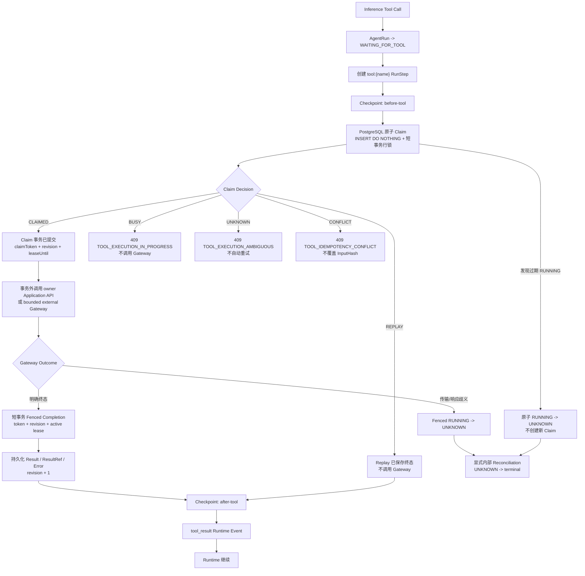

数据库唯一约束：

```text
UNIQUE(agent_run_id, tool_call_id)
```

M10-PR1 后 ToolExecutionLedger 已实现：

- 唯一逻辑键 `(agentRunId, toolCallId)`；
- PostgreSQL 原子决定 `CLAIMED / REPLAY / BUSY / UNKNOWN / CONFLICT`；
- 同一逻辑调用最多只有一个有效 Claim Holder 可以进入 Gateway；
- `input_hash` 创建后不被普通 Claim/Completion/Reconciliation SQL 更新；
- 相同 InputHash 的已保存终态结果 Replay；
- 有效 `RUNNING` 返回 BUSY，过期 `RUNNING` 原子转为 UNKNOWN；

- Completion 使用 `claim_token + expected revision + active lease` fencing；
- `UNKNOWN` 不自动重试，只能通过显式内部 Reconciliation 转成终态；
- 外部 Gateway 调用发生在 Claim 事务提交后，Completion 使用新的短事务。

### 9.1 Tool Claim 状态转换

| 当前状态/条件 | 操作结果 | 是否调用 Gateway |
| --- | --- | --- |
| ABSENT | `RUNNING`，返回 CLAIMED，revision=1 | 是，仅 Claim Holder |
| RUNNING + valid lease | BUSY | 否 |
| RUNNING + expired lease | `UNKNOWN`，revision+1 | 否 |
| UNKNOWN | UNKNOWN | 否 |
| terminal + same InputHash | REPLAY | 否 |
| any + different InputHash | CONFLICT | 否 |
| RUNNING + matching token/revision/lease | terminal，revision+1 | 已完成一次外部调用 |
| RUNNING + wrong token/stale revision | CLAIM_LOST | 否，不覆盖当前记录 |
| UNKNOWN + evidence + matching revision | terminal，revision+1 | 否，显式 Reconciliation |

### 9.2 崩溃与 exactly-once 边界

Claim 提交后但 Tool 调用前崩溃，或 Tool 已产生副作用但终态尚未落库时，记录会暂时保持 `RUNNING`；Lease 过期后的下一次 inspect/claim 会把它原子转为 `UNKNOWN`，不会自动接管执行。M53-PR2 可通过只读 OCI 后置状态核验调和 Document/Coding write/delete；不支持的 Tool 继续保持 UNKNOWN。

该设计提供单 Claim Holder、fenced ledger updates 和安全终态 Replay，但不能把外部系统的副作用与本地 PostgreSQL 事务原子提交，因此不承诺外部副作用 exactly-once。

### 9.3 M33 executable Runtime Tool catalog

| Tool family | IDs | Current boundary |
| --- | --- | --- |
| compatibility | `echo` | Existing Sandbox ledger; `tool:echo` remains an alias |
| network | `web_search`, `http_fetch` | Agent network flag + Governance + public HTTPS; Web Search requires configured SearXNG |
| knowledge | `knowledge_search` | Only the pinned AgentVersion's enabled Knowledge bindings |
| Workspace read | `file_read`, `file_list`, `git_status`, `git_diff`, `document_read` | Run tenant/Project/Task + READY writable managed Workspace; relative non-symlink paths and bounded output |
| MCP/GitHub | `mcp_call`, `github_search_repositories`, `github_get_repository` | Authorized Marketplace Connection, advertised schema/annotations, official/custom GitHub MCP mapping |
| mutation | `document_write`, `coding_write_file`, `coding_delete_file`, `coding_run_command` | Governance, atomic document/file changes; command uses authenticated disposable OCI Sandbox plus Coding Ledger/Checkpoint/Artifact; ambiguity becomes UNKNOWN |

Agent create/update/version validation, model Tool definitions and Runtime dispatch read the same
catalog. Unknown/unavailable/unpinned Tools and invalid JSON arguments fail before execution.
Tooling owns external calls and ledger, Project owns Workspace bytes/Git, Knowledge owns retrieval,
and Runtime stores no duplicate result authority.

## 10. Memory 授权与生命周期

### 10.1 所有 Memory HTTP 操作共用同一授权 Policy

适用入口：

- Candidate POST；
- Candidate GET；
- Candidate Review；
- Recall；
- Consolidate。

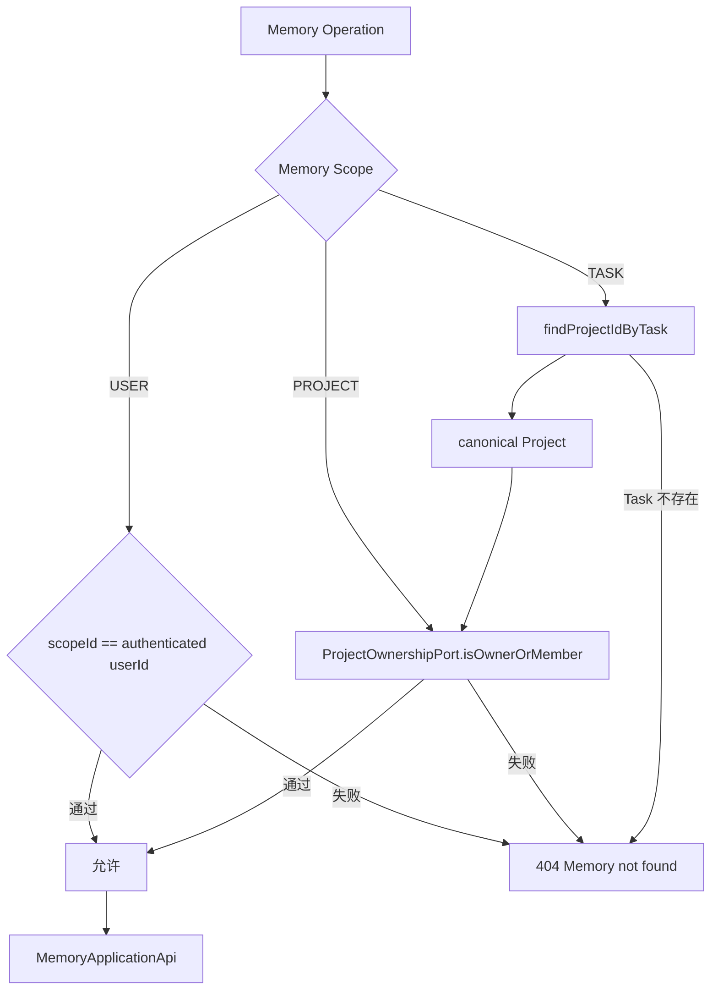

当前 Project 模块以 PostgreSQL Project/Membership 为权威状态，
`PostgresProjectOwnershipAdapter` 已替换默认 fail-closed Provider：

- USER scope 正常工作；
- PROJECT scope 由 OWNER/ADMIN/MEMBER 的活动 Tenant + Project Membership 授权；
- VIEWER 可查看 Project，但不能访问 PROJECT Memory；
- TASK scope 通过权威 `platform_tasks.project_id` 解析 canonical Project，再复用 OWNER/ADMIN/MEMBER 授权；
- 不再使用 Conversation participant 推断 Memory ownership；
- 不允许通过自己的 Conversation 向其他用户 Scope 注入 Candidate。

### 10.2 Memory 生成和 Consolidation

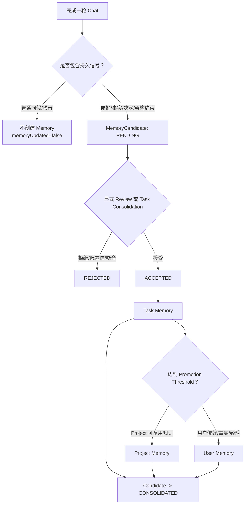

Candidate 状态：

```text
PENDING -> ACCEPTED / REJECTED -> CONSOLIDATED
                                 -> EXPIRED（模型已预留）
```

## 11. Runtime 状态机与 Checkpoint

### 11.1 AgentRun 状态

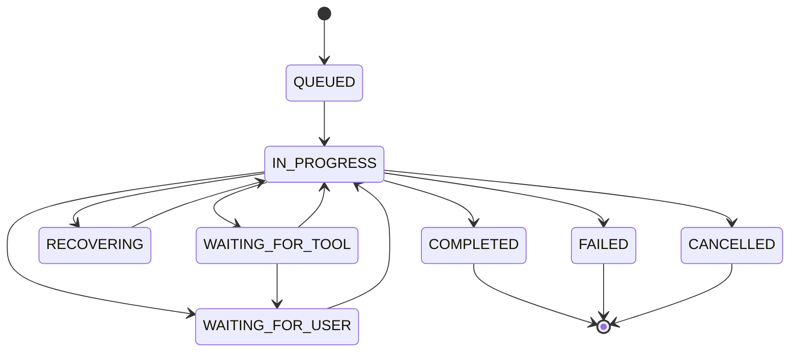

当前 Application Service 的 RunStep 状态转换：

```text
PENDING -> COMPLETED
        -> FAILED
```

`IN_PROGRESS` 会被恢复逻辑识别为未完成 Step，但当前 API 没有独立的
`markStepInProgress` 操作；`SKIPPED` 和 AgentRun 的 `CHECKPOINTING` 状态已在领域枚举中预留，
当前 Chat 主链不主动写入这些状态。

所有新 Run 的 `StartAgentRunCommand` 强制要求 canonical `agentId` 与 `agentVersionId`，
并校验 Version 归属。AgentRun 创建后两个引用不可切换；更新 Agent 只影响后续 Run。旧数据库记录允许版本字段为 NULL，并按
`LEGACY_UNVERSIONED` 处理，不推断其历史配置。

### 11.2 Chat Checkpoint 阶段

当前 Chat Runtime 在以下边界写入耐久 Checkpoint：

1. `request-received`；
2. `message-persisted`；
3. `context-compiled`；
4. `inference-completed`；
5. `tooling-skipped` 或 `before-tool` / `after-tool`；
6. `conversation-persisted`；
7. `memory-evaluated`；
8. `completed`。

## 12. Recovery 与重启恢复链路

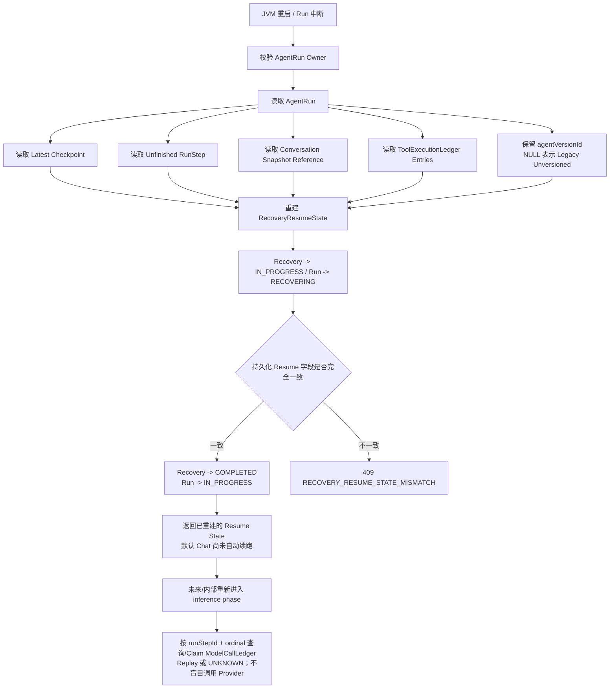

当前 Recovery 能够从 PostgreSQL 重建 `RecoveryResumeState`，比对调用方提交的耐久字段，并在一致时将 Recovery 标记为 `COMPLETED`、将 AgentRun 恢复为 `IN_PROGRESS`。默认 Chat `/recover` 随后只返回恢复信息；当前不会自动继续模型调用、工具执行或消息落库。

真正的异步 Resume/Continuation 尚未实现，计划由后续 Durable Task Runtime 承担。当前不能把“恢复状态被接受”描述为“业务执行已从 Checkpoint 自动续跑”。

恢复依据只来自 Java/PostgreSQL：

- AgentRun；
- AgentRun 固定的 AgentVersion ID；
- Latest Checkpoint；
- Unfinished RunStep；
- ConversationContextSnapshot；
- ToolExecutionLedger；
- 同一推理阶段重新进入时由 InferenceExecutionApi 查询的 ModelCallLedger；
- Project/Task/Conversation/Agent 等 ID Reference。

ModelCallLedger 尚未嵌入当前 `RecoveryResumeState` DTO，且 `/recover` 不会自动重新进入
推理；它为未来或内部同一 AgentRun/RunStep 的确定性重新进入提供 Claim/Replay/UNKNOWN
依据，不应被描述成已经实现自动 Continuation。

不使用以下内容作为权威恢复源：

- Python 进程内存；
- JVM 内存缓存；
- Redis；
- 重新读取完整 Conversation 后猜测执行位置。

## 13. Knowledge 处理与 Retrieval 链路

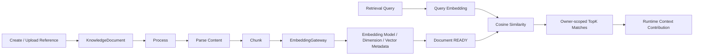

生产 PostgreSQL 模式要求真实 HTTP Embedding；`deterministic` 只允许测试配置。

## 14. 错误契约与日志安全链路

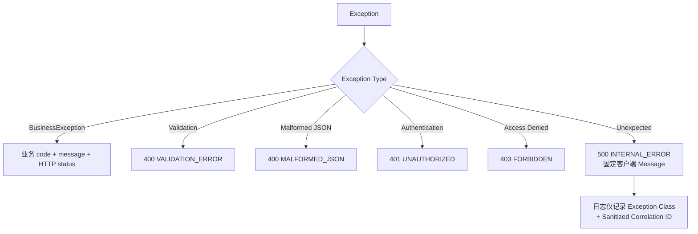

Unexpected exception 日志禁止记录：

- `exception.getMessage()`；
- Exception Stack Trace；
- JDBC URL / Password Detail；
- Provider URL / API Secret；
- Token-like String。

客户端仍只收到稳定契约：

```json
{
  "code": "INTERNAL_ERROR",
  "message": "An unexpected error occurred",
  "details": [],
  "timestamp": "..."
}
```

## 15. PostgreSQL 状态归属

### 15.1 Identity

| 表 | 作用 |
| --- | --- |
| `platform_tenants` | Organization/Tenant、唯一 creator/OWNER 指针、ACTIVE/SUSPENDED/DELETING/DELETED 生命周期 |
| `platform_users` | 用户身份 |
| `platform_user_profiles` | 用户 Profile |
| `platform_user_credentials` | Username + Password Hash |
| `platform_tenant_memberships` | Role、ACTIVE/SUSPENDED Membership |
| `platform_refresh_tokens` | Opaque Refresh Token Digest 与 Rotation State |
| `platform_access_token_revocations` | Access JTI 撤销 |
| `platform_organization_invitations` | Organization 邀请角色、SHA-256 Token Digest、有效期和终态证据；不存明文 Token |
| `platform_organization_cleanup_jobs` | 空 Organization 清理 Job、Retention、Claim Lease/Fencing、Retry/BLOCKED/Completion Guard |
| `platform_organization_cleanup_steps` | ADR-025 固定顺序的 Owner Step、Attempt、安全错误摘要和完成证据 |

### 15.2 Agent 与 Inference

| 表 | 作用 |
| --- | --- |
| `platform_agent_definitions` | 唯一 canonical Agent 身份、Owner/Tenant、元数据、生命周期、Current Version |
| `platform_legacy_agent_definitions` | 无可靠映射的旧 Definition 行；reference-only，无活动 Java Repository |
| `platform_agent_versions` | 不可变 DRAFT/IN_REVIEW/PUBLISHED/DEPRECATED 快照、Lifecycle Actor/Time、ModelPool/直连互斥绑定、config_hash、Version Number |
| `platform_agent_knowledge_bindings` | Agent → Knowledge Reference |
| `platform_agent_api_keys` | Agent API Key Hash、Scope、Expiry、Revocation |
| `platform_model_providers` | Provider 配置与加密 Secret |
| `platform_provider_models` | Provider Model 列表 |
| `platform_model_pools` | Organization/Owner、可见性、Priority 路由、Fallback 与生命周期 |
| `platform_model_pool_members` | Pool → ProviderModel、优先级、权重元数据与启用状态 |
| `platform_model_call_ledger` | ModelCall 原子 Claim、RequestHash、Provider/Model、标准 Response/Usage、Provider Request ID、Fencing 与 UNKNOWN |

### 15.3 Knowledge、Conversation 与 Memory

| 表 | 作用 |
| --- | --- |
| `platform_knowledge_documents` | Document 生命周期与 Owner |
| `platform_knowledge_chunks` | Chunk、Embedding Metadata/Vector |
| `platform_conversations` | Conversation、Tenant/User/Agent、validated active Task Reference；legacy task_id 保留兼容 |
| `platform_messages` | 有序 USER/ASSISTANT Message |
| `platform_memory_candidates` | Scope、Kind、Confidence、Candidate State |
| `platform_consolidated_memories` | USER/PROJECT/TASK 长期 Memory |

### 15.4 Project、Task 与 TaskPlan

| 表 | 作用 |
| --- | --- |
| `platform_projects` | Project identity/lifecycle |
| `platform_project_memberships` | Project-local OWNER/ADMIN/MEMBER/VIEWER |
| `platform_tasks` | durable intent/lifecycle、parent ancestry、current TaskPlan pointer |
| `platform_task_plans` | immutable version identity、DRAFT/PROPOSED/APPROVED/ACTIVE/COMPLETED/CANCELLED、approval evidence |
| `platform_plan_steps` | direct child Task、expected output、acceptance、preferred Agent/capability、execution-state placeholder |
| `platform_plan_step_dependencies` | normalized same-plan DAG edges |

### 15.5 Runtime 与 Tooling

| 表 | 作用 |
| --- | --- |
| `platform_agent_runs` | AgentRun Root；固定 canonical `agent_id`，新 Run 固定 `agent_version_id`，旧 Run 版本可为 NULL |
| `platform_run_steps` | RunStep 序列 |
| `platform_run_checkpoints` | 耐久执行 Checkpoint |
| `platform_run_recoveries` | Recovery Attempt |
| `platform_run_handoffs` | Typed Handoff Snapshot |
| `platform_tool_execution_ledger` | 原子 Claim、输入 Hash、claim token/owner、lease、revision、终态 Replay、UNKNOWN 与 Reconciliation Evidence |
| `platform_mcp_marketplace_entries` | MCP 市场目录与能力 Manifest；V1027 内置 GitHub/Custom HTTP |
| `platform_mcp_installations` | User/Organization scoped 安装与生命周期 |
| `platform_mcp_connections` | HTTPS Endpoint、AES-GCM AuthRef、OAuth/连接状态与 Revision |
| `platform_conversation_context_snapshots` | Conversation Compact Snapshot |

### 15.6 Migration Evidence

| 表 | 作用 |
| --- | --- |
| `platform_migration_runs` | Migration Job 执行记录 |
| `platform_migration_watermarks` | Source/Target Watermark |
| `platform_migration_id_map` | Legacy → Platform ID 映射 |

## 16. 状态权威关系

| 状态类型 | 权威 Owner | 非权威/可重建副本 |
| --- | --- | --- |
| Identity、Agent、Conversation、Knowledge、Memory、Provider、ModelPool | PostgreSQL | JVM Cache、响应 DTO |
| Agent Identity/Lifecycle | PostgreSQL `platform_agent_definitions` | HTTP/Conversation/API Key 中的同值引用 |
| Agent Version Snapshot | PostgreSQL `platform_agent_versions` | AgentDefinition 的 current-version 指针；不得作为旧 Run 历史替代 |
| AgentRun、RunStep、Checkpoint、Recovery | PostgreSQL Runtime Ledger | Python/JVM 当前执行上下文 |
| Tool Execution Ledger State | PostgreSQL ToolExecutionLedger | Worker Response；外部副作用可能因 crash-before-terminal 而处于 UNKNOWN |
| Model Call Ledger State | PostgreSQL ModelCallLedger | Provider Response/Usage；生成或计费可能因 crash-before-terminal 而处于 UNKNOWN |
| SourceRepository/Connection/Bridge Metadata | PostgreSQL | HTTP/CLI secret-free DTO |
| Client Local Root | CLI/Desktop mode-0600 local mapping | 服务器仅持有 opaque rootHandle |
| Source Workspace | Git/isolated Worktree + PostgreSQL Workspace metadata | 临时构建输出 |
| Cache、Rate Window、短期锁 | Redis | 可过期、可重建 |
| Large Object | S3/MinIO Reference（配置时） | PostgreSQL Metadata |

## 17. Java 与 Python 的责任边界

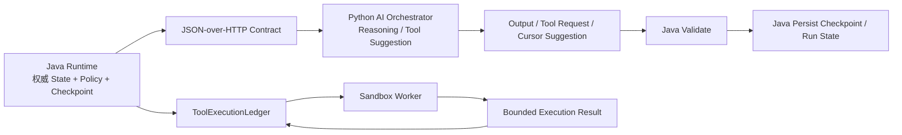

Python 不允许：

- 连接业务 PostgreSQL 并拥有 Project/Task/Conversation/Memory；
- 将 LangGraph Checkpoint 当作系统恢复源；
- 绕过 Java ToolExecutionLedger 执行可产生副作用的工具；
- 修改 Java AgentRun/Checkpoint 的最终状态。

当前这是架构责任约束，而不是完整网络安全边界。`sandbox-worker` HTTP `/execute` 当前没有认证；如果错误暴露到不可信网络，调用方可能绕过 Java ToolExecutionLedger 直接请求 Worker。因此 Worker 必须保持在受信网络内，直至补充服务认证和网络隔离。

### 17.1 TypeScript Multi-Agent 目标与 M17 Skeleton

Multi-Agent 不使用 Python AI-orchestrator，而由 TypeScript/LangGraph.js
实现 Supervisor、Subagent、Handoff、TaskPlan reasoning 和结果汇总。Java 继续拥有
Organization、Provider Secret、ModelPool、AgentVersion、Task/Plan、Runtime、Checkpoint、
Model/Tool Ledger、Memory、Workspace Metadata 和全部副作用。TypeScript 不直连业务
PostgreSQL、不读取 Provider Secret、不直接执行 Git/MCP/Tool 写操作。

M17 已交付 `services/multi-agent-orchestrator` 的确定性骨架：真实 LangGraph.js
StateGraph、strict Zod codecs、framework-neutral `multi-agent/v1` JSON Schema/fixtures、
bounded HTTP adapter 和 Java/TS contract tests。M18 已加入默认关闭的 Java HTTP adapter，
校验 correlation 后把 accepted command 写入 Java RunEvent 并推进 durable cursor。M22 已加入
specialist、Handoff、Reviewer 路由与严格 contract：Java 校验 Organization/AgentVersion、
TaskPlan/PlanStep/Artifact scope，持久化 Delegation/Review，按 `isolationKey` 创建独立 child
Workspace，启动 pinned Coding Run，并在 Reviewer 批准后完成 Handoff/Delegation。

当前 TypeScript 仍无业务数据库、durable checkpointer、Provider Secret 或 Tool/Git side
effect。M28-PR1 的 Provider-backed reasoning 只消费 Java 返回的标准化模型结果，并由
Java ModelCallLedger/预算/ModelPool 负责副作用与恢复；远程自动合并、默认 Java 路由切换和长周期
Graph 自动续跑仍未实现。

### 17.2 M19 SourceRepository / GitHub / Local Bridge

M19 已交付 Project-owned SourceRepository API/PostgreSQL，支持无需连接的 public GitHub
metadata import、用户私有仓库的 OAuth connection、authenticated repository listing、连接撤销
和 duplicate/tenant/Project-role protection。OAuth state 是一次性 SHA-256 digest，十分钟过期并
绑定 Tenant/User；GitHub access token 使用独立 AES-GCM key 加密，任何 read view 均不返回 Token。

Local Workspace Bridge 由 Go CLI 在本机解析/校验目录，向 Java 只提交随机 `rootHandle`、设备与
显示信息。绝对路径和 Bridge Token 仅保存在 `~/.spaceagent/workspace-bridges/<profile>.json`
的 mode-0600 文件中；平台只存 token hash/rootHandle/heartbeat。M19 不 clone、不读取本地文件、
M20 已基于这些引用 provision isolated Workspace：managed Git 在配置根目录下执行，LOCAL
通过 Bridge command 完成，服务端仍不接收本地绝对路径。

M60 在该边界上增加 owner/Bridge-authenticated、可恢复的本地源码复制：Project/PostgreSQL
持有 expiring session、bounded chunk metadata 与 `MANAGED_SNAPSHOT` 的 opaque snapshot ref、
manifest/content hash。Finalize 只发布 immutable Source，不创建 Directory/Task/Workspace；正常
Coding 通过 OCI Sandbox 将只读 Source snapshot 物化到唯一可写 Workspace 并创建本地 Git baseline。
过期与 Organization cleanup 都先删除受管字节，失败保持阻断；不存在 host-process fallback。

## 18. Legacy 删除与 Git 归档

legacy 范围：

- `backend/`；
- `services/gateway-service`；
- `services/identity-service`；
- `services/agent-service`；
- `services/chat-service`；
- `services/knowledge-service`。

L0 后规则：

- 状态为 `REMOVED_FROM_ACTIVE_TREE / AVAILABLE_IN_GIT_TAG`；
- 源码、Maven module、Compose service、Nginx route 和启动脚本均不在活动树；
- 不拥有活动 Flyway Schema；
- 历史实现仅存在于未随本公开快照分发的私有归档中；
- M8 Migration Evidence 与平台 migration tables 继续保留；
- 不再支持 Legacy Runtime Rollback 或 dual-write。

当前恢复方式是恢复/重新部署 `platform-server` 与 `spaceagent_platform`，不是重新启用
旧运行时。完整删除记录见 `docs/archive/LEGACY-DECOMMISSION.md`。

## 19. 当前明确限制

1. **Project Coding 串行自动调度已交付，并行调度仍未交付**

   已有权威 Project/Membership/Task、TaskPlan/PlanStep、SourceRepository、GitHub connection、
   Local Bridge、managed Workspace/worktree、ProjectBlueprint、Coding Runtime 与 Artifact。
   Chat TaskPlan proposal/Child Task DAG、default-off 自动 Planner/耐久审核等待和 lease-fenced
   Chat PlanStep 执行已实现；Project Plan 现在可由 owner 一次提交审核后的执行绑定，自动激活并
   串行派发 dependency-ready Coding Job，完成后原子派发下一 Step，最终关闭 Plan/Root。
   并行 ready Step、Local Bridge coding execution 和远程自动 merge 仍未产品化。

2. **Task-scoped Runtime 已接入 Project Plan 生命周期闭环**

   M18 已将新 Project Run 绑定到 canonical Project/Task/TaskPlan/PlanStep UUID/FK，并持久化
   cursor 与 RunEvent。M56-PR1 通过耐久 ProjectCodingJob 串行派发 Run，Job start/complete/fail
   同步 Step、Child Task、Plan 与 Root Task；旧 VARCHAR reference 只作为兼容列保留，删除需
   独立迁移审计。

3. **SSE 不是 Provider Token 直通**
   Runtime 完成 Chat 后输出 Runtime Events、Delta 和唯一 Done。

4. **Docker/runc Sandbox 已实现，public-untrusted runsc 验收仍未完成**

   M34 已将 Coding command 切到私有、Bearer-authenticated Docker SDK Worker，并实测非 root、read-only rootfs、NetworkMode none、capability drop、资源限制、精确 Workspace volume-subpath、timeout kill 和零遗留。当前 Docker Desktop 只提供 runc，没有 gVisor runsc；因此仍不能把它声明为公网敌对多租户最终安全边界，public-untrusted 启动开关继续拒绝。

5. **Governance、Automation 与 backend Tracing 基础已交付**
   Artifact 已支持 Coding 验收元数据。M24-PR1 已实现 tenant-scoped Monitoring read model
   和 operations UI。M24-PR2 已实现 Organization Policy、耐久 ApprovalRequest/Decision、
   职责分离/TTL/精确操作一次性消费，并在 WRITE_FILE/DELETE_FILE/RUN_COMMAND 的 Tool claim
   与 Workspace side effect 前强制检查。M24-PR3 已实现 PostgreSQL-clock Schedule、审批等待、
   Continuation/fencing 和 prepared Chat。M33 又接入 NETWORK_ACCESS 与 Document mutation；
   M53-PR1 已实现通用 Chat Tool 的版本化 Checkpoint、`WAITING_FOR_USER`、精确审批和 Worker
   Lease fenced same-Run resume；M53-PR2 已实现 `WAITING_RECONCILIATION`、Workspace 后置状态
   verifier、hashed evidence 和终态 Replay。MCP/command UNKNOWN 调和、Webhook/Event trigger、
   effect-aware 自动重试仍未实现。M24-PR4 已从权威 owner evidence 构建脱敏 Trace views；
   M52-PR1 又接入 Spring Boot Micrometer/Prometheus、可选 OpenTelemetry OTLP，以及从这些
   disposable view 刷新的低基数 Agent Run/Model/Tool/UNKNOWN/Latency/Token/Cost/Handoff/
   Review/Acceptance 指标、Grafana Agent Operations 面板、Prometheus 业务规则和 Alertmanager
   路由/静默控制面。M52-PR2 已补充真实 first-useful-chunk 时间与固定/脱敏 GenAI span；生产
   外发 receiver/OTLP 实机验收仍未执行。所有 view/metrics/spans 可丢失重建且不是恢复/计费权威。

6. **外部编排服务已有可选 Provider 推理，但尚未默认切换**
   默认 Chat 仍由 Java Runtime 直接协调 Context、Inference 和 Tooling；M38-PR2 已删除
   Python AI-orchestrator。M22 TypeScript/LangGraph.js 已能提出 Delegate/Handoff/Review，
   Java 已能落地隔离 child Run 和 Reviewer 决策；M28-PR1 已能通过 Java ModelPool 执行一次
   Provider-backed Supervisor decision，且崩溃后复用 ModelCallLedger。自动并行调度、默认
   cutover、自动 merge 与长周期 Graph 续跑尚未实现。

7. **Redis 不是耐久状态源**
   Redis 丢失不能导致业务或 Runtime 状态丢失。

8. **ToolExecutionLedger 不是 exactly-once 保证**
   当前已支持 PostgreSQL 原子 Claim、Lease/Fencing、InputHash 冲突检测、终态 Replay、过期 RUNNING 转 UNKNOWN 和显式 Reconciliation，但外部副作用不能与本地 Ledger 事务原子提交。

9. **ModelCallLedger 不保证生成或计费 exactly-once**
   同一 AgentRun 内的稳定逻辑调用只有一个有效 Claim Holder，已保存终态可 Replay；但
   Provider 调用与 PostgreSQL Completion 不是原子提交，崩溃窗口会留下 UNKNOWN。
   新客户端 HTTP 请求会创建新 AgentRun，跨 Run 请求幂等与 Provider-side idempotency
   仍未实现。ModelPool 会固定候选快照并对已知安全失败逐尝试 Fallback；UNKNOWN 永不继续。

10. **Recovery 有自动 Resume 边界，但不是任意阶段重放引擎**
    Chat Recovery 重建并接受 Resume State 后创建 durable `RESUME_RUN` Continuation；任一
    副本可 claim 并 fenced 地把 Run 恢复为 `IN_PROGRESS`。M23 不会猜测并重放任意已跨越的
    Provider/Tool side effect；这些阶段仍依赖 Checkpoint 与 Model/Tool Ledger 的
    Replay/UNKNOWN/Reconciliation。

11. **Active-Active 保证限定于 Runtime 协调**
    Worker Lease、AgentRun CAS/Fencing、Continuation claim/retry、atomic RunEvent sequence 和
    SSE reconnect cursor 已实现。Provider/Tool 外部效果仍不能与本地事务原子提交，不承诺
    端到端 exactly-once。

12. **AgentVersion 发布由独立 Governance 证据保护**
    M63-PR1 在不可变 AgentVersion 上增加 Governance-owned Organization policy、Agent-owned exact-hash
    Review/Comment/Decision 和 PostgreSQL-clock activation schedule。生产默认要求 creator、reviewer、
    approver 三方分离，自动激活默认关闭；启用后仍需独立批准并在执行时重验 policy/hash/revision。
    `SKIP LOCKED`、lease/fence 和 CAS 保证多副本单次切换，异常结果保持 UNKNOWN。切换只影响未来
    Run；历史 Run 的 `agent_version_id` 不变。SystemAdmin 只能读取无正文的状态计数。

13. **旧 Run 不是精确可复现版本**
    V1004 之前的 Run 保持 `agent_version_id = NULL`，标记为 LEGACY_UNVERSIONED。
    系统不会把当前 AgentVersion 伪装成旧 Run 当时实际使用的配置。

14. **Organization 销毁保留最小 Tombstone**
    M13-PR1 已实现唯一 OWNER、创建/列表/切换、成员角色、所有权转移、退出和空组织
    DELETING；M25-PR1 已实现安全邀请令牌生命周期。DELETING 会立即撤销访问。
    M25-PR2A 完成所有权/保留/顺序协议；M25-PR2B 已新增耐久 Job/Step、最后成员事务入队、
    `SKIP LOCKED` Claim、Lease/Fencing、Heartbeat、Retry/BLOCKED 和 Integration 协调骨架；
    M25-PR2C 已完成跨模块清理、Git 外部资源删除与最终 DELETED Tombstone。未来外部对象
    存储仍必须提供自己的幂等删除适配器。
    M25-PR2C 已实现 Owner API、PostgreSQL-only Scheduler、Runtime lease drain、按序 Purge、
    Managed Git worktree/mirror 删除、Identity finalization 和 DELETED。用户级 Knowledge/
    USER Memory/身份与外租户保留；`platform_users.tenant_id` 所需最小 Tombstone 不物理删除。

15. **ModelPool 绑定仍是第一阶段**
    M15-PR1 已允许不可变 AgentVersion 绑定 ModelPool，并在 Chat Run 前解析确定性主候选、
    写入 Checkpoint/Event/ModelCall 证据。历史直连仍兼容；自动 Fallback 重试、独立 Run 决策列、
    定时健康探测、Weighted/Cost/Latency 路由和限额尚未实现。

## 20. 端到端链路总结

### 20.1 用户首次使用

```text
Register
  -> Tenant + User + OWNER Membership
  -> Password Hash
  -> Access/Refresh Token
  -> Create Provider + Model
  -> Test Provider Connection
  -> Create + Activate ModelPool
  -> Create/Process Knowledge
  -> Create Agent + Bind ModelPool/Knowledge（兼容直连 Provider/Model）
  -> Create Conversation
  -> Chat
```

### 20.2 一轮完整 Agent Chat

```text
Authenticated HTTP/SSE Request
  -> Resolve Current AgentVersion Runtime Snapshot
  -> Resolve ModelPool Primary Candidate or Direct Provider/Model
  -> Conversation Ownership
  -> AgentRun pinned to agentVersionId / RunStep
  -> USER Message
  -> Memory Recall + Knowledge Retrieval
  -> ContextCompiler
  -> ModelCallLedger Claim
  -> CLAIMED: HTTP Inference + Fenced Completion
  -> REPLAY: Standardized Response/Usage（不调用 Provider）
  -> optional ToolExecutionLedger + Sandbox
  -> ASSISTANT Message
  -> ConversationContextSnapshot
  -> selective MemoryCandidate
  -> final Checkpoint
  -> AgentRun COMPLETED
  -> JSON or SSE(delta + done)
```

### 20.3 重启恢复

```text
Restart
  -> Load AgentRun
  -> Preserve pinned agentVersionId（旧 Run 可为 NULL）
  -> Load Latest Checkpoint
  -> Load Unfinished RunStep
  -> Load Conversation Snapshot Ref
  -> Load ToolExecutionLedger
  -> 同一 inference phase 未来重新进入时查询 ModelCallLedger
  -> Reconstruct + Compare Resume State
  -> Recovery COMPLETED
  -> AgentRun IN_PROGRESS
  -> Return Resume State
  -> Default Chat does not automatically continue execution yet
```

### 20.4 Project TaskPlan Foundation

```text
Create Root Task + direct Child Tasks
  -> Create immutable TaskPlan Version
  -> Validate Step keys / direct-child references / DAG
  -> DRAFT -> PROPOSED -> APPROVED
  -> ACTIVE（Root Task.currentTaskPlanId）
  -> Conversation bind/switch/clear activeTaskId
  -> COMPLETED or CANCELLED
  -> M18 canonical AgentRun binds one child Task + PlanStep
  -> Runtime IN_PROGRESS/COMPLETED/FAILED/CANCELLED advances Task + PlanStep
  -> Owner execute-plan supplies one reviewed immutable execution binding
  -> Java materializes one dependency-ready ProjectCodingJob in sequence order
  -> Reviewed completion atomically materializes the next ready Job
  -> Final Step completes TaskPlan + Root Task
  -> Durable execution cursor + append-only RunEvent
```

### 20.5 Coding Governance Approval

```text
Organization OWNER/ADMIN enables file or command approval
  -> Coding Action resolves Run + tenant-scoped Workspace
  -> canonical Run/Workspace/toolCall/arguments SHA-256
  -> Governance authorize
  -> no approval: deduplicate/create PENDING ApprovalRequest and return 409 + request ID
  -> OWNER/ADMIN decision (optional separation-of-duties)
  -> retry Action with approvalId
  -> PostgreSQL CAS APPROVED -> CONSUMED for exact actor/action/resource/hash
  -> create RunStep + checkpoint
  -> ToolExecutionLedger claim
  -> Workspace side effect
  -> terminal ledger result/checkpoint
  -> exact terminal replay skips approval consumption and side effect
```

### 20.6 Authoritative Automation

```text
Create periodic/one-time Schedule
  -> Spring CronExpression + IANA timezone validation
  -> persist nextFireAt
  -> stateless wake-up poll
  -> PostgreSQL clock + FOR UPDATE SKIP LOCKED claims due row
  -> unique fireKey creates one PENDING_DISPATCH occurrence
  -> resolve/pin published AgentVersion
  -> Governance AUTOMATION_TRIGGER
     -> APPROVAL_REQUIRED: durable wait, no Conversation/Run
     -> APPROVED/disabled: consume/allow
  -> atomically create Conversation + AgentRun + AUTOMATION_EXECUTION Continuation
  -> M23 worker claim + Run lease/fence
  -> prepared Chat uses the pre-created Run
  -> fenced Run terminal + Continuation terminal
  -> AutomationExecution SUCCEEDED/FAILED
  -> lost ambiguous worker -> UNKNOWN, never blind retry
```

### 20.7 Authoritative-evidence Trace projection

```text
AgentRun (root authority)
  + ModelCallLedger -> LLM spans
  + ToolExecutionLedger -> Tool spans
  + RunEvent -> System spans
  + AutomationExecution -> System evidence
  + Handoff / Delegation / Review -> Collaboration evidence
  + Artifact -> Acceptance evidence
  -> V1024 platform_trace_* disposable views
  -> tenant + authenticated owner filter
  -> list / detail / stats HTTP
  -> no prompt / checkpoint / arguments / results / provider payload / secrets
  -> no mutation and no recovery/billing authority
```

## 21. 代码与文档索引

### 架构文档

- [`V2-ARCHITECTURE.md`](./V2-ARCHITECTURE.md)
- [`FINAL-ARCHITECTURE.md`](./FINAL-ARCHITECTURE.md)
- [`DEPENDENCY-RULES.md`](./DEPENDENCY-RULES.md)
- [`V2-FINAL-ACCEPTANCE.md`](./V2-FINAL-ACCEPTANCE.md)
- [`SANDBOX-ISOLATION.md`](./SANDBOX-ISOLATION.md)
- [`M8-LEGACY-RUNTIME-POLICY.md`](./M8-LEGACY-RUNTIME-POLICY.md)
- [`TARGET-PRODUCT-BUSINESS-ARCHITECTURE.md`](./TARGET-PRODUCT-BUSINESS-ARCHITECTURE.md)
- [`ADR-003-agent-version-and-run-pinning.md`](../adr/ADR-003-agent-version-and-run-pinning.md)
- [`ADR-005-project-foundation.md`](../adr/ADR-005-project-foundation.md)
- [`ADR-006-task-foundation.md`](../adr/ADR-006-task-foundation.md)
- [`ADR-007-typescript-multi-agent-orchestration.md`](../adr/ADR-007-typescript-multi-agent-orchestration.md)
- [`ADR-008-organization-lifecycle-foundation.md`](../adr/ADR-008-organization-lifecycle-foundation.md)
- [`ADR-009-provider-test-and-model-pool-foundation.md`](../adr/ADR-009-provider-test-and-model-pool-foundation.md)
- [`ADR-010-agent-model-pool-binding.md`](../adr/ADR-010-agent-model-pool-binding.md)
- [`ADR-011-explicit-agent-version-workflow.md`](../adr/ADR-011-explicit-agent-version-workflow.md)
- [`ADR-012-task-plan-and-conversation-active-task.md`](../adr/ADR-012-task-plan-and-conversation-active-task.md)
- [`ADR-013-langgraphjs-multi-agent-skeleton.md`](../adr/ADR-013-langgraphjs-multi-agent-skeleton.md)
- [`ADR-014-task-scoped-runtime-and-run-events.md`](../adr/ADR-014-task-scoped-runtime-and-run-events.md)
- [`ADR-015-source-repository-github-and-local-bridge.md`](../adr/ADR-015-source-repository-github-and-local-bridge.md)
- [`ADR-016-workspace-blueprint-and-project-memory.md`](../adr/ADR-016-workspace-blueprint-and-project-memory.md)
- [`ADR-017-single-agent-coding-artifacts.md`](../adr/ADR-017-single-agent-coding-artifacts.md)
- [`ADR-018-multi-agent-supervisor-reviewer.md`](../adr/ADR-018-multi-agent-supervisor-reviewer.md)
- [`ADR-019-durable-runtime-coordination.md`](../adr/ADR-019-durable-runtime-coordination.md)
- [`ADR-020-observability-read-model-and-operations-ui.md`](../adr/ADR-020-observability-read-model-and-operations-ui.md)
- [`ADR-021-governance-exact-operation-approval.md`](../adr/ADR-021-governance-exact-operation-approval.md)
- [`ADR-022-postgres-automation-continuation.md`](../adr/ADR-022-postgres-automation-continuation.md)
- [`ADR-023-disposable-authoritative-trace-read-model.md`](../adr/ADR-023-disposable-authoritative-trace-read-model.md)
- [`ADR-048-agent-operational-telemetry.md`](../adr/ADR-048-agent-operational-telemetry.md)

### 核心实现

- `apps/platform-server/src/main/java/com/spaceagent/platform/runtime/application/ChatRuntimeApplicationService.java`
- `apps/platform-server/src/main/java/com/spaceagent/platform/runtime/application/RuntimeApplicationService.java`
- `apps/platform-server/src/main/java/com/spaceagent/platform/agent/application/AgentApplicationService.java`
- `apps/platform-server/src/main/java/com/spaceagent/platform/agent/application/AgentVersionApplicationService.java`
- `apps/platform-server/src/main/java/com/spaceagent/platform/agent/application/AgentVersionWorkflowApplicationService.java`
- `apps/platform-server/src/main/java/com/spaceagent/platform/context/application/ContextCompilerService.java`
- `apps/platform-server/src/main/java/com/spaceagent/platform/memory/application/MemoryApplicationService.java`
- `apps/platform-server/src/main/java/com/spaceagent/platform/tooling/application/SandboxToolExecutionService.java`
- `apps/platform-server/src/main/java/com/spaceagent/platform/tooling/application/ToolExecutionLedgerService.java`
- `apps/platform-server/src/main/java/com/spaceagent/platform/inference/infrastructure/OpenAiCompatibleInferenceExecutor.java`
- `apps/platform-server/src/main/java/com/spaceagent/platform/inference/infrastructure/OpenAiCompatibleProviderConnectionTester.java`
- `apps/platform-server/src/main/java/com/spaceagent/platform/inference/application/ModelPoolApplicationService.java`
- `apps/platform-server/src/main/java/com/spaceagent/platform/knowledge/application/KnowledgeApplicationService.java`
- `apps/platform-server/src/main/java/com/spaceagent/platform/project/application/ProjectApplicationService.java`
- `apps/platform-server/src/main/java/com/spaceagent/platform/identity/application/OrganizationApplicationService.java`
- `apps/platform-server/src/main/java/com/spaceagent/platform/project/application/TaskApplicationService.java`
- `apps/platform-server/src/main/java/com/spaceagent/platform/project/application/TaskPlanApplicationService.java`
- `apps/platform-server/src/main/java/com/spaceagent/platform/project/application/WorkspaceApplicationService.java`
- `apps/platform-server/src/main/java/com/spaceagent/platform/runtime/application/CodingRuntimeApplicationService.java`
- `apps/platform-server/src/main/java/com/spaceagent/platform/runtime/application/MultiAgentCollaborationApplicationService.java`
- `apps/platform-server/src/main/java/com/spaceagent/platform/runtime/application/RuntimeCoordinationApplicationService.java`
- `apps/platform-server/src/main/java/com/spaceagent/platform/runtime/application/RuntimeContinuationWorker.java`
- `apps/platform-server/src/main/java/com/spaceagent/platform/integration/infrastructure/http/PlatformRuntimeEventHttpController.java`
- `apps/platform-server/src/main/java/com/spaceagent/platform/observability/application/ObservabilityApplicationService.java`
- `apps/platform-server/src/main/java/com/spaceagent/platform/integration/infrastructure/http/PlatformObservabilityHttpController.java`
- `apps/platform-server/src/main/java/com/spaceagent/platform/governance/application/GovernanceApplicationService.java`
- `apps/platform-server/src/main/java/com/spaceagent/platform/integration/infrastructure/http/PlatformGovernanceHttpController.java`
- `apps/platform-server/src/main/java/com/spaceagent/platform/automation/application/AutomationApplicationService.java`
- `apps/platform-server/src/main/java/com/spaceagent/platform/automation/application/AutomationExecutionCoordinator.java`
- `apps/platform-server/src/main/java/com/spaceagent/platform/automation/application/AutomationSchedulerWorker.java`
- `apps/platform-server/src/main/java/com/spaceagent/platform/integration/infrastructure/http/PlatformAutomationHttpController.java`
- `apps/platform-server/src/main/java/com/spaceagent/platform/observability/application/TracingApplicationService.java`
- `apps/platform-server/src/main/java/com/spaceagent/platform/observability/infrastructure/persistence/PostgresTracingQueryRepository.java`
- `apps/platform-server/src/main/java/com/spaceagent/platform/integration/infrastructure/http/PlatformTracingHttpController.java`
- `apps/platform-server/src/main/java/com/spaceagent/platform/observability/infrastructure/AgentOperationalMetricsBinder.java`
- `apps/platform-server/src/main/java/com/spaceagent/platform/observability/infrastructure/persistence/PostgresAgentOperationalMetricsQueryRepository.java`
- `docker/observability/alerts.yml`
- `docker/observability/grafana/dashboards/agent-operations.json`
- `apps/platform-server/src/main/java/com/spaceagent/platform/conversation/application/ConversationApplicationService.java`
- `services/multi-agent-orchestrator/src/contracts.ts`
- `services/multi-agent-orchestrator/src/graph.ts`
- `services/multi-agent-orchestrator/src/server.ts`
- `contracts/multi-agent/v1/orchestration-request.schema.json`
- `contracts/multi-agent/v1/orchestration-response.schema.json`
- `apps/platform-server/src/main/java/com/spaceagent/platform/project/infrastructure/persistence/PostgresProjectOwnershipAdapter.java`
- `apps/platform-server/src/main/java/com/spaceagent/platform/integration/infrastructure/http/PlatformMemoryAuthorizationPolicy.java`
- `apps/platform-server/src/main/java/com/spaceagent/platform/integration/infrastructure/http/PlatformSystemAdministrationHttpController.java`
- `apps/platform-admin-server/src/main/java/com/spaceagent/admin/platformclient/AdminPlatformClient.java`
- `apps/platform-admin-server/src/main/java/com/spaceagent/admin/dashboard/AdminPlatformReadController.java`
- `contracts/platform-admin/v1`

### 数据库

- `apps/platform-server/src/main/resources/db/platform-server/V1__identity.sql` 至 `V11__m8_migration_framework.sql`
- `apps/platform-server/src/main/resources/db/platform-runtime/V1000__runtime.sql`
- `apps/platform-server/src/main/resources/db/platform-runtime/V1001__tool_execution_atomic_claim.sql`
- `apps/platform-server/src/main/resources/db/platform-server/V1003__agent_versions.sql`
- `apps/platform-server/src/main/resources/db/platform-runtime/V1004__agent_run_version_pinning.sql`
- `apps/platform-server/src/main/resources/db/platform-server/V1007__project_foundation.sql`
- `apps/platform-server/src/main/resources/db/platform-server/V1008__task_foundation.sql`
- `apps/platform-server/src/main/resources/db/platform-server/V1009__organization_lifecycle.sql`
- `apps/platform-server/src/main/resources/db/platform-server/V1010__provider_test_and_model_pool.sql`
- `apps/platform-server/src/main/resources/db/platform-server/V1011__agent_model_pool_binding.sql`
- `apps/platform-server/src/main/resources/db/platform-server/V1012__explicit_agent_version_workflow.sql`
- `apps/platform-server/src/main/resources/db/platform-server/V1013__task_plan_foundation.sql`
- `apps/platform-server/src/main/resources/db/platform-runtime/V1014__task_scoped_runtime.sql`
- `apps/platform-server/src/main/resources/db/platform-server/V1015__source_repository_and_bridge.sql`
- `apps/platform-server/src/main/resources/db/platform-server/V1016__workspace_blueprint.sql`
- `apps/platform-server/src/main/resources/db/platform-server/V1017__coding_artifacts.sql`
- `apps/platform-server/src/main/resources/db/platform-runtime/V1018__multi_agent_collaboration.sql`
- `apps/platform-server/src/main/resources/db/platform-runtime/V1019__runtime_coordination.sql`
- `apps/platform-server/src/main/resources/db/platform-server/V1020__observability_views.sql`
- `apps/platform-server/src/main/resources/db/platform-server/V1021__governance_approval.sql`
- `apps/platform-server/src/main/resources/db/platform-runtime/V1022__automation_continuation.sql`
- `apps/platform-server/src/main/resources/db/platform-server/V1023__automation_schedule.sql`
- `apps/platform-server/src/main/resources/db/platform-server/V1024__authoritative_trace_views.sql`
- `apps/platform-server/src/main/resources/db/platform-server/V1025__organization_invitations.sql`
- `apps/platform-server/src/main/resources/db/platform-server/V1026__organization_cleanup_control_plane.sql`
- `apps/platform-server/src/main/resources/db/platform-server/V1027__mcp_marketplace_foundation.sql` 至
  `V1041__generic_mcp_oauth.sql`
- `apps/platform-admin-server/src/main/resources/db/platform-admin-server/V1__admin_foundation.sql` 至
  `V4__singleton_system_administrator.sql`

## M57-PR1 Durable Project Plan Execution

M57-PR1 adds a Runtime-owned execution aggregate above the Project TaskPlan/PlanStep graph. Each
TaskPlan has at most one durable execution row in PostgreSQL V1053. The Runtime application API
supports stable start/get/list, inputHash replay/conflict, revision-CAS lifecycle transitions and
active CodingJob projection. The Integration coordinator acquires the execution lock before
activating a plan, creating a successor or closing a failure. New automatic Jobs persist the
execution ID; manual and historical Jobs remain nullable-compatible.

M57-PR2-U01 adds the Runtime-owned control state machine for the same execution aggregate. V1053
persists `desired_state` and bounded `control_reason`, expands the state/terminal constraints and
active index, and uses the existing revision-CAS update for atomic control-field writes. A pause
or cancellation request is distinct from its safe-boundary acknowledgement; UNKNOWN, AMBIGUOUS
and LEASE_LOST remain fail-closed in `BLOCKED`. Coordinator now checks pause intent at safe points,
writes a bounded `project-plan-paused` checkpoint, releases the active Job lease and acknowledges
`PAUSED` before returning. Resume revalidates the active Plan/Step/Job, exact Workspace and Run pins,
published AgentVersion, pause checkpoint, Model/Tool Ledgers and Approval state before the Runtime
performs an expected-revision `PAUSED -> RUNNING` transition. Validation failure records `BLOCKED`;
cancel terminates pending/expired Jobs, uses a Runtime WorkerLease for active Run cancellation,
synchronizes Project Plan/Step terminal state and recovers interrupted PAUSING/CANCELLING rows.
UNKNOWN/AMBIGUOUS or proven SourceMerge evidence blocks cancellation without retry/rollback.
M57-PR2-U06 exposes authenticated owner-scoped pause, resume and cancel commands with an expected
revision, plus read-only `control` and `trace` projections. Those projections contain only Runtime
state, desired state, safe error code, control-reason presence, revision, active Job count and
timestamps; they never expose the raw control reason. Runtime cleanup quiesces every non-terminal
control state before dependent Handoff/Job deletion and execution-row deletion.

M58-PR1-U01 defines the accepted Runtime-owned `ProjectPlanStepAssignment` domain/API contract for
one Project PlanStep. It captures source, positive revision, primary and distinct reviewer Agent
versions, exact ModelPool, capability/configuration hashes and a canonical scope-bound aggregate
hash. Plan-default selection is materialized per step and overrides are independent immutable
evidence; Project retains PlanStep lifecycle and `preferredAgentId` remains only a selection
constraint. M58-PR1-U02 persists this Runtime evidence in V1054 with immutable scope/revision/hash
constraints and append-only repositories. U03 validates new bindings through public owner APIs and
fails closed as `ASSIGNMENT_REQUIRED`; dispatch and Handoff integration remain deferred.
Dispatch now reuses or materializes the validated snapshot, and handoff appends a higher immutable
revision before moving the source Job/Run. Owner-scoped assignment projection/default/override routes
return only safe immutable evidence; Runtime cleanup deletes assignment rows before execution rows.

M58-PR2-U01 defines Runtime's pure deterministic ready-wave selector: only waiting steps whose
dependencies all completed are eligible, `(sequence,id)` ordering is stable, the wave has an explicit
positive bound, and failed/cancelled/blocked dependencies prevent downstream redispatch. V1055
persistence provides cross-replica budget/lease/fence claims; Workspace dispatch and merge barriers remain deferred.
Durable execution Jobs use execution+PlanStep scoped writable Workspace isolation; merge barriers remain deferred.
V1056 Runtime reviewed merge barriers persist stable opaque SourceMerge order and a restart-safe apply cursor;
M58-PR2-U05A adds the separate Project-owned reconciliation Step contract for SourceMerge base drift.
It binds the original Project/Runtime/merge/Artifact evidence without mutating TaskPlan or PlanStep,
requires one isolated-Workspace proposal and complete replacement Patch/Commit/Test/Review/SourceMerge
CAS evidence before resolution, and keeps UNKNOWN fail-closed. Runtime is only its read-only blocker/
wait projection; persistence and Runtime/Integration/Sandbox wiring remain deferred.
M58-PR2-U05B persists that Project aggregate through V1057 with scope and origin foreign keys,
unique SourceMerge binding, state-shape constraints and revision/state CAS. The release schema is
`1057/69`; Runtime still owns no reconciliation persistence, and local-Git wiring remains deferred.
actual Git apply/conflict handling remains deferred.

Owner-scoped HTTP start/get/list routes use authenticated tenant/user identity. Organization/User
cleanup first quiesces active execution/Job state, then deletes Handoff/Job rows and finally
execution rows to respect the execution FK. PostgreSQL/Testcontainers milestone acceptance remains
complete through V1053 fresh/upgrade/restart/cleanup and real transactional concurrent-start proof.
Public start passes through Integration scope validation, active Job projection is execution-scoped,
and terminal completion is linearized with pause/cancel under the execution row lock. Deterministic
failure is `FAILED`; only proof-required ambiguity is `BLOCKED`.

## 22. 文档维护规则

更新本文时必须遵守：

1. 只描述当前代码、迁移和测试已经证明的能力；
2. 规划能力必须标注“未实现”或“边界占位”；
3. 新业务模块仍需使用 `api/application/domain/infrastructure` 边界；
4. 新跨模块链路必须通过 public Application API 或 Event；
5. 新耐久状态必须明确 PostgreSQL/Git/Object Storage Owner；
6. Python/Redis 不得成为 Project/Task/Conversation/Memory/Runtime 权威状态源；
7. 变更 Chat、Memory、Tool 或 Recovery 时同步更新对应 Mermaid 流程图。
