# SpaceAgent 项目架构与业务流程

更新时间：2026-08-20

`SpaceAgent` 是一个面向面试展示的 AI Agent 创建与调用平台。当前主后端是
`apps/platform-server` Java 21 modular platform；Identity、Agent、Chat Runtime、
Knowledge 及其 durable state 已收敛到 `spaceagent_platform`。历史五服务与旧
backend 代码已从活动树移除，相关私有归档不随本公开快照分发。项目配套前端和 Go CLI，
支持 Agent 配置、真实大模型调用、SSE、RAG、上下文与 Runtime checkpoint。

这份文档重点说明三件事：

- **技术栈**：前端、CLI、后端、数据库、RAG、模型调用、可观测分别用了什么。
- **系统架构图**：客户端、后端模块、数据层、外部模型服务之间如何协作。
- **业务链路图**：登录、Agent 配置、聊天、SSE、RAG、Tool、CLI 每条链路如何落到具体接口、类和表。

历史五服务总览图、认证图、聊天图、RAG 图和 CLI 图见 [architecture-diagrams.md](architecture-diagrams.md)。本文档保留更长的演进解释和模块说明。

> 当前实现以 `apps/platform-server`、[V2-ARCHITECTURE.md](architecture/V2-ARCHITECTURE.md)
> 和 [M8-LEGACY-RUNTIME-POLICY.md](architecture/M8-LEGACY-RUNTIME-POLICY.md)
> 为准。下文五服务内容只用于说明架构演进与 rollback evidence。
>
> 2026-08-22 之后的完整产品目标（Organization、ModelPool、Chat/Project、TaskPlan、
> 三层记忆和 TypeScript Multi-Agent）以
> [TARGET-PRODUCT-BUSINESS-ARCHITECTURE.md](architecture/TARGET-PRODUCT-BUSINESS-ARCHITECTURE.md)
> 为准。

## 历史五服务能力快照（非 active runtime）

| 能力 | 当时的五服务实现 |
| --- | --- |
| Agent 管理 | 创建、编辑、查询、删除、Agent API Key、模型/Prompt/参数/知识库/工具绑定、RuntimeConfig |
| 真实模型调用 | 通过 LangChain4j 统一调用 OpenAI-Compatible 协议；当前可接 DashScope / Qwen、DeepSeek、OpenAI 与显式放行的兼容网关 |
| 流式输出 | `/api/v1/chat/messages/stream` 支持模型原生 SSE、取消传播和唯一终止事件 |
| 思考过程 | 后端解析 `reasoning_content` / `reasoning` / `thinking` / `thoughts`，CLI 可用 `--show-thinking` 展示 |
| RAG | 文档上传、Tika 类型识别/解析、文本切分、embedding、pgvector 入库、TopK 检索、上下文拼接、引用返回 |
| Tool / Skill / MCP | `@Tool` 实现 Time / Memory / Profile；与 Agent 绑定的 MCP stdio / Streamable HTTP 动态工具共用原生多轮 Tool Loop |
| 上下文治理 | Agent `maxTurns`、token budget、输出预留、安全余量、持久化摘要压缩和内容优先级 |
| 认证授权 | 用户注册登录、JWT、Redis Token 黑名单、角色控制、接口限流 |
| 数据存储 | PostgreSQL 17 + pgvector，Redis 7，Flyway 迁移；知识原始文件可用本地磁盘或 S3/MinIO |
| 远程调用保护 | Resilience4j Circuit Breaker、semaphore Bulkhead、按幂等性选择 Retry；Micrometer 指标 |
| 客户端 | React 前端、Go CLI |
| 回归验证 | 五服务后端 280 个测试（5 个 Docker 容器用例可条件跳过）与 JaCoCo 门禁、兼容单体 754 个测试（1 跳过）、Go race、五服务网关 smoke、固定模型浏览器 E2E、真实模型 RAG/SSE E2E、两类 MCP E2E |

## 历史五服务技术栈分层

| 层级 | 使用技术 | 在项目中的作用 |
| --- | --- | --- |
| Web 前端 | React 19、TypeScript、Vite | 当前提供第一方公共入口；后续通过权威 REST / SSE 契约增量建设产品工作台 |
| CLI | Go、Cobra、命名 Profile、HTTP/SSE Client | 命令行登录、聊天、Agent 管理、知识库管理、自动 Token 刷新、结构化输出 |
| 后端框架 | Java 21、Spring Boot 3.5.13、Spring Web、Spring Security、Validation | REST API、SSE、认证授权、业务编排、参数校验 |
| 持久层 | MyBatis、PostgreSQL 17、pgvector、Flyway | 业务数据、消息、Agent 配置、向量存储、数据库迁移 |
| 缓存与安全 | Redis 7、JJWT、BCrypt、Rate Limit | JWT 黑名单、Token 失效、密码加密、接口限流 |
| 模型调用 | OpenAI-Compatible HTTP、LangChain4j 1.13.1 | 统一封装 Qwen / DeepSeek / 其他兼容模型调用 |
| RAG | Apache Tika 2.9.2、DocumentChunker、Embedding API、pgvector | 文档解析、文本切分、向量化、TopK 语义检索 |
| 对象存储 | `DocumentStorage`、MinIO Java SDK | 文档 ID 作为对象 key，PostgreSQL 保存元数据与状态；本地磁盘和 S3/MinIO-compatible 存储可配置切换 |
| Tool / Skill / MCP | LangChain4j `@Tool`、统一 `AgentToolRegistry`、MCP stdio Content-Length JSON-RPC 与 Streamable HTTP | 内置工具注册、Agent allowlist、MCP 动态 Schema、模型多轮工具调用 |
| 稳定性 | Resilience4j Circuit Breaker / Bulkhead / Retry、Testcontainers | 隔离模型、Embedding、MCP 和内部 HTTP；真实验证 pgvector HNSW/租约与 Redis Lua 状态 |
| JVM 与可观测 | Java 21 Virtual Threads、G1、JFR、Micrometer、Prometheus、Grafana、Loki、SpringDoc OpenAPI | 阻塞 I/O 并发、GC/pinning 诊断、指标、日志、调用链、Swagger 文档 |
| 测试 | JUnit 5、jqwik、Go test、Vitest、smoke 脚本 | 单元测试、性质测试、CLI 测试、接口回归 |
| 部署 | Docker Compose、Maven Wrapper、npm、Go toolchain | 本地一键拉起 PostgreSQL / Redis 和五个后端服务，前端与 CLI 独立运行 |

## 历史兼容：模块化单体架构图

历史五服务版本的详细技术架构图见 [architecture-diagrams.md](architecture-diagrams.md)。下面这张图保留模块化单体兼容路径的视角，便于说明项目演进来源。

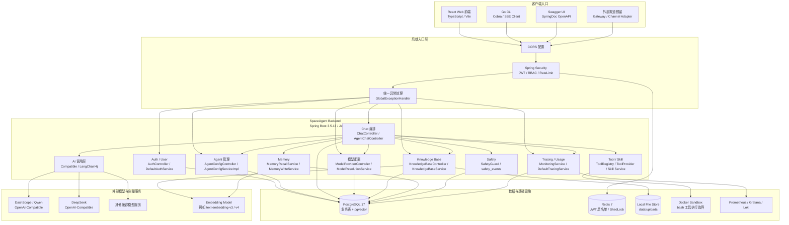

## 历史兼容：模块化单体内部模块图

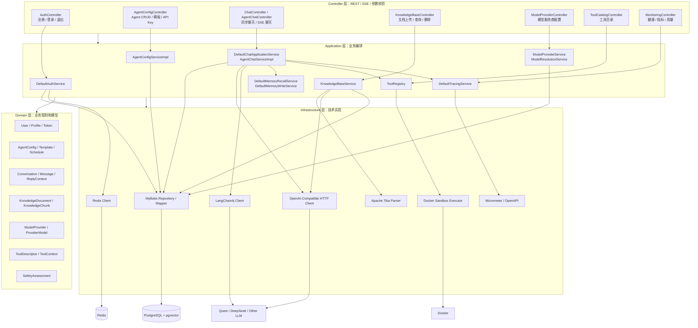

### 后端模块职责

| 模块 | 关键类 / 入口 | 主要数据表 | 职责 |
| --- | --- | --- | --- |
| 认证用户 | `AuthController`、`DefaultAuthService`、`PostgresUserRepository` | `users`、`user_profiles` | 注册、登录、密码加密、JWT 签发、用户资料 |
| Agent 管理 | `AgentConfigController`、`AgentConfigServiceImpl` | `agent_configs`、`agent_templates`、`agent_api_keys`、`agent_schedules` | Agent CRUD、模板、API Key、定时任务、发布配置 |
| 对话会话 | `ChatController`、`AgentChatController`、`DefaultChatApplicationService` | `conversations`、`messages`、`chat_turn_usages` | 会话创建、消息保存、同步回复、SSE 流式输出 |
| 模型服务商 | `ModelProviderController`、`ModelProviderService`、`ModelResolutionService` | `model_providers`、`provider_models` | Base URL、API Key、模型名、默认模型解析 |
| RAG 知识库 | `KnowledgeBaseController`、`KnowledgeBaseService` | `knowledge_documents`、`knowledge_chunks`、`agent_knowledge_bases` | 上传、解析、切分、embedding、pgvector 检索 |
| Tool / Skill | `ToolCatalogController`、`ToolRegistry`、`DefaultSkillAdminService` | `companion_skills`、`skill_proposals`、`mcp_server_config` | 工具目录、工具执行、技能审批、MCP 配置 |
| 记忆 | `DefaultMemoryRecallService`、`DefaultMemoryWriteService` | `memory_items`、`conversations` | 长期记忆召回、自动写入、会话摘要 |
| 安全 | `SafetyGuard`、`SafetyService` | `safety_events` | 风险判断、高风险拦截、安全事件记录 |
| 可观测 | `MonitoringController`、`MonitoringService`、`DefaultTracingService` | `agent_trace`、`trace_span`、`agent_usage_records` | token 用量、调用耗时、Trace、指标 |

## 关键业务链路总览

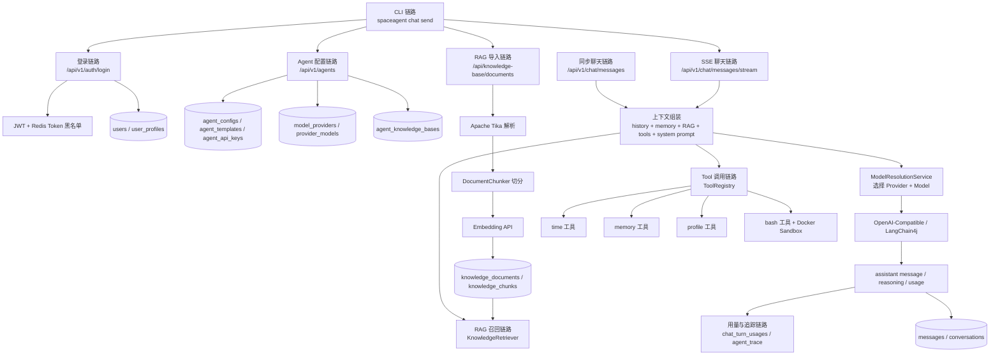

## 认证与登录链路

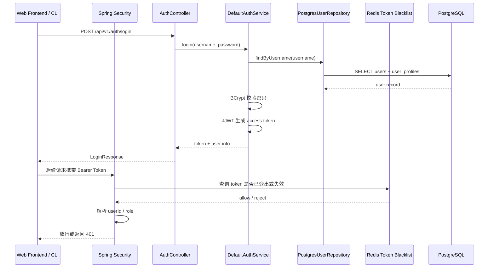

链路说明：

- 前端和 CLI 都不保存密码，只保存后端签发的 JWT。
- 退出登录时 Token 进入 Redis 黑名单，避免 JWT 在过期前继续使用。
- 所有核心业务接口通过安全过滤器获取 `userId`，后续查询都按用户隔离。

## Agent 配置链路

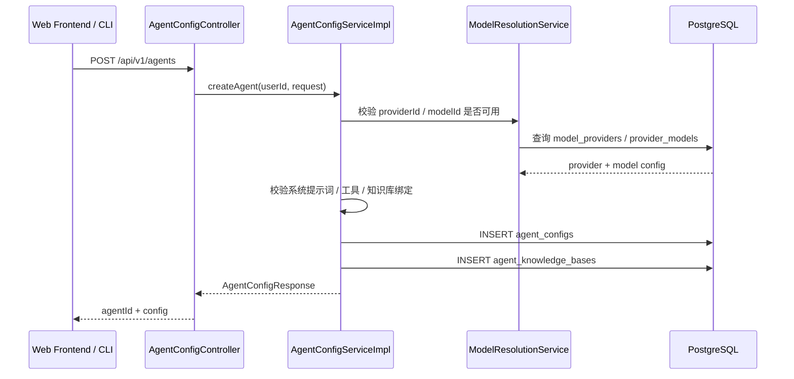

Agent 配置中会影响聊天链路的字段：

| 配置项 | 来源 | 聊天时的作用 |
| --- | --- | --- |
| `modelProviderId` | `agent_configs` / `model_providers` | 决定 Base URL、API Key、Provider 类型 |
| `modelId` | `agent_configs` / `provider_models` | 决定调用哪个大模型 |
| `systemPrompt` | `agent_configs` | 作为最高优先级系统提示词 |
| `memoryEnabled` | `agent_configs` | 是否召回并自动写入长期记忆；关闭时两条链路都禁用 |
| `ragEnabled` | `agent_configs` | 是否执行知识库召回 |
| `knowledgeBaseIds` | `agent_knowledge_bases` | 限定 RAG 检索范围 |
| `enabledToolIds` | `agent_configs` | 限定模型可调用工具 |
| `permissionMode` | `agent_configs` | `private/auto` 允许已绑定工具；`deny` 不暴露工具；`ask` 产生结构化待授权事件且不执行副作用 |
| `networkEnabled` | `agent_configs` | 传递到运行时，作为网络型工具后续接入时的统一能力边界；当前不会冒充已经存在的联网工具 |
| `temperature` / `maxTokens` | Agent 或模型配置 | 控制模型生成参数 |

工具策略事件通过同步响应的 `events` 和 SSE 事件同时暴露：
`tool_approval_required`、`tool_denied`、`tool_call`、`tool_result`、`tool_error`。
这使前端、CLI 和审计系统可以区分“没有调用”“等待授权”“策略拒绝”和“执行失败”。

### 业务审计 Kafka 通道

普通应用日志仍由 Alloy 写入 Loki；需要供安全、治理和计量系统稳定消费的业务事件进入独立 Kafka Topic。`chat-service` 生产工具执行、权限决定和模型用量事件，`identity-service` 生产租户治理变更，`gateway-service` 生产 API Key、JWT 与限流安全告警。

事件先写各服务 PostgreSQL 的 `business_audit_outbox`，再由带租约的批量 Dispatcher 投递 Kafka；这提供至少一次投递、指数退避、`DEAD` 隔离和人工重放能力。统一信封包含 `eventId/eventVersion/tenantId/actorId/traceId/requestId`，消费者以 `eventId` 去重。审计属性统一过滤 Prompt、消息正文、工具参数/结果、JWT、API Key、密码和密钥。完整 Topic、启用和运维说明见 `docs/business-audit-kafka.md`。

## 聊天与 SSE 链路

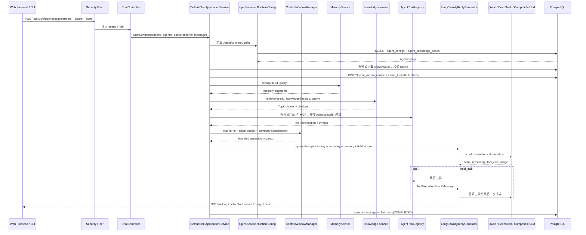

聊天链路的关键设计：

- **不是前端直连模型**：所有 API Key 只保存在后端模型服务商配置中。
- **Agent 决定运行时能力**：同一套聊天接口会根据 Agent 配置决定模型、系统提示词、RAG、工具和记忆。
- **SSE 事件类型清晰**：CLI / 前端可区分普通内容、思考过程、工具调用、工具结果和完成事件。
- **模型原生流式**：`chat-service` 使用 LangChain4j provider callback 实时发送 `delta`，不等待完整回答后再人工切片。
- **思考过程可控**：后端接收 provider thinking chunk，并兼容 `<think>` / `<thinking>`；CLI 通过 `--show-thinking` 控制是否展示。
- **Token 用量闭环**：同步和流式响应都采集 provider usage；MCP 多轮调用累加后写入 `chat_turn_usages`，并在 SSE `done` 与 CLI 中展示。
- **失败可追踪**：每轮对话在 `chat_turns` 记录运行、成功、失败或取消状态及安全截断的错误；token 另存 `chat_turn_usages`。

## RAG 文档导入链路

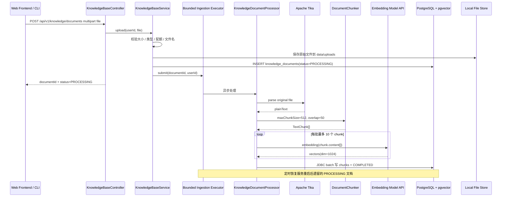

以下 RAG 默认配置来自未公开分发的历史 Knowledge 服务实现，仅作为历史证据：

| 配置 | 默认值 | 说明 |
| --- | --- | --- |
| `KNOWLEDGE_BASE_MAX_CHUNK_SIZE` | `512` | 单个 chunk 最大字符数 |
| `KNOWLEDGE_BASE_OVERLAP_SIZE` | `50` | chunk overlap，降低跨段落断裂 |
| `KNOWLEDGE_BASE_DEFAULT_TOP_K` | `5` | 默认召回数量 |
| `KNOWLEDGE_BASE_HNSW_EF_SEARCH` | `100` | 查询事务内的 HNSW 搜索宽度；实际值不会低于候选数量 |
| `KNOWLEDGE_BASE_SIMILARITY_THRESHOLD` | `0.55` | 候选向量相似度过滤阈值；最终结果还会经过混合重排 |
| `KNOWLEDGE_BASE_RERANK_ENABLED` | `true` | 是否对向量候选集执行本地混合重排 |
| `KNOWLEDGE_BASE_RERANK_CANDIDATE_MULTIPLIER` | `4` | 候选数量相对最终 TopK 的倍数 |
| `KNOWLEDGE_BASE_RERANK_MAX_CANDIDATES` | `80` | 单次重排候选上限 |
| `KNOWLEDGE_INGESTION_MAX_POOL_SIZE` | `4` | 异步文档处理最大线程数 |
| `KNOWLEDGE_INGESTION_QUEUE_CAPACITY` | `100` | 待处理文档队列容量 |
| `KNOWLEDGE_BASE_RERANK_VECTOR_WEIGHT` | `0.85` | 混合分数中的向量权重 |
| `KNOWLEDGE_BASE_RERANK_LEXICAL_WEIGHT` | `0.15` | 混合分数中的词项覆盖权重 |
| `AI_EMBEDDING_DIMENSIONS` | `1024` | 向量维度，需与 pgvector 表结构一致 |
| `AI_EMBEDDING_BATCH_SIZE` | `10` | 单次同步 Embedding 请求的文本数量 |
| `AI_EMBEDDING_CACHE_MAXIMUM_SIZE` | `1000` | 内存向量缓存容量；缓存 key 为文本摘要而非原文 |
| `AI_EMBEDDING_CACHE_TTL_SECONDS` | `600` | 重复查询与重复 chunk 向量缓存时间 |
| `KNOWLEDGE_INGESTION_PERSISTENCE_BATCH_SIZE` | `100` | 单批 JDBC chunk 写入数量 |
| `KNOWLEDGE_BASE_MAX_FILE_SIZE` | `20MB` | 单文件大小上限 |
| `KNOWLEDGE_BASE_MAX_DOCUMENTS_PER_USER` | `50` | 单用户文档数量上限 |
| `KNOWLEDGE_BASE_MAX_CHUNKS_PER_USER` | `10000` | 单用户 chunk 数量上限 |

## RAG 聊天召回链路

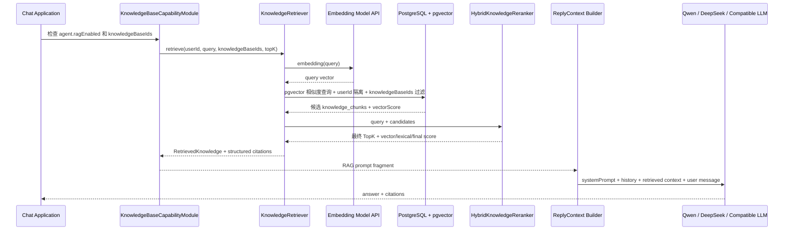

RAG 设计重点：

- 文档按 `user_id` 隔离，避免多用户数据串读。
- Agent 通过 `agent_knowledge_bases` 绑定可检索文档范围。
- `knowledge_chunks.embedding` 使用 pgvector 存储，维度与配置的 embedding 模型一致。
- 摄取阶段对 chunk 去重后执行批量 Embedding 和 JDBC batch，避免逐 chunk 的 HTTP/SQL 往返。
- 查询阶段使用有界 TTL Embedding 缓存，并在短只读事务中设置 `hnsw.ef_search` 后执行 KNN。
- 召回结果会进入 prompt，同时以 citations 形式返回给客户端用于展示。

## Tool / Skill 调用链路

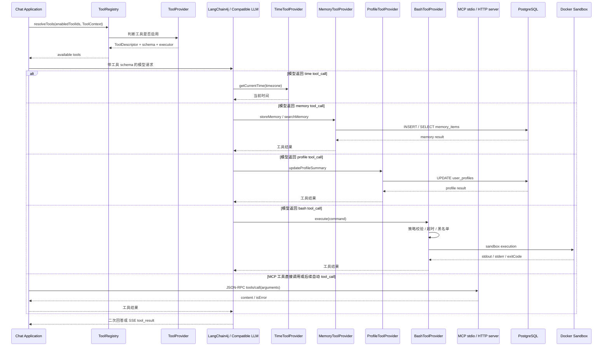

Tool 与 Skill 的区别：

| 类型 | 定位 | 当前实现 |
| --- | --- | --- |
| Tool | 模型运行时可调用的函数能力 | `time`、`memory`、`profile`、`bash` |
| Skill | 被人工审核沉淀的行为知识或能力说明 | 提案、审批、激活、优先级管理 |
| MCP | 外部工具服务接入 | `mcp_server_configs` 记录用户级 stdio / Streamable HTTP server；`/api/v1/mcp/tools` 发现工具；`/api/v1/mcp/tools/call` 执行工具 |

当前 MCP 支持边界：

- 已支持用户配置 stdio 和 Streamable HTTP MCP server，按 `user_id` 隔离。
- 两类传输均支持 `initialize`、`tools/list`、`tools/call`；stdio 使用标准 `Content-Length` 帧，HTTP 支持 session ID、JSON/SSE 响应和会话关闭。
- 远程 URL 经过协议、域名白名单和 DNS 地址校验，默认阻止私网 SSRF；授权 Header 在 API 响应中脱敏。
- 每个 server 具有独立工具 allowlist，发现与执行时双重过滤；调用结果写入 `mcp_tool_audit_logs`。
- MCP 工具会以 `mcp:{serverId}:{toolName}` 进入统一工具目录，可绑定到 Agent。
- 聊天编排层默认使用 OpenAI-Compatible 原生 Tool Calling：把 MCP `inputSchema` 转为模型工具定义，校验模型返回的工具别名和参数后执行 `tools/call`，再用标准 tool-result message 回填模型；最多执行受控轮数。旧 `mcp_tool_call` JSON 仅作为可配置兼容回退。
- 助手消息、会话最终状态和 provider Token usage 在一个短数据库事务内提交；模型和 MCP 网络调用位于事务外，避免长事务占用连接。

## 模型调用链路

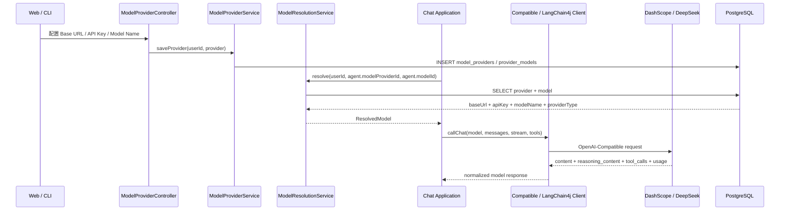

当前模型配置口径：

- `compatible`：后端自己按 OpenAI-Compatible 协议发 HTTP 请求，适合接 Qwen、DeepSeek、OpenRouter 等兼容服务。
- `langchain4j`：通过 LangChain4j 的模型抽象调用，适合复用其 Tool Calling / Streaming 能力。
- 已移除演示模型配置，模型链路只保留真实 Provider 调用。
- embedding 维度默认按 `1024` 配置，适配阿里云 `text-embedding-v3` / `text-embedding-v4` 默认输出维度。

## CLI 调用链路

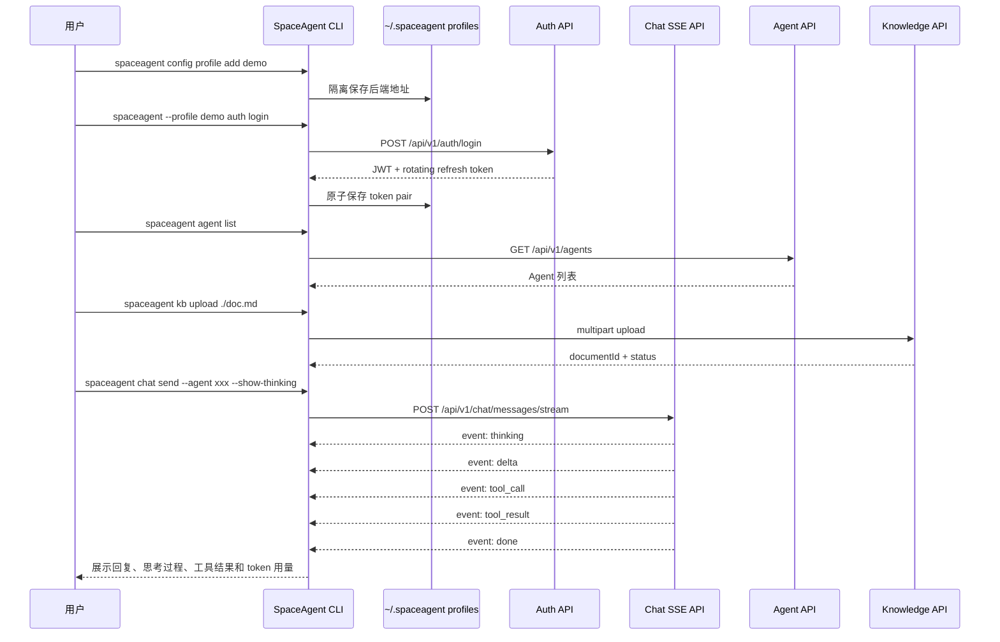

CLI 覆盖的主要能力：

- 登录、注册、状态、改密、退出。
- 单轮聊天、交互式聊天、历史、用量、会话关闭。
- Agent 列表、详情、创建、更新、删除、聊天和 API Key 管理。
- Provider 创建、更新、删除、模型添加和可用模型查询，支持 flags 非交互执行。
- 知识库上传、列表、状态、删除、服务/文档诊断和真实 RAG 检索。
- Tool Catalog、MCP stdio 服务发现/测试/调用、Memory 和外部渠道用户绑定。
- SSE 增量正文、provider reasoning、Tool 事件、RAG citation 和 token usage 展示。
- 命名 Profile、`--format json` 稳定 envelope、分类退出码，以及普通
  HTTP/multipart/SSE 的并发安全 Token 自动刷新。
- 管理员可查询渠道投递状态，并通过 `--dry-run` / `--yes` 安全重放死信。

## 数据模型关系图

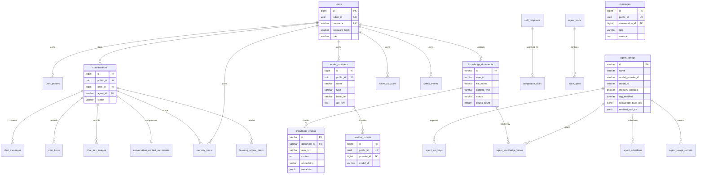

## 五服务微服务方案

历史五服务拆分曾完成可运行、可演示验证。2026-07-31 的测试、网关 smoke、模型/RAG/MCP 与渠道协议结果仅作为迁移证据保留，不代表 M9 active deployment。当前运行拓扑以 `FINAL-ARCHITECTURE.md` 为准。

代码层面 `services/` 父工程已经收敛到这 5 个服务；`identity-service` 负责注册、登录、JWT 签发和用户信息；`agent-service` 负责 Agent CRUD、Agent API Key 和 `AgentRuntimeConfig`；`knowledge-service` 负责 Tika 解析、文本切分、OpenAI-Compatible embedding 和 pgvector TopK 检索；`chat-service` 负责会话、上下文、Memory、Tool、模型调用、SSE 和 usage；`gateway-service` 负责 JWT / Agent API Key 入口认证、固定窗口限流、可信身份头重写、统一 proxy 和 gateway message ingress。

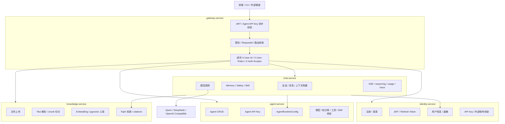

服务边界：

| 服务 | 负责 | 核心数据 |
| --- | --- | --- |
| `gateway-service` | 统一入口、JWT 本地验签与 Redis 撤销检查、Agent API Key 初步校验、Redis 分布式固定窗口限流、请求转发、OpenAPI 聚合、CLI / 外部渠道入口、飞书/企业微信/钉钉验签解密与异步回复 | `session_bindings`、`channel_conversation_bindings`、`channel_webhook_events`、Redis rate-limit keys |
| `identity-service` | 注册、登录、JWT 签发/刷新/登出、密码修改、用户资料；用户与资料只写 PostgreSQL，登出 Token 的 SHA-256 摘要写 Redis 并按 JWT 到期时间设置 TTL | `users`、`user_profiles`、Redis revoked-token keys |
| `agent-service` | Agent CRUD、Agent API Key、加密模型 Provider、知识库绑定、工具绑定和运行配置查询；创建/更新时跨服务校验知识文档归属，不为未落库 Agent 生成内存配置 | `agent_configs`、`agent_api_keys`、`agent_knowledge_bases`、`model_providers`、`provider_models` |
| `chat-service` | 会话、消息、maxTurns/token budget、持久化摘要、Memory、`@Tool`、MCP、模型调用、可取消 SSE 和 usage；先校验真实 Agent，再以 `chat_turns` 跟踪运行/完成/失败/取消 | `conversations`、`chat_messages`、`chat_turns`、`chat_turn_usages`、`conversation_context_summaries`、`memory_entries`、`mcp_server_configs`、`mcp_tool_audit_logs` |
| `knowledge-service` | 文件上传、文档解析、chunk、embedding、pgvector、TopK 检索 | `knowledge_documents`、`knowledge_chunks` |

鉴权边界：

- `identity-service` 是身份来源，负责签发 JWT 和维护用户信息。
- `gateway-service` 是统一入口，负责本地验签 JWT，或调用 `agent-service` 内部 verify 校验 Agent API Key，并向下游透传 `X-User-Id`、`X-User-Roles`、`X-Auth-Scopes`、`X-Request-Id`。
- `chat-service`、`agent-service`、`knowledge-service` 负责资源级权限校验，例如 conversation owner、agent owner、knowledge owner。
- 下游服务只信任 gateway 的内部请求，使用 `X-Internal-Token: ${INTERNAL_SERVICE_TOKEN}` 防止绕过 gateway。
- 当前 `identity-service`、`agent-service`、`chat-service` 和 `knowledge-service` 已启用 `InternalServiceAuthenticationFilter`，gateway 转发时会写入 `X-Internal-Token`。
- 当前 `gateway-service` 已实现统一 proxy：登录注册放行，其余外部业务路由需要 JWT 或 Agent API Key；`/api/v1/gateway/messages` 会把 CLI / 外部渠道消息映射到内部用户后调用 `chat-service`；`/internal/**` 不对外暴露；转发时会重写内部身份头和 internal token，并以流式方式转发 SSE 响应。
- Agent API Key 入口支持 `X-Api-Key` 或 `Authorization: ApiKey ...`，gateway 会剥离这两类明文 key 头，只把校验后的 `X-Agent-Id`、`X-Agent-Key-Id` 和 scopes 传给下游。
- Agent API Key 只允许访问聊天写接口 `POST /api/v1/chat/messages` 和 `POST /api/v1/chat/messages/stream`，且必须具备 `CHAT` scope；Agent / 知识库 / 用户等管理接口仍必须使用 JWT。
- gateway 已实现 Redis 分布式固定窗口入口限流：Agent API Key 按 `keyId` 限流，JWT 用户按 `userId` 限流，登录注册按来源 IP 限流，匿名请求按来源 IP 限流；窗口 Key 自动设置 TTL，多实例共享计数。默认窗口 60 秒，阈值和可信代理可通过 `GATEWAY_RATE_LIMIT_*` 环境变量调整。
- gateway proxy 会把下游不可达、连接失败、中断等异常转换为 `SERVICE_UNAVAILABLE`，再由共享异常处理返回统一 `ApiError` JSON。

推荐拆分顺序：

1. 先拆 `knowledge-service`：RAG 边界清楚，文档解析和向量检索负载独立。
2. 再拆 `agent-service`：通过 `AgentRuntimeConfig` 解耦聊天运行配置。当前已落地 Agent CRUD、Agent API Key 和知识库绑定同步，模板、定时任务后续继续迁移。
3. 再拆 `identity-service`：统一注册登录、JWT、API Key 和用户资料。
4. 最后加 `gateway-service`：统一入口、鉴权、限流、SSE 转发。当前已完成统一 proxy、JWT 本地验签、Redis 撤销检查、Agent API Key 入口校验和 Redis 分布式固定窗口限流。
5. 剩余聊天编排自然收口为 `chat-service`。

五服务拆分方案已随活动树清理；相关私有归档不随本公开快照分发。

## 本地启动与运行链路

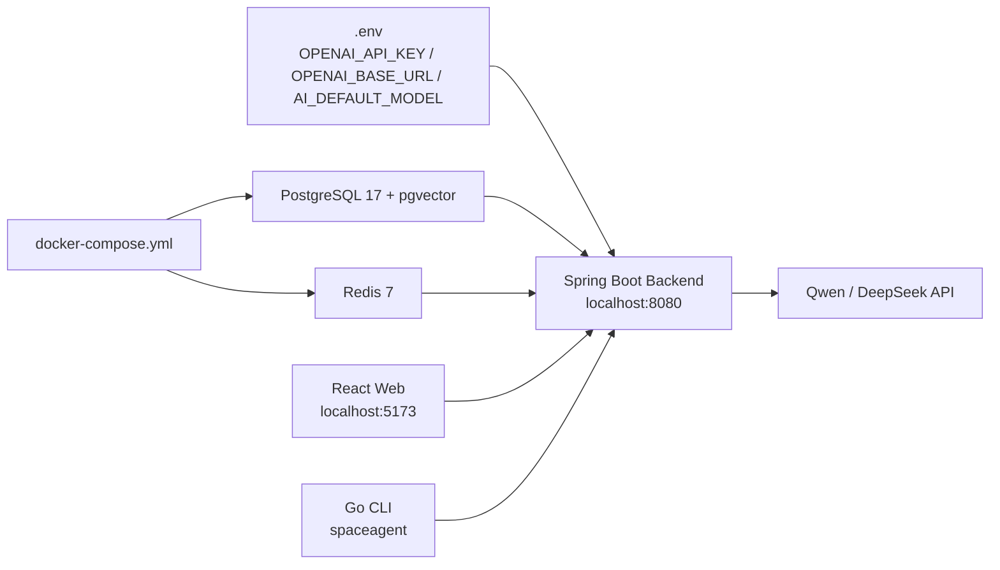

启动依赖关系：

1. Docker Compose 先启动 PostgreSQL + pgvector 和 Redis。
2. 后端读取 `.env` / Spring 配置，连接数据库和 Redis。
3. Flyway 初始化业务表和向量表。
4. 前端通过 `VITE_API_BASE_URL` 或代理访问后端。
5. CLI 通过 `spaceagent config set-server` 绑定后端地址。
6. 真实模型调用必须配置有效 API Key、Base URL、模型名和 embedding 模型。

## 面试讲解口径

可以按这条线讲：

1. **平台定位**：这是一个 Agent 创建与调用平台，不只是聊天页面。
2. **Agent 配置**：每个 Agent 可以配置模型、系统提示词、工具、知识库、记忆、网络和会话策略。
3. **模型抽象**：后端统一封装 OpenAI-Compatible 调用，前端和 CLI 不直接接触模型 API Key。
4. **RAG 流程**：文档上传后由 Tika 解析、DocumentChunker 切分、embedding 入 pgvector；聊天时按 Agent 绑定知识库做 TopK 召回。
5. **SSE 与思考过程**：后端支持流式输出，并抽取模型返回的 reasoning 字段；CLI 可开关展示。
6. **工具扩展**：ToolRegistry 统一收集工具，新增工具只需实现 ToolProvider。
7. **安全与隔离**：JWT、Redis 黑名单、限流、用户级数据隔离、bash sandbox。
8. **工程能力**：Flyway、MyBatis、测试、CLI、Docker Compose、Prometheus、Swagger 都具备。

## Mermaid 显示说明

本文档中的图使用 Markdown Mermaid 语法，也就是代码块必须写成：

````text
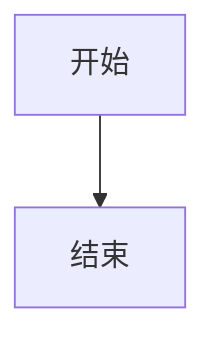
````

如果在 IDE 或普通 Markdown 预览里只显示代码块，没有渲染成图，通常是预览器没有启用 Mermaid。GitHub、部分 JetBrains Markdown 插件、VS Code Mermaid Preview 插件可以正常渲染。
