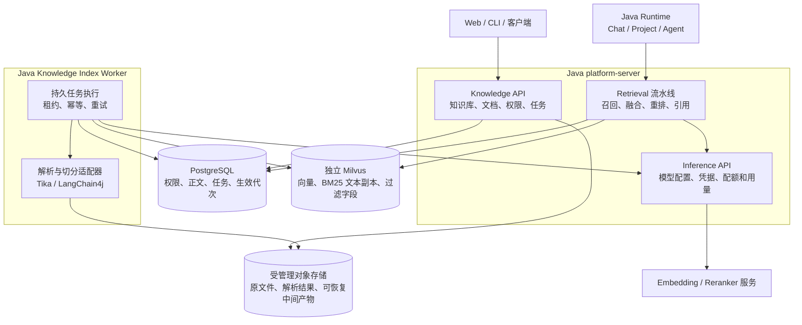

# 企业级 Milvus RAG 设计

> 设计状态：已确认，作为 M79 实施依据
> 实现状态：M79-PR1–PR4 本地确定性完成；真实模型质量/生产高可用仍待外部验收，以[实施计划](../../../.agent/ENTERPRISE-RAG-PLAN.md)中的证据为准
> 确认日期：2026-09-14
> 设计编号：RAG-D001
> 决策记录：[ADR-086](../../adr/ADR-086-enterprise-rag-milvus.md)

> 当前实现更新：PR1–PR4 已本地收口（V1094/106），完整 Maven854/854 + 最终存储回归33/33。
> 删除/旧代次清理、无模型向量修复、独立 Worker、重排/引用/配额和迁移均已实现；操作步骤见
> [运行手册](../../operations/KNOWLEDGE-RAG-RUNBOOK.md)。下文原型 checkpoint 中的待完成描述为历史记录，
> 最新队列见实施计划；不代表真实模型质量、TEI 引擎或生产高可用验收完成。
> 总开发队列：[BACKEND-PLAN](../../../.agent/BACKEND-PLAN.md)

## 设计目标

### PR3 已实现契约（2026-09-14）

- 独立 Tika 3.3.0（固定镜像摘要）解析 PDF/DOCX；`docker-compose.parser.yml` 的解析进程仅接入 internal 网络，
  不接收 DB/Provider 凭据。只读网关开放 `/version`、`/rmeta`，禁止透传用户解析选项、抓取 URL 和其他路径。
  原文件 8 MB、展开 ZIP 32 MB/2048 entries、输出 1M chars、超时 30 秒；嵌入附件/OCR 不解析。
  PDF 真实页码、DOCX 无页码明确标记；附件排除警告不伪称完整附件索引。
- `GET/PUT /api/v1/knowledge/bases/{baseId}/processing-policy`：`expectedRevision` CAS；MANAGE 修改。
  `POST .../chunk-preview`：WRITE，最多 64k 字符、256 段，零模型调用。
  FIXED_CHARACTER / RECURSIVE_TOKEN / MARKDOWN_SECTION，默认 512/64 Tokens；复用 LangChain4j 1.19.2、
  CommonMark 0.24.0，O200K 本地估算不冒充任意 Provider 的实际账单。源登记时固定策略，修改策略不改旧任务。
- `POST /api/v1/knowledge/collections/retrieve`：`Idempotency-Key` + `baseIds/query/topK/maxContextTokens`。
  与旧 document-ID `/knowledge/retrieve` 区分。8 Base、每 Base 256 生效文档、16 模型/schema 分组、每批 64 generation、
  每通道最多 100 候选；超界标 partial，不静默宣称全量召回。RRF 分数仅用于排序，不是余弦阈值或概率。
- 新任务 `hybrid_v2`：Milvus 同时建立 dense COSINE 和中文 analyzer BM25，旧任务 `dense_v1` 保留不迁移。
  候选正文全部从 PG 生效指针回源并二次鉴权；重建期间保留旧的完整索引，删除立刻隐藏。
  响应有 citation（Base/Doc/Generation/Chunk/修订/hash/位置）、partial/degraded/insufficientEvidence。
- 查询 Embedding 使用 Inference 的预算、密文缓存与原逻辑 key；身份始终是查询用户。
  私有 Provider 不因共享 Agent 或 Base 而开放；只有已明确共享且 ACTIVE 的组织 ModelPool 内相同启用模型
  才能委托组织成员调用。共享被撤销后拒绝使用。Embedding UNKNOWN 不重复请求，可降级 BM25 并明确标记。
- Chat/Project Chat 和 `knowledge_search` 使用 Run 当前快照的 `knowledgeCollectionIds`；旧 `knowledgeBaseIds`
  保持 document-ID 兼容。前端未改。源默认 1093/105，本地业务栈未迁移；PR4 收口前不启用生产开关。

构建可解耦、可维护、可独立扩展的企业级 RAG 后端。明确采用 Milvus，Java/PostgreSQL
保留业务与权限权威，复用 Tika、LangChain4j、Milvus 官方 SDK。本文保存已经确定的架构、
流程和边界；实施计划保存工作步骤、完成状态和验证结果，避免两处重复维护设计。

## 1. 目标架构（具体交付状态见实施计划）

Knowledge 的 Indexing/Retrieval 首先是同一业务模块内的独立组件，不创建三个重复权威服务。
Java Index Worker 首期允许内嵌调度，PR4 提供同代码独立启动角色；只有 Knowledge 仓储可操作
Knowledge 表，跨模块调用公开 API。解析子进程仅接收有界文件内容并返回解析结果，不接收业务数据库
或 Provider 凭据。Java Worker 中的 Inference 组件可以按职责解析密钥，但不得交给解析进程。
Milvus Standalone 及版本要求的元数据/存储依赖使用独立 profile 和持久卷，端口限内网/loopback。
生产扩展到 Milvus Distributed 不改变 Knowledge API；Standalone 验收不等于高可用验收。

## 2. 写入与读取流程

## 3. 已固定的数据和权限决策

- KnowledgeBase：scope=PERSONAL 或 ORGANIZATION，ownerId，组织范围时 organizationId，状态、
  默认索引策略、默认检索策略。个人范围只供所有者使用，组织共享通过显式 grant。
- 组织 OWNER 管理组织知识库；creator/被授予 MANAGE 的成员管理文档，WRITE 可导入，READ 可检索。
  所有组织操作重新校验 active membership，组织 VIEWER 不可写。ROLE 与 USER grant 均在组织内。
- Agent 知识库绑定不是权限凭据。Runtime 必须携带真实 tenant/actor，服务身份也必须有明确授权；
  不使用 Agent 创建者身份代替查询用户。文档 ID、Collection 名或筛选表达式不得绕过权限入口。
- 旧文档保留原 owner 私有可见性，不直接使用用户当前组织进行批量回填。可证明来源的组织文档才
  绑定对应组织；其余进入 owner 的 PERSONAL 知识库，组织共享必须显式操作。
- DocumentRevision 表示原文件内容修订；IndexGeneration 固定内容 hash、解析器/切分器配置、
  embeddingSpaceId、目标存储 schema 和 chunk 清单。它们属于内部更新恢复元数据，不增加用户发布流程。
- EmbeddingSpace 固定受信任模型配置 ID/修订、模型名、dimensions、distance 和预处理 fingerprint；
  相同维度不等于相同空间。模型部署变更必须新建空间，不静默覆盖。
- Chunk 正文及可用的页码、标题路径、源范围在 PostgreSQL；无页码的解析结果不可伪造页码。
- Milvus 的 PK 使用 generationId + chunkId 的确定性有界 ID；保存 scopeKey、knowledgeBaseId、
  documentId、generationId、embeddingSpaceId、contentHash、denseVector 和可选 text/BM25 副本。
  使用同一模型空间及兼容索引 schema 的 Collection，不按每用户/每文档创建 Collection。
- Milvus 可保存启用 BM25 必需的正文副本，因此属于敏感数据存储，需认证、传输保护和删除策略。
  它不是正文权威；API 返回内容和引用来自 PostgreSQL，经授权后再提供给重排服务。
- 原文件和可恢复 Embedding 中间产物使用 Knowledge-owned 对象前缀与对象引用；复用现有受管理存储
  能力，不把 Artifact 不可变执行证据强行当可变知识文档，不支持任意服务器路径读取。

## 4. 一致性和失败语义

1. 文档登记、索引任务、待投递操作在 PG 同一事务创建；外部解析/模型/Milvus 调用不占长事务。
2. IndexJob 持久阶段：QUEUED → PARSING → CHUNKING → EMBEDDING → WRITING → VERIFYING
   → READY_TO_ACTIVATE → COMPLETED；另有 FAILED/CANCELLED/RECONCILIATION_REQUIRED。
   每阶段记录输入 hash、输出引用、已完成批次、租约/fencing 和下一重试时间。
3. 向量写入至少一次。每个代次的数据不可变，同 PK 只能写同 payloadHash；租约丢失的 Worker 不能
   激活代次。超时先查询批次清单再补写相同 payload，不能承诺跨库 exactly-once。
4. Embedding 请求结果不确定时保存 UNKNOWN 证据并等待处理；不因重试任务重复产生未经核算费用。
   已有向量中间产物可复用，Milvus 恢复不能强迫用户重新购买 Embedding。
5. 激活前验证预期 ID/hash 清单、维度和搜索可见性，使用明确 Strong consistency。PG 激活以文档
   revision、job fencing、目标代次做 CAS；索引构建失败时旧代次仍可读。
6. 检索先限制 scope/知识库，再限制或过采样代次，回源拒绝失效代次并有界补查。不得构造无限长
   generation IN 列表；批量过滤、候选上限和补查次数配置有界，结果不足如实返回 partial。
7. 删除/撤权先提交 PG 不可见状态，返回前再次查询当前权限及可见性。查询授权线性化点为最终
   PG 检查：撤权提交后开始最终检查的请求不能返回内容；已发送内容不能追溯收回。
8. Milvus 删除由耐久任务执行并确认；先停用代次，再等未完成写请求结束/超时并重复清理验证，
   防止迟到 upsert 复活。墓碑和巡检在清理确认前不删除；对象清理遵循相同引用/保留期规则。
9. Milvus 故障时返回稳定 unavailable/partial；不静默使用全组织无过滤召回或退回旧 JSON 索引。
   Reranker 可配置回退至已经通过权限校验的融合结果，并标记 degraded；错误日志不含正文或密钥。

## 5. 组件和公共契约

适配器使用 Tika、LangChain4j 和 Milvus 官方 Java SDK。首个部署 Unit 固定稳定版本和镜像 digest，
验证 SDK、服务器、CPU 架构、BM25/中文 analyzer/一致性兼容；不使用浮动 latest 或源码快照。
不在本计划额外引入 Elasticsearch、Kafka、Redis、另一套 pgvector 或 Python RAG 编排。

接口名称为目标设计，实施时遵循现有 ApplicationApi/Command/Repository 风格：

- KnowledgeAccessApplicationApi：计算当前可见范围和管理能力。
- DocumentParser/DocumentChunker：输入受管理正文，输出有界结构块，不依赖 Runtime。
- Embedding/Reranker public Inference APIs：公开非密钥引用、用量、失败类型；SDK 与凭据留在适配层。
- VectorIndexGateway：ensureSpace、upsertBatch、verifyBatch、search、deleteGeneration；只含中立 DTO。
- RetrievalApplicationApi：actor、scope、知识库、query、topK/tokenBudget；返回 evidence、citation、
  stage timings、degraded/partial 和索引/模型标识。

新增路由建议采用 `/api/v1/knowledge/bases`，其下文档、grants、preview、index-jobs、reindex 和
retrieval；`GET /api/v1/knowledge/index-jobs/{id}` 提供分页进度，取消操作保留已生效索引。
旧 `/knowledge/documents`、`/process`、`/retrieve` 在过渡期通过兼容适配调用同一权威路径；
同步 process 与异步 202 不静默互换。旧 Agent knowledgeBaseIds 实际是 document IDs，新增明确
knowledgeCollectionIds，禁止把历史 ID 静默解释成新知识库 ID。旧绑定保持只读兼容直到客户端迁移。

### 已落地的索引任务基础契约（PR2-U01）

- `GET /api/v1/knowledge/bases/{baseId}/index-jobs`：READ，offset/limit 分页，limit 最大 100。
- `GET /api/v1/knowledge/index-jobs/{jobId}`：READ，返回 stage/state/revision、尝试次数、下次重试时间和安全错误码。
- `GET /api/v1/knowledge/index-jobs/{jobId}/batches?stage=PARSING&offset=0&limit=50`：READ，offset 为起始批次序号；不返回正文、对象引用或凭据。
- `POST /api/v1/knowledge/index-jobs/{jobId}/cancel`、`/retry`：MANAGE，body 为 `{"expectedRevision":1}`。
  过期 revision 或不可重试状态返回 409；未知结果必须调和，取消不撤销此前生效索引。
- `KnowledgeIndexJobApplicationApi.enqueue` 目前仅供 Knowledge 内部导入事务调用，要求 WRITE 和同库已登记的 generation。
  一个 generation 只运行一个 job，同用户/知识库/idempotency key 仅允许同载荷重入。
- 状态拆分为 `stage` 与 `state`：stage 是解析到待激活的执行阶段；state 是 QUEUED/RUNNING/RETRY_WAIT/
  FAILED/CANCELLED/RECONCILIATION_REQUIRED/COMPLETED。当前基础不能将任务标记 COMPLETED，须等待 U03 的真实激活事务。
- 此阶段没有接入自动处理 Worker；只建任务不会开始付费模型调用。完整导入、激活、删除调和由 U02/U03 接线。
  在删除协调器完成前，含索引任务的范围清理返回 `KNOWLEDGE_INDEX_CLEANUP_PENDING`，不删除恢复证据。

### 已落地的 Embedding 阶段（PR2-U02）

KnowledgeEmbeddingStage 使用 Inference 的公开批次 API，不读取全局测试 Key 或 Provider 密文。
Inference 复用现有预算、价格和加密组件，独立 Embedding Call 不冒充 Agent Run；在网络请求前提交
调用意图与预留，在结果后记录权威用量。响应缺失 usage 或费用未知不能显示为零成本。

首期使用已有 Spring HTTP 客户端模式：无应用级自动重试、禁跳转、有界响应，按返回 index 对齐输入。
条数上限 64、向量分量上限 262144，通用输入预算采用 UTF-8 字节数+8 的保守上界，单条 8192/整批
32768；不冒充任意模型的精确 Tokenizer。模型空间 dimensions 是验证约束，应登记模型实际输出维度。
缓存/批次复用不产生第二次模型调用；明确拒绝才允许新的有界 attempt，UNKNOWN 必须调和。

中间产物位于 Knowledge 专用内容寻址存储；host 目录受 Git 忽略，Compose 的独立持久卷不挂给
Sandbox。当前实现推进到 WRITING，文件/URL 全链路、实际 Milvus 激活与删除调和尚待 U03，不能据此
声明新 RAG 已经对用户开放或通过真实付费模型验收。

### 内部构建与原子生效 checkpoint（PR2-U03 进行中）

V1090 已落地 document head/source revision/不可变分块正文。内部构建器将受管理 UTF-8 源接到现有
EmbeddingStage，再执行 Milvus 写入、强一致批次和搜索验证，最后以短 PG 事务激活并结束任务。
恢复至待激活阶段仍需复验存储；失败重建不替换此前生效指针。该内部路径已通过真实 PG/Milvus 测试。

公开文件/URL 快照接入现已由 V1091 补充（见下节），完整删除协调器仍未完成。内部 invalidate 仅取消
可见性，不代表副本已经删除。U03 仍需处理删除墓碑、孤立对象、迟到写及 UNKNOWN 调和，之后才能收口 PR2。

### 文件/URL 快照导入契约（V1091，默认关闭）

总开关为 `PLATFORM_KNOWLEDGE_INDEX_INTAKE_ENABLED=false`。在 PostgreSQL 模式注册接口，但默认
拒绝新导入；未接入自动 Index Worker。删除/恢复验收完成前保持关闭，不因此声明生产可用。

| 方法与路径（公共前缀 `/api/v1/knowledge/bases/{baseId}`） | 输入 | 结果 |
| --- | --- | --- |
| `POST /indexed-documents` | 原始 UTF-8 字节，Content-Type 为 text/plain 或 text/markdown；query：name、spaceId，可选 documentId、expectedRevision | 202：documentId/documentRevision/generationId/jobId/state |
| `POST /indexed-documents/from-url-snapshot` | JSON：name、spaceId、urlJobId、versionId，可选 documentId、expectedRevision | 202：独立副本的索引任务 |
| `GET /indexed-documents/{documentId}` | 当前 Actor/组织上下文 | READ 权限下的 scope、ownerId、revision、state、activeGenerationId |

两个 POST 必须携带 `Idempotency-Key`（1–100 位字母、数字、点、下划线、冒号或短横线）。新建省略
documentId，expectedRevision=0；更新显式传入同 Base 的文档 ID 与当前 revision。相同键/载荷不重复建任务，
错误 revision/载荷冲突返回 409，缺参数 400，文件超过 8,000,000 字节返回 413，不支持的 Content-Type 返回 415。
规范化文本另有 1,000,000 字符上限；PDF/DOCX 原生解析仍是 PR3 范围，不能传服务器路径代替文件内容。

URL 接口读取当前用户在当前组织下已抓取的 STAGED/ACTIVE/SUPERSEDED 快照，不执行新的网络抓取。
源知识库 READ 与目标 WRITE 分别检查，提交元数据前再次复验，防止复制期间源被撤权。原始对象、hash、
MIME/charset、源版本 ID 与规范化文本分开保留，不依赖旧全局 Embedding 完成才能导入。

新组织文档的 ownerId=null，权限来自组织 Base；创建者删除不清理组织共有文档。数据库延迟约束拒绝
无组织 scope 的空 owner 文档，旧 owner-only 接口也不能操作这些 EXPLICIT 源。历史个人文档不自动转属。
创建模型资源的既有权限与 Provider 所有者检查保持不变，Knowledge WRITE 不自动授予他人的模型密钥使用权。

原始/规范化对象先在私有 Knowledge 存储写入，随后以短 PG 事务原子登记文档、scope、修订、generation、
job/Outbox 和幂等 receipt；失败的元数据事务不激活任何索引，可能留下未引用私有对象。其有界回收、
完整删除和 UNKNOWN 调和仍须在 U03 完成。新组织源启用前须先升级所有读取节点，不能直接回滚到
不支持 NULL-owner 文档的旧应用。

## 6. 变更与接力要求

- 实现前读取本文和实施计划中当前步骤，按确认的数据库、模块职责和失败语义实现。
- 局部代码选择可自行决定；替换 Milvus、扩大数据可见性、转移业务权威或新增产品范围时，先在
  本文与 ADR 记录原因、影响和迁移方式，涉及新的用户决策时取得明确方向。
- 每个实施步骤更新实施计划的状态、代码提交、验证证据与下一动作；设计未变化时无需修改本文。
- 不以已确认设计代替已实现能力，不以确定性测试代替真实模型效果或生产高可用验收。
- 4 阶段/12 步功能顺序保留；2026-09-14 用户启动 RAG，M79 当前优先，M78 剩余项暂停留存。

## 7. 设计留痕

| 日期 | 记录 | 原因与影响 |
| --- | --- | --- |
| 2026-09-14 | RAG-D001 初始方案 | 用户确认企业级解耦目标；采用 Milvus，确定权限、索引代次与跨库恢复方案 |
| 2026-09-14 | 将确认方案集中到本文件 | 从实施计划迁出架构正文；方案不变，形成固定设计入口 |
| 2026-09-14 | 用户启动 M79；明确组织创建者删除语义 | M78 暂缓留痕；个人库由用户清理删除，组织库保留且 creator 可空，当前组织 OWNER 继续管理 |

组件官方资料位于[实施计划的组件依据](../../../.agent/ENTERPRISE-RAG-PLAN.md#11-组件依据)。
