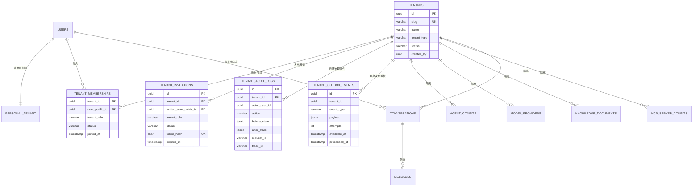
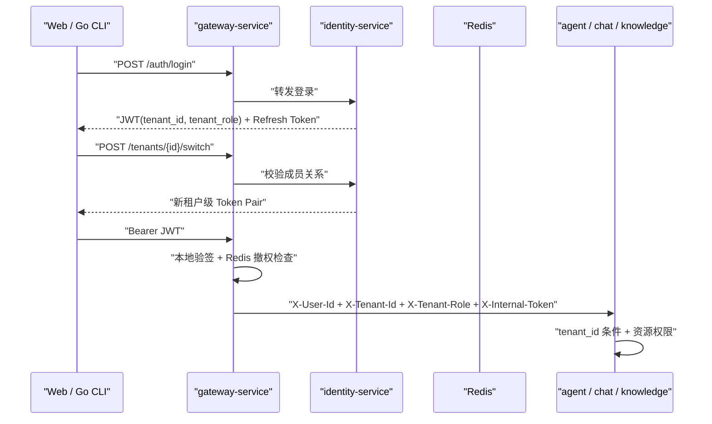

# SpaceAgent 多租户 SaaS 设计

> M8 cutover 注记：Identity/tenant active ownership 已迁入
> `apps/platform-server`/`spaceagent_platform`。下文五服务表名与验证内容是
> legacy migration evidence，不代表当前部署拓扑。旧代码已从活动树移除，只能
> 旧源码仅存在于未随本公开快照分发的私有归档中，不再支持 runtime rollback。
>
> 当前 Organization 最终产品语义以
> `architecture/TARGET-PRODUCT-BUSINESS-ARCHITECTURE.md` 为准。下文邀请、所有权转移、
> 空组织处理等五服务实现是可复用设计证据，不表示这些 HTTP 能力已全部迁入活动平台。
> M13-PR1 已把创建/列表/切换、现有用户绑定、角色、唯一 OWNER、所有权转移、退出和
> DELETING 迁入活动平台；邀请令牌和物理清理 Worker 仍未迁入。

## 1. 当前实现范围

SpaceAgent 的五服务后端已经具备多租户 SaaS 基础能力：

- 每个注册用户自动获得一个 `PERSONAL` 个人工作区。
- 用户可以创建 `ORGANIZATION` 组织工作区并邀请已注册用户。
- 组织支持名称/slug 更新、所有权转移、成员主动退出和软归档，并保护唯一 OWNER。
- 邀请采用 256-bit 随机令牌，数据库只保存 SHA-256；支持接受、拒绝、撤销和 7 天自动过期。
- 治理操作写入结构化审计日志；成员撤权通过 Transactional Outbox 在事务提交后可靠投递 Redis。
- 一个用户可以加入多个组织，并通过租户级 JWT 切换当前工作区。
- `OWNER / ADMIN / MEMBER / VIEWER` 四级角色控制管理和写入权限。
- Agent、模型来源、知识库、MCP、渠道绑定按租户隔离。
- 会话、消息和长期记忆在租户内继续按用户隔离，避免成员互相读取私人对话。
- 旧数据通过 Flyway 自动回填到用户的个人工作区，迁移不改变原有数据库主键。

当前没有实现订阅套餐、支付、发票、席位计费和用量账单。这些属于商业化计费层，不应与已经落地的数据隔离能力混为一谈。

## 2. 数据模型



租户主键使用 UUID。为了兼容升级前的数据，个人租户 ID 与用户 `public_id` 相同；组织租户使用独立 UUID。

## 3. 角色矩阵

| 操作 | OWNER | ADMIN | MEMBER | VIEWER |
| --- | --- | --- | --- | --- |
| 读取租户资源 | 是 | 是 | 是 | 是 |
| 创建/编辑 Agent、知识库、模型、MCP | 是 | 是 | 是 | 否 |
| 管理普通成员 | 是 | 是 | 否 | 否 |
| 设置或移除 ADMIN | 是 | 否 | 否 | 否 |
| 修改组织名称 | 是 | 是 | 否 | 否 |
| 修改组织 slug / 转移所有权 / 归档 | 是 | 否 | 否 | 否 |
| 主动退出组织 | 转移所有权后 | 是 | 是 | 是 |

个人工作区不允许添加额外成员。业务服务使用 `TenantSecurity.requireWrite` 和 `requireAdmin` 执行角色检查，不能依赖前端按钮控制权限。

## 4. 身份和可信透传



Gateway 会删除外部请求伪造的 `X-User-Id`、`X-Tenant-Id` 和 `X-Tenant-Role`，只向下游写入由 JWT 或 Agent API Key 验证得到的可信值。业务服务只接受带正确 `X-Internal-Token` 的内部身份头。

## 5. 角色变化与即时撤权

Gateway 本地验签避免每次请求同步调用 identity-service。为了同时满足成员即时撤权：

1. identity-service 在同一数据库事务中撤销该租户的 Refresh Token，并写入 `tenant_outbox_events`。
2. 事务提交后 Outbox dispatcher 立即投递 Redis；Redis 暂时不可用时按指数退避重试，事件成功后记录 `processed_at`。
3. Redis 保存 `tenantId + userId + revokedAt`；重复投递是幂等的。
4. JWT 同时携带毫秒级 `tenant_auth_time_ms`；Gateway 本地验签后将它与撤权时间比较，旧 Token 则兼容回退到标准 `iat`。
5. 签发时间严格早于 `revokedAt` 的旧 Token 立即失效；重新登录并切换工作区后签发的新 Token 可以正常使用。

Redis 撤权键 TTL 比 Access Token 生命周期多一小时，不会永久积累。

## 6. 服务边界

| 服务 | 多租户职责 |
| --- | --- |
| `identity-service` | 租户生命周期、邀请、成员、角色、审计、Outbox、租户切换与租户级 Refresh Token |
| `gateway-service` | JWT 租户声明校验、撤权检查、伪造 Header 清理、可信租户上下文透传 |
| `agent-service` | Agent、模型来源、Agent API Key 按 `tenant_id` 查询和写入 |
| `knowledge-service` | 文档、chunk、向量检索和 Agent 知识绑定按 `tenant_id` 隔离 |
| `chat-service` | 会话/消息/记忆按 `tenant_id + user_id` 私有，MCP/工具配置按租户共享 |

## 7. 前端与 CLI

后续 React Web 的工作区切换器与组织设置必须覆盖组织资料、邀请令牌、成员角色、所有权转移、退出/归档和治理审计。切换工作区后，客户端必须清空 Agent、会话、知识库、模型和工具缓存，避免展示旧租户数据；当前公共入口尚未声明这项产品能力。

Go CLI 将当前 `tenantId` 和 `tenantRole` 与 Token Pair 一起保存到命名 Profile：

```bash
spaceagent tenant list
spaceagent tenant create --name "Agent Team" --slug agent-team
spaceagent tenant switch agent-team
spaceagent tenant members
spaceagent tenant invite alice --role MEMBER
spaceagent tenant incoming
spaceagent tenant accept <token>
spaceagent tenant invitations
spaceagent tenant set-role <user-id> --role VIEWER
spaceagent tenant remove-member <user-id> --yes
spaceagent tenant update --name "Runtime Team" --slug runtime-team
spaceagent tenant transfer-owner <user-id> --yes
spaceagent tenant audit --limit 50
spaceagent tenant leave --tenant runtime-team --yes
spaceagent tenant archive --tenant runtime-team --yes
```

## 8. 验证

```bash
# PostgreSQL/Flyway、角色边界、Refresh Token 和 Redis 撤权单元/集成测试
./mvnw -pl services/identity-service,services/gateway-service -am test

# Web 与 CLI
npm ci && npm run build
(cd cli && go test ./...)

# 真实五服务租户回归
scripts/regression-tenant-local.sh
```

端到端脚本真实启动五个服务并通过 Gateway 覆盖：组织更新、邀请接受/拒绝/撤销、个人空间隔离、组织资源共享、Viewer 禁写、旧 Token/Refresh Token 即时撤权、审计、所有权转移、成员退出和软归档。邀请过期与 Outbox 失败重试由 PostgreSQL Testcontainers 集成测试覆盖。
